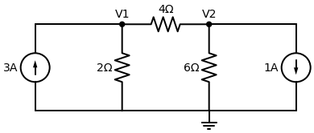

# Exemplo Resolvido Clássico: Análise Nodal

Este é um exercício clássico de aplicação direta da **Lei de Kirchhoff dos Nós (LKC)**. Vamos seguir rigorosamente a "Receita de Bolo" que aprendemos.

**Enunciado:** Determine as tensões $V_1$ e $V_2$ no circuito abaixo usando Análise Nodal.

---

## Passo a Passo

### 1. Definindo o "Chão" (Referência)
O circuito já mostra o símbolo de Terra ($0 \, V$) na linha inferior inteira. Logo, todas as tensões calculadas são em relação a esse fio de baixo.

### 2. Batizando os Nós
Temos dois nós principais na parte superior:
- O nó da esquerda, batizado de $V_1$.
- O nó da direita, batizado de $V_2$.

### 3. Escrevendo a Equação do Nó $V_1$
> *Regra: Assuma que todas as correntes fogem (saem) do nó. Se encontrar uma fonte entrando, coloque o valor dela como negativo (ou do outro lado do igual).*

Vamos olhar todas as "ruas" saindo do nó $V_1$:
1. Pela esquerda: Tem uma fonte de $3A$ entrando. Então escrevemos **$-3$**.
2. Para baixo: Passa pelo resistor de $2 \, \Omega$ e vai para o Terra. Escrevemos: **$\frac{V_1 - 0}{2}$**
3. Para a direita: Passa pelo resistor de $4 \, \Omega$ e vai em direção ao $V_2$. Escrevemos: **$\frac{V_1 - V_2}{4}$**

Somando tudo e igualando a zero (LKC):
$$ -3 + \frac{V_1}{2} + \frac{V_1 - V_2}{4} = 0 $$

*Dica de Ouro: Multiplique a equação inteira pelo MMC (que é 4) para sumir com as frações!*
$$ -12 + 2V_1 + V_1 - V_2 = 0 $$
$$ 3V_1 - V_2 = 12 \quad \text{--- (Equação 1)} $$

### 4. Escrevendo a Equação do Nó $V_2$
Vamos olhar todas as "ruas" saindo do nó $V_2$:
1. Para a esquerda: Passa pelo resistor de $4 \, \Omega$ e vai em direção ao $V_1$. Escrevemos: **$\frac{V_2 - V_1}{4}$**
2. Para baixo: Passa pelo resistor de $6 \, \Omega$ e vai para o Terra. Escrevemos: **$\frac{V_2 - 0}{6}$**
3. Para a direita: Tem uma fonte de $1A$ apontando para fora (saindo). Como ela já está saindo, obedece à nossa regra. Escrevemos: **$+1$**

Somando tudo e igualando a zero (LKC):
$$ \frac{V_2 - V_1}{4} + \frac{V_2}{6} + 1 = 0 $$

*O MMC de 4 e 6 é 12. Vamos multiplicar a equação inteira por 12 para sumir com as frações:*
$$ 3 \cdot (V_2 - V_1) + 2 \cdot (V_2) + 12 = 0 $$
$$ 3V_2 - 3V_1 + 2V_2 + 12 = 0 $$
$$ -3V_1 + 5V_2 = -12 \quad \text{--- (Equação 2)} $$

### 5. Resolvendo o Sistema Linear
Temos um sistema com duas equações super limpas:
1. $3V_1 - V_2 = 12$
2. $-3V_1 + 5V_2 = -12$

Se você somar a Equação 1 com a Equação 2, olha que mágica: o $3V_1$ corta com o $-3V_1$ e o $12$ corta com o $-12$!
$$ (3V_1 - 3V_1) + (-V_2 + 5V_2) = (12 - 12) $$
$$ 4V_2 = 0 \implies V_2 = 0 \, V $$

Agora substituímos $V_2 = 0$ na Equação 1:
$$ 3V_1 - 0 = 12 \implies 3V_1 = 12 \implies V_1 = 4 \, V $$

---
> **✅ Resposta Final:** 
> - A tensão no nó da esquerda é **$V_1 = 4 \, V$**.
> - A tensão no nó da direita é **$V_2 = 0 \, V$** (sim, por conta do equilíbrio das correntes e resistências, o nó $V_2$ está no mesmo potencial do Terra!).
