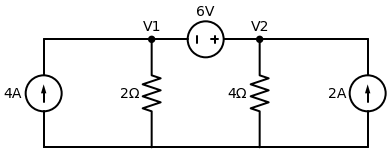

# Exemplo Resolvido: O Chefão Final (Supernó)

Este é o temido Supernó. Ele acontece sempre que uma **Fonte de Tensão** cai de paraquedas entre dois nós que não são o Terra. 

**Enunciado:** Determine as tensões $V_1$ e $V_2$ no circuito abaixo usando Análise Nodal.

---

## Passo a Passo

### 1. Identificando a Armadilha
Olhe para o fio de cima: temos o nó $V_1$ e o nó $V_2$. Bem no meio deles, ligando os dois, existe uma **fonte de tensão de $6V$**. 
- Se tentarmos fazer a LKC apenas para o $V_1$, não sabemos qual é a corrente que passa por essa fonte de $6V$ (fontes de tensão não seguem a lei de Ohm $V=R \cdot I$).

### 2. Criando o Supernó
A solução é criar uma "bolha" imaginária gigante que engole o nó $V_1$, o nó $V_2$ e a própria fonte de $6V$. 
A LKC (a regra de que a soma das correntes fugindo é zero) agora será aplicada **à bolha inteira**.

**Quais são as "ruas" que saem de dentro da bolha para o mundo exterior?**
1. Na ponta esquerda da bolha ($V_1$), tem a fonte de $4A$ entrando na bolha. Fica: **$-4$**
2. Também no $V_1$, a corrente desce pelo resistor de $2 \, \Omega$ em direção ao Terra. Fica: **$\frac{V_1}{2}$**
3. Na ponta direita da bolha ($V_2$), a corrente desce pelo resistor de $4 \, \Omega$ em direção ao Terra. Fica: **$\frac{V_2}{4}$**
4. Também no $V_2$, a fonte de $2A$ está entrando na bolha (flecha para cima). Fica: **$-2$**

Somando todas as correntes que saem da bolha e igualando a zero:
$$ -4 + \frac{V_1}{2} + \frac{V_2}{4} - 2 = 0 $$
$$ \frac{V_1}{2} + \frac{V_2}{4} = 6 $$

Multiplicando por 4 para tirar a fração:
$$ 2V_1 + V_2 = 24 \quad \text{--- (Equação 1 - Do Supernó)} $$

### 3. A Equação Interna (A Restrição)
A Equação 1 tem duas incógnitas ($V_1$ e $V_2$). Precisamos de uma segunda equação. De onde ela vem? **De dentro da bolha!**

Olhe para a fonte de tensão que está presa lá dentro. A placa positiva dela (o traço maior) está virada para a esquerda (conectada no $V_1$). A negativa está no $V_2$. O valor dela é $6V$.
Isso significa simplesmente que o potencial de $V_1$ é 6 volts maior que o de $V_2$:
$$ V_1 - V_2 = 6 \implies V_1 = V_2 + 6 \quad \text{--- (Equação 2 - Da Fonte)} $$

*(Dica: Se o traço maior estivesse encostado no $V_2$, seria $V_2 - V_1 = 6$)*.

### 4. Resolvendo o Sistema
Agora é só substituir a Equação 2 dentro da Equação 1:
$$ 2 \cdot (V_2 + 6) + V_2 = 24 $$
$$ 2V_2 + 12 + V_2 = 24 $$
$$ 3V_2 = 12 \implies V_2 = 4 \, V $$

Sabendo que $V_2 = 4 \, V$, voltamos na Equação 2:
$$ V_1 = 4 + 6 \implies V_1 = 10 \, V $$

---
> **✅ Resposta Final:** 
> - A tensão no nó da esquerda é **$V_1 = 10 \, V$**.
> - A tensão no nó da direita é **$V_2 = 4 \, V$**.
> 
> *Viu só? O Supernó não é um bicho de sete cabeças, ele na verdade deixa a montagem do sistema até mais fácil!*
