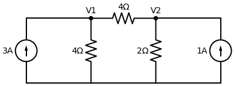
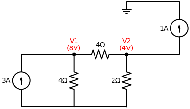

# Exercício Proposto Resolvido: O Desafio dos Nós

Este arquivo contém a resolução completa e detalhada do desafio proposto, corrigindo os erros de sinais mais comuns que costumam acontecer na montagem das equações.

**Enunciado:** Determine as tensões nos nós $V_1$ e $V_2$ do circuito abaixo utilizando a Análise Nodal (LKC).

---

## Passo a Passo da Resolução

Lembrando a nossa Receita de Bolo: **Assuma que todas as correntes fogem do nó.** Se uma fonte estiver entrando no nó, ela recebe sinal negativo.

### 1. Equação do Nó $V_1$
Posicionado no nó $V_1$, temos três "ruas":
1. O ramo da esquerda: A fonte de $3A$ está **entrando** no nó (apontando para cima). Na equação, entra como: **$-3$**
2. O ramo para baixo: A corrente foge pelo resistor de $4 \, \Omega$ para o Terra. Fica: **$\frac{V_1 - 0}{4}$**
3. O ramo da direita: A corrente foge pelo resistor de $4 \, \Omega$ em direção ao nó $V_2$. Fica: **$\frac{V_1 - V_2}{4}$** *(Atenção: o sinal de menos acompanha o $V_2$)*.

Somando tudo (LKC):
$$ -3 + \frac{V_1}{4} + \frac{V_1 - V_2}{4} = 0 $$

Multiplicando toda a equação por $4$ para eliminar os denominadores:
$$ -12 + V_1 + V_1 - V_2 = 0 $$
$$ 2V_1 - V_2 = 12 \quad \text{--- (Equação 1)} $$

### 2. Equação do Nó $V_2$
Posicionado no nó $V_2$, temos três "ruas":
1. O ramo da esquerda: A corrente foge pelo resistor de $4 \, \Omega$ de volta para o $V_1$. Fica: **$\frac{V_2 - V_1}{4}$**
2. O ramo para baixo: A corrente foge pelo resistor de $2 \, \Omega$ para o Terra. Fica: **$\frac{V_2 - 0}{2}$**
3. O ramo da direita: A fonte de $1A$ está **entrando** no nó $V_2$ (a flechinha também está para cima). Pela nossa regra, ela entra com sinal negativo: **$-1$**.

Somando tudo (LKC):
$$ \frac{V_2 - V_1}{4} + \frac{V_2}{2} - 1 = 0 $$

O MMC entre 4 e 2 é 4. Multiplicando a equação inteira por $4$:
$$ 1 \cdot (V_2 - V_1) + 2 \cdot (V_2) - 4 = 0 $$
$$ V_2 - V_1 + 2V_2 - 4 = 0 $$
$$ -V_1 + 3V_2 = 4 \quad \text{--- (Equação 2)} $$

### 3. Resolvendo o Sistema
Nosso sistema limpo ficou assim:
1. $2V_1 - V_2 = 12$
2. $-V_1 + 3V_2 = 4$

Na Equação 2, podemos isolar o $V_1$. Jogando ele para a direita e o 4 para a esquerda:
$$ 3V_2 - 4 = V_1 \implies V_1 = 3V_2 - 4 $$

Substituímos isso na Equação 1:
$$ 2 \cdot (3V_2 - 4) - V_2 = 12 $$
$$ 6V_2 - 8 - V_2 = 12 $$
$$ 5V_2 = 20 \implies V_2 = 4 \, V $$

Agora pegamos esse valor de $V_2$ e voltamos no $V_1$ que estava isolado:
$$ V_1 = 3 \cdot (4) - 4 $$
$$ V_1 = 12 - 4 = 8 \, V $$

---

## Resultado Final

A matemática perfeitinha nos mostra que não sobrou nenhuma dízima ou fração quebrada:
- A tensão no nó 1 é **$V_1 = 8 \, V$**.
- A tensão no nó 2 é **$V_2 = 4 \, V$**.

Confira o circuito final com os valores das respostas já aplicados aos nós correspondentes:

