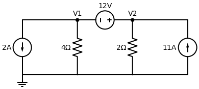

# Exercício Proposto: Domando o Supernó

Chegou a hora de você enfrentar o chefão sozinho. Eu desenhei este circuito para gerar números 100% inteiros e exatos no final, para você treinar a lógica sem estresse matemático.

**Enunciado:** Determine as tensões nos nós $V_1$ e $V_2$ do circuito abaixo.

---

## Passo a Passo para você resolver

### 1. A Equação da Bolha (Supernó)
Imagine uma bolha engolindo o $V_1$, o $V_2$ e a fonte de $12V$ que está entre eles.
Olhe para as 4 "ruas" que saem dessa bolha:
1. No $V_1$, a fonte de $2A$ está **fugindo** (apontando para baixo) em direção ao Terra. (Lembre da regra: se foge, é positivo).
2. No $V_1$, a corrente desce pelo resistor de $4 \, \Omega$.
3. No $V_2$, a corrente desce pelo resistor de $2 \, \Omega$.
4. No $V_2$, a fonte de $11A$ está **entrando** na bolha (apontando para cima). Qual é o sinal dela?

**Some essas 4 coisas, iguale a Zero e multiplique a equação por 4 para tirar as frações.**
- Escreva a sua primeira equação final (do tipo $aV_1 + bV_2 = C$): `[ Sua Equação da Bolha Aqui ]`

### 2. A Equação Interna (Da Fonte)
Olhe para a fonte de $12V$ presa entre $V_1$ e $V_2$.
- Onde está o traço maior (placa positiva) dela? Está encostado no $V_1$ ou no $V_2$?
- Monte a equação do tipo $(Nó\_Positivo - Nó\_Negativo) = 12$.

- Escreva a sua segunda equação final: `[ Sua Equação Interna Aqui ]`

### 3. Resolvendo o Sistema
Resolva o seu sistema de 2 equações substituindo uma na outra.

**Seus Resultados Finais:**
- $V_1 = $ `[  ] Volts`
- $V_2 = $ `[  ] Volts`

---
Assim que terminar as contas, mande aqui no chat os dois valores que você encontrou para verificarmos! E eu já deixei o arquivo com a resolução completinha com o diagrama resolvido (igual fizemos no último) preparado para te enviar assim que você terminar!
