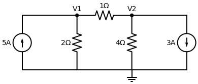

# Resolução: Exercício Enviado pelo Usuário (Análise Nodal)

Este é o circuito que você enviou por imagem! Eu passei ele a limpo usando o nosso gerador de esquemáticos para ficar perfeito nos nossos registros.

**Enunciado:** Determine as tensões $V_1$ e $V_2$ no circuito usando a Lei de Kirchhoff dos Nós (LKC).

---

## Passo a Passo

Temos o nó superior esquerdo ($V_1$), o nó superior direito ($V_2$) e o fio debaixo inteiro que é o nosso Terra (referência $0V$). Vamos aplicar a regra de ouro: **Assuma que todas as correntes fogem do nó.**

### 1. Equação do Nó $V_1$
Olhando para o nó $V_1$, temos três caminhos:
1. Pela esquerda: A fonte de $5A$ está **entrando** no nó. Logo, na nossa equação, ela entra negativa: **$-5$**.
2. Para baixo: A corrente foge pelo resistor de $2 \, \Omega$ em direção ao Terra. Escrevemos: **$\frac{V_1 - 0}{2}$**
3. Para a direita: A corrente foge pelo resistor de $1 \, \Omega$ em direção a $V_2$. Escrevemos: **$\frac{V_1 - V_2}{1}$**

Somando tudo e igualando a zero (LKC):
$$ -5 + \frac{V_1}{2} + \frac{V_1 - V_2}{1} = 0 $$

*Para tirar essa fração chata do $V_1/2$, vamos multiplicar a equação inteira por 2:*
$$ 2 \cdot (-5) + 2 \cdot \left(\frac{V_1}{2}\right) + 2 \cdot (V_1 - V_2) = 0 $$
$$ -10 + V_1 + 2V_1 - 2V_2 = 0 $$
$$ 3V_1 - 2V_2 = 10 \quad \text{--- (Equação 1)} $$

### 2. Equação do Nó $V_2$
Olhando para o nó $V_2$, temos três caminhos:
1. Pela esquerda: A corrente foge pelo resistor de $1 \, \Omega$ em direção a $V_1$. Escrevemos: **$\frac{V_2 - V_1}{1}$**
2. Para baixo: A corrente foge pelo resistor de $4 \, \Omega$ em direção ao Terra. Escrevemos: **$\frac{V_2 - 0}{4}$**
3. Para a direita: A fonte de $3A$ está **saindo** do nó em direção ao Terra. Como ela já está fugindo, obedece à regra e entra positiva: **$+3$**.

Somando tudo e igualando a zero (LKC):
$$ \frac{V_2 - V_1}{1} + \frac{V_2}{4} + 3 = 0 $$

*Para tirar a fração do $V_2/4$, vamos multiplicar a equação inteira por 4:*
$$ 4 \cdot (V_2 - V_1) + 4 \cdot \left(\frac{V_2}{4}\right) + 4 \cdot (3) = 0 $$
$$ 4V_2 - 4V_1 + V_2 + 12 = 0 $$
$$ -4V_1 + 5V_2 = -12 \quad \text{--- (Equação 2)} $$

### 3. Resolvendo o Sistema Linear
Nosso sistema é:
1. $3V_1 - 2V_2 = 10$
2. $-4V_1 + 5V_2 = -12$

Este sistema não tem números perfeitinhos que cortam de primeira, então vamos usar o método da adição multiplicando a Equação 1 por $5$ e a Equação 2 por $2$ (assim o $V_2$ vai virar $10$ e $-10$ para cortarmos):

* Nova Equação 1 (x5): $15V_1 - 10V_2 = 50$
* Nova Equação 2 (x2): $-8V_1 + 10V_2 = -24$

Somando as duas:
$$ (15V_1 - 8V_1) + (-10V_2 + 10V_2) = 50 - 24 $$
$$ 7V_1 = 26 \implies V_1 = \frac{26}{7} \approx 3,714 \, V $$

Agora substituímos o valor de $V_1$ na primeira equação para achar $V_2$:
$$ 3 \left(\frac{26}{7}\right) - 2V_2 = 10 $$
$$ \frac{78}{7} - 10 = 2V_2 $$
*Tirando o MMC no lado esquerdo:*
$$ \frac{78 - 70}{7} = 2V_2 $$
$$ \frac{8}{7} = 2V_2 \implies V_2 = \frac{4}{7} \approx 0,571 \, V $$

---
> **✅ Resposta Final Exata:** 
> - A tensão no nó 1 é **$V_1 = \frac{26}{7} \, V$** (aproximadamente $3,71 \, V$).
> - A tensão no nó 2 é **$V_2 = \frac{4}{7} \, V$** (aproximadamente $0,57 \, V$).
