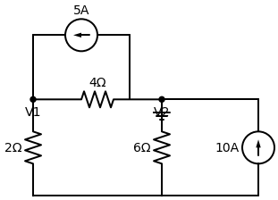

# Resolução: Circuito Enviado 1 (Imagem da Esquerda)

Este circuito tem dois nós principais e o terra. A armadilha aqui está apenas em observar atentamente para onde as fontes de corrente estão apontando.

**Enunciado:** Determine as tensões $V_1$ (esquerda) e $V_2$ (direita) no circuito abaixo usando a Análise Nodal.

---

## Passo a Passo

### 1. Equação do Nó $V_1$ (Esquerda)
Olhando para o nó $V_1$, temos três "ruas":
1. Ramo superior: A fonte de $5A$ está **entrando** no $V_1$ (a flecha aponta para a esquerda). Logo: **$-5$**
2. Ramo para baixo: A corrente foge pelo resistor de $2 \, \Omega$ para o Terra. Logo: **$\frac{V_1}{2}$**
3. Ramo para a direita: A corrente foge pelo resistor de $4 \, \Omega$ em direção ao $V_2$. Logo: **$\frac{V_1 - V_2}{4}$**

Equação (LKC):
$$ -5 + \frac{V_1}{2} + \frac{V_1 - V_2}{4} = 0 $$

Multiplicando tudo por $4$ para eliminar os denominadores:
$$ -20 + 2V_1 + V_1 - V_2 = 0 $$
$$ 3V_1 - V_2 = 20 \quad \text{--- (Equação 1)} $$

### 2. Equação do Nó $V_2$ (Direita)
Olhando para o nó $V_2$, temos quatro "ruas":
1. Ramo superior: A fonte de $5A$ está **fugindo** do $V_2$. Logo: **$+5$**
2. Ramo da esquerda: A corrente foge pelo resistor de $4 \, \Omega$ para o $V_1$. Logo: **$\frac{V_2 - V_1}{4}$**
3. Ramo para baixo: A corrente foge pelo resistor de $6 \, \Omega$ para o Terra. Logo: **$\frac{V_2}{6}$**
4. Ramo da direita: A fonte de $10A$ está **entrando** no nó $V_2$ (vindo do terra). Logo: **$-10$**

Equação (LKC):
$$ 5 + \frac{V_2 - V_1}{4} + \frac{V_2}{6} - 10 = 0 $$
$$ \frac{V_2 - V_1}{4} + \frac{V_2}{6} - 5 = 0 $$

Multiplicando tudo por $12$ (MMC de 4 e 6) para tirar a fração:
$$ 3 \cdot (V_2 - V_1) + 2 \cdot V_2 - 60 = 0 $$
$$ 3V_2 - 3V_1 + 2V_2 = 60 $$
$$ -3V_1 + 5V_2 = 60 \quad \text{--- (Equação 2)} $$

### 3. Resolvendo o Sistema
As equações ficaram perfeitamente preparadas para o método da adição:
1. $3V_1 - V_2 = 20$
2. $-3V_1 + 5V_2 = 60$

Somando as duas diretamente:
$$ (3V_1 - 3V_1) + (-V_2 + 5V_2) = 20 + 60 $$
$$ 4V_2 = 80 \implies V_2 = 20 \, V $$

Substituindo $V_2$ na Equação 1:
$$ 3V_1 - 20 = 20 $$
$$ 3V_1 = 40 \implies V_1 = \frac{40}{3} \approx 13,33 \, V $$

---
> **✅ Resposta Final:** 
> - **$V_1 = \frac{40}{3} \, V$**
> - **$V_2 = 20 \, V$**
