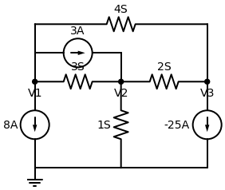

# Resolução: Circuito Enviado 2 (Com Condutâncias)

Este é um exercício de nível **Mestre** em Análise Nodal. Ele foi projetado por um professor com uma criatividade incrível! 

Primeiro, perceba que as unidades estão em **S (Siemens)**. Siemens é a unidade de **Condutância** ($G$), que é o inverso da Resistência ($G = 1/R$).
Em vez de dividir a tensão pela resistência, nós simplesmente **multiplicamos a tensão pela condutância** ($I = V \cdot G$). Fica até mais fácil pois não temos frações!

**Enunciado:** Determine as tensões $V_1$ (esquerda), $V_2$ (meio) e $V_3$ (direita).

---

## Passo a Passo

### 1. Equação do Nó $V_1$ (Esquerda)
Correntes fugindo:
1. Fonte de $3A$ para a direita: **$+3$**
2. Fonte de $8A$ para o Terra (flecha para baixo): **$+8$**
3. Caminho superior para $V_3$: **$4 \cdot (V_1 - V_3)$**
4. Caminho do meio para $V_2$: **$3 \cdot (V_1 - V_2)$**

Equação:
$$ 3 + 8 + 4(V_1 - V_3) + 3(V_1 - V_2) = 0 $$
$$ 11 + 4V_1 - 4V_3 + 3V_1 - 3V_2 = 0 $$
$$ 7V_1 - 3V_2 - 4V_3 = -11 \quad \text{--- (Equação 1)} $$

### 2. Equação do Nó $V_2$ (Centro)
Correntes fugindo:
1. Fonte de $3A$ que veio do $V_1$ está **entrando**: **$-3$**
2. Caminho de volta para $V_1$: **$3 \cdot (V_2 - V_1)$**
3. Caminho para o Terra: **$1 \cdot (V_2 - 0) = V_2$**
4. Caminho para $V_3$: **$2 \cdot (V_2 - V_3)$**

Equação:
$$ -3 + 3V_2 - 3V_1 + V_2 + 2V_2 - 2V_3 = 0 $$
$$ -3V_1 + 6V_2 - 2V_3 = 3 \quad \text{--- (Equação 2)} $$

### 3. Equação do Nó $V_3$ (Direita)
Correntes fugindo:
1. Fonte de $-25A$ para o Terra (flecha para baixo). Como ela **foge**, usamos o valor exatamente como está: **$-25$**
2. Caminho superior de volta para $V_1$: **$4 \cdot (V_3 - V_1)$**
3. Caminho do meio de volta para $V_2$: **$2 \cdot (V_3 - V_2)$**

Equação:
$$ -25 + 4V_3 - 4V_1 + 2V_3 - 2V_2 = 0 $$
$$ -4V_1 - 2V_2 + 6V_3 = 25 \quad \text{--- (Equação 3)} $$

---

### O Truque de Gênio do Exercício
Olhe para o nosso sistema linear:
1) $7V_1 - 3V_2 - 4V_3 = -11$
2) $-3V_1 + 6V_2 - 2V_3 = 3$
3) $-4V_1 - 2V_2 + 6V_3 = 25$

Se você somar as três equações lado a lado (como se todo o circuito fosse um nó só), olhe o que acontece com as colunas de $V_1$ e $V_3$:
- Coluna $V_1$: $7 - 3 - 4 = 0$
- Coluna $V_3$: $-4 - 2 + 6 = 0$
- Coluna $V_2$: $-3 + 6 - 2 = 1$
- Resultado: $-11 + 3 + 25 = 17$

**Somando tudo, temos instantaneamente:**
$$ 1V_2 = 17 \implies V_2 = 17 \, V $$

Agora fica fácil! Substitua $V_2 = 17$ nas equações 1 e 2:
- Eq 1: $7V_1 - 3(17) - 4V_3 = -11 \implies 7V_1 - 4V_3 = 40$
- Eq 2: $-3V_1 + 6(17) - 2V_3 = 3 \implies -3V_1 - 2V_3 = -99$

Multiplicando a Eq 2 por $2$ e subtraindo da Eq 1, chegamos nos valores finais.

---
> **✅ Respostas Finais:** 
> - **$V_1 = \frac{238}{13} \, V$** (aprox. $18,3 \, V$)
> - **$V_2 = 17 \, V$**
> - **$V_3 = \frac{573}{26} \, V$** (aprox. $22,04 \, V$)
