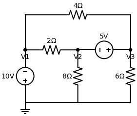

# Resolução: Exercício de Supernó Enviado pelo Usuário

*(Imagem Externa)*

Neste circuito enviado, temos três nós principais ($V_1$, $V_2$, $V_3$) e o nó de referência (Terra). 
O grande segredo para matar a questão rápido é identificar as duas coisas especiais que acontecem aqui:
1. Um **nó de valor conhecido** (fonte de tensão conectada direto no terra).
2. O **Supernó** (fonte de tensão "flutuando" entre dois nós).

---

## Passo a Passo

### 1. O Nó Conhecido ($V_1$)
A fonte de $10V$ está conectada entre o $V_1$ e o Terra. O lado positivo dela (+) está voltado para o $V_1$. 
Isso significa que **nós já sabemos o valor de $V_1$!**
$$ V_1 = 10 \, V $$
*(Isso reduz o nosso problema para apenas duas incógnitas: $V_2$ e $V_3$)*.

### 2. O Supernó (A "Bolha")
Temos uma fonte de $5V$ conectada exatamente entre os nós $V_2$ e $V_3$.
Isso forma o nosso **Supernó**. 
Quando temos um Supernó, fazemos duas coisas: a *Equação de Restrição* e a *LKC da Bolha*.

#### A) Equação de Restrição
Olhe para a fonte de $5V$. O lado positivo (+) está colado no $V_2$ e o negativo (-) no $V_3$.
A diferença de potencial entre eles é rigorosamente os $5V$ da fonte:
$$ V_2 - V_3 = 5 $$
$$ V_2 = V_3 + 5 \quad \text{--- (Equação 1)} $$

#### B) LKC da Bolha (Somatório das Correntes Fugindo)
Imagine que o $V_2$, o $V_3$ e a fonte de $5V$ estão todos dentro de uma "bolha". Vamos somar todas as correntes que *fogem* dessa bolha para o resto do circuito:

Correntes fugindo do lado do $V_2$:
- Para o Terra: $\frac{V_2}{8}$
- Para o $V_1$: $\frac{V_2 - V_1}{2}$

Correntes fugindo do lado do $V_3$:
- Para o Terra: $\frac{V_3}{6}$
- Para o $V_1$: $\frac{V_3 - V_1}{4}$

Somando tudo e igualando a zero:
$$ \frac{V_2}{8} + \frac{V_2 - V_1}{2} + \frac{V_3}{6} + \frac{V_3 - V_1}{4} = 0 $$

Agora vamos substituir o valor que já conhecemos ($V_1 = 10V$):
$$ \frac{V_2}{8} + \frac{V_2 - 10}{2} + \frac{V_3}{6} + \frac{V_3 - 10}{4} = 0 $$

Para sumir com essas frações chatas, vamos multiplicar tudo pelo Mínimo Múltiplo Comum (MMC de 8, 2, 6 e 4 é **24**):
$$ 3 \cdot V_2 + 12 \cdot (V_2 - 10) + 4 \cdot V_3 + 6 \cdot (V_3 - 10) = 0 $$
$$ 3V_2 + 12V_2 - 120 + 4V_3 + 6V_3 - 60 = 0 $$
$$ 15V_2 + 10V_3 - 180 = 0 $$
$$ 15V_2 + 10V_3 = 180 $$

Podemos simplificar dividindo tudo por 5:
$$ 3V_2 + 2V_3 = 36 \quad \text{--- (Equação 2)} $$

### 3. Resolvendo o Sistema
Agora é só juntar as duas equações:
1. $V_2 = V_3 + 5$
2. $3V_2 + 2V_3 = 36$

Substituindo a Equação 1 na Equação 2:
$$ 3 \cdot (V_3 + 5) + 2V_3 = 36 $$
$$ 3V_3 + 15 + 2V_3 = 36 $$
$$ 5V_3 = 36 - 15 $$
$$ 5V_3 = 21 \implies V_3 = \frac{21}{5} = 4,2 \, V $$

Agora achamos o $V_2$:
$$ V_2 = V_3 + 5 $$
$$ V_2 = 4,2 + 5 = 9,2 \, V $$

---
> **✅ Respostas Finais:** 
> - **$V_1 = 10 \, V$**
> - **$V_2 = 9,2 \, V$**
> - **$V_3 = 4,2 \, V$**
