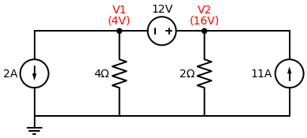

# Gabarito: Exercício Proposto de Supernó

Parabéns! O usuário resolveu este circuito com perfeição.

## Resolução do Aluno

### 1. A Equação de Restrição
A fonte de $12V$ está entre o $V_1$ e o $V_2$, com o polo positivo virado para o $V_2$. Logo, o potencial de $V_2$ é $12V$ maior que o de $V_1$:
$$ V_2 - V_1 = 12 \implies -V_1 + V_2 = 12 $$

### 2. A Equação da Bolha (Supernó)
Somando as correntes que fogem da bolha que envolve $V_1$, $V_2$ e a fonte de $12V$:
- Em $V_1$: A fonte de $2A$ foge ($+2$) e a corrente desce pelo resistor de $4 \, \Omega$ ($\frac{V_1}{4}$).
- Em $V_2$: A fonte de $11A$ entra ($-11$) e a corrente desce pelo resistor de $2 \, \Omega$ ($\frac{V_2}{2}$).

LKC do Supernó:
$$ 2 + \frac{V_1}{4} - 11 + \frac{V_2}{2} = 0 $$
$$ \frac{V_1}{4} + \frac{V_2}{2} = 9 $$

Multiplicando por 4 para remover as frações:
$$ V_1 + 2V_2 = 36 $$

### 3. Solução do Sistema
Temos o sistema:
1) $V_2 = V_1 + 12$
2) $V_1 + 2V_2 = 36$

Substituindo a primeira na segunda:
$$ V_1 + 2 \cdot (V_1 + 12) = 36 $$
$$ V_1 + 2V_1 + 24 = 36 $$
$$ 3V_1 = 12 \implies V_1 = 4 \, V $$

Sabendo o $V_1$:
$$ V_2 = 4 + 12 \implies V_2 = 16 \, V $$

---
> **✅ Conclusão:** 
> - **$V_1 = 4 \, V$**
> - **$V_2 = 16 \, V$**
> 
> O domínio sobre Supernós foi atingido com sucesso absoluto!
