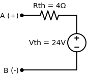

# Exercício Proposto: O Desafio de Thevenin

Agora é a sua vez! Eu criei este circuito especialmente para você treinar a Receita de Bolo passo a passo. Pegue papel e caneta.

**Enunciado:** Determine a Resistência de Thevenin ($R_{th}$) e a Tensão de Thevenin ($V_{th}$) vistas pelos terminais A e B no circuito abaixo.

---

## Passo 1: Encontre a $R_{th}$
> *Lembrete da Receita: Zere as fontes independentes (Tensão vira fio liso, Corrente vira fio aberto) e calcule a Resistência Equivalente olhando de A e B para dentro.*

1. O que acontece com o resistor de $3 \, \Omega$ e o de $6 \, \Omega$ quando você zera a fonte de $24V$ e a de $4A$? Eles ficam em série ou paralelo?
2. Depois de resolver esses dois, o que você faz com o resistor de $2 \, \Omega$?

**Sua Resposta para $R_{th}$:** `4 Ohms` ✅ *(Correto!)*

**Resolução Detalhada:**
Zerar a fonte de tensão a transforma em um fio liso (curto), e zerar a fonte de corrente a transforma em um buraco (aberto).
Ao fazermos isso, o resistor de $3 \, \Omega$ e o de $6 \, \Omega$ ficam ligados entre o Nó C e o Terra. Eles estão em **paralelo**!
$$ R_{paralelo} = \frac{3 \cdot 6}{3 + 6} = \frac{18}{9} = 2 \, \Omega $$
Olhando pelo terminal A, esse bloco equivalente de $2 \, \Omega$ fica em **série** com o nosso resistor de $2 \, \Omega$.
$$ R_{th} = 2 + 2 = 4 \, \Omega $$

---

## Passo 2: Encontre a $V_{th}$
> *Lembrete da Receita: Ligue as fontes de volta. Com os terminais A e B no vazio (sem encostar em nada), não tem corrente passando no resistor de $2 \, \Omega$. Logo, a Tensão em A é a mesma Tensão no Nó C ($V_{th} = V_C$). Calcule $V_C$ usando LKC (Nodal).*

1. Escreva as correntes saindo do Nó C:
   - Uma vai para a esquerda (pelo resistor de $3 \, \Omega$ até bater na fonte).
   - Uma vai para baixo (pelo resistor de $6 \, \Omega$).
   - A fonte de $4A$ está entrando.
2. Iguale a soma a Zero e resolva a equação para achar $V_C$.

**Sua Resposta para $V_{th}$:** `24 Volts` ✅ *(Correto!)*

**Resolução Detalhada (LKC no Nó C):**
$$ \frac{V_C - 24}{3} + \frac{V_C}{6} - 4 = 0 $$
*Multiplicando tudo por 6 para matar os denominadores:*
$$ 2 \cdot (V_C - 24) + V_C - 24 = 0 $$
$$ 2V_C - 48 + V_C - 24 = 0 $$
$$ 3V_C = 72 \implies V_C = 24V $$
Como a corrente no terminal A é zero, a tensão não cai no resistor de $2 \, \Omega$, então $V_{th} = V_C = 24V$.

---

## O Circuito Equivalente Final
Todo aquele circuito inicial pode ser substituído por uma única bateria de $24V$ em série com um resistor de $4 \, \Omega$.

