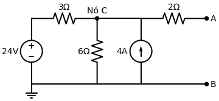

# Exercício Proposto: O Desafio de Thevenin

Agora é a sua vez! Eu criei este circuito especialmente para você treinar a Receita de Bolo passo a passo. Pegue papel e caneta.

**Enunciado:** Determine a Resistência de Thevenin ($R_{th}$) e a Tensão de Thevenin ($V_{th}$) vistas pelos terminais A e B no circuito abaixo.

---

## Passo 1: Encontre a $R_{th}$
> *Lembrete da Receita: Zere as fontes independentes (Tensão vira fio liso, Corrente vira fio aberto) e calcule a Resistência Equivalente olhando de A e B para dentro.*

1. O que acontece com o resistor de $3 \, \Omega$ e o de $6 \, \Omega$ quando você zera a fonte de $24V$ e a de $4A$? Eles ficam em série ou paralelo?
2. Depois de resolver esses dois, o que você faz com o resistor de $2 \, \Omega$?

**Sua Resposta para $R_{th}$:** `[  ] Ohms`

---

## Passo 2: Encontre a $V_{th}$
> *Lembrete da Receita: Ligue as fontes de volta. Com os terminais A e B no vazio (sem encostar em nada), não tem corrente passando no resistor de $2 \, \Omega$. Logo, a Tensão em A é a mesma Tensão no Nó C ($V_{th} = V_C$). Calcule $V_C$ usando LKC (Nodal).*

1. Escreva as correntes saindo do Nó C:
   - Uma vai para a esquerda (pelo resistor de $3 \, \Omega$ até bater na fonte).
   - Uma vai para baixo (pelo resistor de $6 \, \Omega$).
   - A fonte de $4A$ está entrando.
2. Iguale a soma a Zero e resolva a equação para achar $V_C$.

**Sua Resposta para $V_{th}$:** `[  ] Volts`

---
*Dica: Os resultados dão números redondos exatos, sem números com vírgula! Assim que terminar, mande os seus resultados no chat para eu corrigir!*
