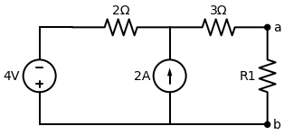
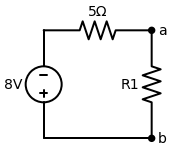

# Resolução: Exercício de Thevenin (Sob o ponto de vista de R1)

*(Imagem Externa)*

Esta é uma questão clássica excelente para treinar a **Receita de Bolo** de Thevenin! Quando o enunciado pede "sob o ponto de vista de $R_1$", ele está dizendo que os terminais `a` e `b` do nosso equivalente ficarão exatamente onde o $R_1$ está conectado. 

A primeira coisa que fazemos é **arrancar o $R_1$ do circuito**, deixando os terminais `a` e `b` abertos (no vazio).

---

## Passo 1: Encontrando a Resistência de Thevenin ($R_{th}$)
Com o $R_1$ removido, vamos olhar para dentro dos terminais `a` e `b` e **desligar todas as fontes independentes**:
- A **Fonte de Tensão de 4V** vira um **curto-circuito** (um fio liso contínuo).
- A **Fonte de Corrente de 2A** vira um **circuito aberto** (um buraco, arrancamos ela do circuito).

O que sobra olhando de `a` para `b`?
1. O resistor de $3 \, \Omega$ está em série com o caminho restante.
2. Como a fonte de corrente sumiu (deixou um buraco no meio), a única "rua" inteira que sobra vai passar reto pelo resistor de $2 \, \Omega$ até chegar no terra (b).
3. Logo, o resistor de $3 \, \Omega$ fica em **série** com o resistor de $2 \, \Omega$.

$$ R_{th} = 3 + 2 = 5 \, \Omega $$

> **✅ Resultado:** $R_{th} = 5 \, \Omega$.

---

## Passo 2: Encontrando a Tensão de Thevenin ($V_{th}$)
A Tensão de Thevenin é a Tensão de Circuito Aberto. Ou seja, ligamos as fontes (4V e 2A) de volta, mantemos o $R_1$ fora do circuito, e calculamos a tensão entre os terminais `a` e `b` ($V_a - V_b$).

- Como a parte de baixo é toda um fio só, vamos chamá-la de **Terra** ($V_b = 0V$). Logo, queremos achar o **$V_a$**.
- Note um detalhe fundamental: Como o terminal `a` está "solto no ar" (circuito aberto), **não existe corrente passando pelo resistor de $3 \, \Omega$!** 
- Se a corrente nele é zero ($0 \cdot 3 = 0V$), não há queda de tensão nele. Isso significa que **a tensão no terminal `a` é exatamente a mesma tensão do nó central do circuito**.

Vamos chamar esse nó central (onde se encontram o resistor de 2, o resistor de 3 e a fonte de 2A) de **$V_x$**. Logo, $V_{th} = V_a = V_x$.

**Aplicando a LKC (Análise Nodal) no Nó $V_x$:**
Somatório das correntes *fugindo* de $V_x$:
1. Ramo da esquerda: $\frac{V_x - 4}{2}$
2. Ramo de baixo: A fonte de $2A$ está **entrando** no nó (seta para cima). Logo: **$-2$**
3. Ramo da direita (para `a`): Corrente é **Zero** (circuito aberto).

Equação:
$$ \frac{V_x - 4}{2} - 2 = 0 $$
$$ \frac{V_x - 4}{2} = 2 $$

Passando o 2 multiplicando:
$$ V_x - 4 = 4 $$
$$ V_x = 8 \, V $$

Como o $V_x$ é a mesma tensão do terminal `a`:
$$ V_{th} = 8 \, V $$

> **✅ Resultado:** $V_{th} = 8 \, V$.

---

## O Circuito Equivalente
Toda aquela estrutura da esquerda pode ser removida e substituída por uma única fonte de $8V$ em série com um resistor de $5 \, \Omega$, ligada ao nosso amado $R_1$.

