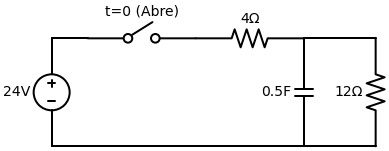
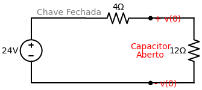
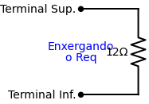
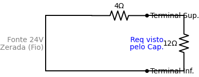

# Exemplo Resolvido: Resposta Natural de um Circuito RC

Este é um exemplo clássico para aplicarmos a **"Receita de Bolo"** passo a passo. 
A chave está **fechada há muito tempo** e, no instante $t=0$, ela se **abre**. Queremos encontrar a equação da tensão no capacitor $v(t)$ para $t > 0$.

---

## Passo 1: Encontrar o Início $v(0)$
Temos que olhar o circuito no instante **antes** da chave abrir ($t < 0$).
Como a chave estava fechada há muito tempo, o circuito atingiu o *Regime Permanente*.
- **Regra:** O Capacitor se comporta como um **Circuito Aberto** (fio quebrado).
- A fonte de 24V está empurrando corrente pelo resistor de $4 \, \Omega$ e pelo resistor de $12 \, \Omega$. O capacitor é apenas um buraco onde não entra corrente, mas ele está em **paralelo** com o resistor de $12 \, \Omega$.

- Logo, a tensão no capacitor $v(0)$ é exatamente igual à tensão no resistor de $12 \, \Omega$.
- **Mas de onde veio aquele "Divisor de Tensão"?**
  Vamos fazer pela lógica passo a passo usando a velha e boa Lei de Ohm ($V = R \cdot I$) para você nunca mais precisar decorar fórmula:
  1. No desenho acima, a corrente sai da fonte de 24V, passa inteira pelo resistor de $4 \, \Omega$, e depois passa inteira pelo resistor de $12 \, \Omega$ (ela não entra no buraco do capacitor). Portanto, esses dois resistores estão em **série**.
  2. A Resistência Total dessa "rua" é: $R_{total} = 4 + 12 = 16 \, \Omega$.
  3. Qual é a corrente ($I$) rodando nesse circuito? $I = \frac{V_{fonte}}{R_{total}} \implies I = \frac{24}{16} = 1,5 \, A$.
  4. Sabendo que desce $1,5 \, A$ pelo resistor de $12 \, \Omega$, qual é a tensão só nele? $V = R \cdot I \implies V = 12 \cdot 1,5 = 18V$.
- A fórmula do **Divisor de Tensão** nada mais é do que fazer esses 4 passos em uma linha só! Ele pega a Tensão da Fonte ($24V$) e multiplica pela "fração" da resistência que você quer descobrir dividida pela resistência total:
  $$ v(0) = V_{fonte} \cdot \left( \frac{R_{alvo}}{R_{total}} \right) = 24 \cdot \left( \frac{12}{4 + 12} \right) = 24 \cdot 0.75 = 18V $$
- Como a tensão no capacitor não dá "saltos" instantâneos, cravamos que **$v(0) = 18V$**.

## Passo 2: Encontrar o Fim $v(\infty)$
Agora olhamos para o circuito **muito tempo depois** da chave abrir ($t \to \infty$).
- Quando a chave abre, a fonte de 24V e o resistor de $4 \, \Omega$ são desconectados do resto do circuito e "morrem".
- O capacitor fica trancado em uma sala sozinho com o resistor de $12 \, \Omega$.
- Como não há nenhuma fonte empurrando nova energia para o capacitor, ele vai descarregar toda a energia de $18V$ que ele tinha armazenado em cima do resistor de $12 \, \Omega$, até zerar.
- Portanto, o valor final é **$v(\infty) = 0V$** (Essa é a clássica **Resposta Natural**).

## Passo 3: Encontrar a Constante de Tempo ($\tau$)
Olhe para o circuito **depois que a chave mudou ($t > 0$)**.
- O circuito do lado direito da chave é apenas o Capacitor de $0.5F$ em paralelo com o resistor de $12 \, \Omega$.
- Arrancamos o capacitor do circuito para ver a Resistência Equivalente (Thevenin) pelos buracos que ficaram.
- O Thevenin "visto" pelo capacitor é simplesmente o resistor de $12 \, \Omega$. Logo, $R_{eq} = 12 \, \Omega$.

- Fórmula do RC: 
  $$ \tau = R_{eq} \cdot C = 12 \cdot 0.5 = 6 \text{ segundos} $$

## Passo 4: Jogar na Equação Mágica
A equação geral é:
$$ v(t) = v(\infty) + [v(0) - v(\infty)] \cdot e^{-\frac{t}{\tau}} $$

Substituindo os três ingredientes que achamos ($v(0) = 18$, $v(\infty) = 0$, $\tau = 6$):
$$ v(t) = 0 + [18 - 0] \cdot e^{-\frac{t}{6}} $$
$$ v(t) = 18 e^{-\frac{t}{6}} \text{ V} $$

**Resposta Final:** $v(t) = 18 e^{-t/6} \, V$ para $t > 0$.

---

## 🤯 Dúvida do Aluno: E se a chave FECHASSE em $t=0$?
*Se o enunciado dissesse que a chave estava ABERTA antes, e FECHOU no $t=0$, toda a nossa lógica seria invertida! Isso se tornaria um problema de **Resposta ao Degrau**.*

Veja como a Receita de Bolo mudaria:
1. **Passo 1 ($v(0)$):** Para $t < 0$ a chave estava aberta. A fonte de 24V não estava conectada em nada. O capacitor estava só com o resistor de $12 \, \Omega$, totalmente descarregado. Logo, $v(0) = 0V$.
2. **Passo 2 ($v(\infty)$):** Para $t \to \infty$ a chave fechou. O capacitor está conectado na fonte, ele vira um **Circuito Aberto** (fio quebrado). É exatamente a mesma conta do nosso "Passo 1" original lá em cima: Usamos o divisor de tensão e achamos $v(\infty) = 18V$. Ele carregou!
3. **Passo 3 ($\tau$):** Agora que a chave está fechada, para calcular o Thevenin visto pelo capacitor nós precisamos **zerar a fonte de 24V** (ela vira um fio liso). Quando ela vira um fio, o resistor de $4 \, \Omega$ fica em **paralelo** com o resistor de $12 \, \Omega$ em relação aos terminais do capacitor!

  $$ R_{eq} = \frac{4 \cdot 12}{4 + 12} = \frac{48}{16} = 3 \, \Omega $$
  $$ \tau = R_{eq} \cdot C = 3 \cdot 0.5 = 1.5 \text{ segundos} $$
4. **Passo 4 (Equação Final):** Jogando tudo na Equação Mágica:
  $$ v(t) = 18 + [0 - 18] \cdot e^{-\frac{t}{1.5}} \implies v(t) = 18 \cdot (1 - e^{-t/1.5}) \text{ V} $$
