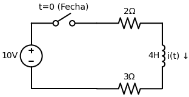
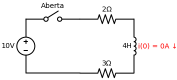
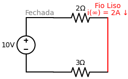
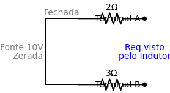

# Exercício Proposto: O Desafio do Indutor

Agora é a sua vez de sujar as mãos! Este é um problema clássico de circuito RL. 
A chave está **aberta** há muito tempo e, no instante $t=0$, ela se **fecha**, ligando a fonte bruscamente no circuito. Queremos encontrar a equação da corrente no indutor $i(t)$ para $t > 0$.

---

## Passo 1: Encontre o Início $i(0)$
> *Dica: Olhe para $t < 0$. A chave está aberta. Tem alguma fonte conectada ao indutor? Qual é a corrente que passa por ele?*

**Sua Resposta para $i(0)$:** `0 Amperes` ✅ *(Correto!)*

**Resolução Detalhada:**
Como a chave estava aberta há muito tempo, o circuito do indutor estava isolado da bateria de 10V. Como não havia energia correndo, o indutor estava completamente descarregado.
$$ i(0) = 0A $$

---

## Passo 2: Encontre o Fim $i(\infty)$
> *Dica: Olhe para $t \to \infty$. A chave fechou há muito tempo. O Indutor se transforma em um "curto-circuito" (fio liso). Calcule a corrente que passa por esse fio liso agora que a fonte de 10V está ligada.*

**Sua Resposta para $i(\infty)$:** `2 Amperes` ✅ *(Correto!)*

**Resolução Detalhada:**
Com a chave fechada por muito tempo, entramos no Regime Permanente e o indutor vira um fio liso (curto-circuito).
Temos uma única malha em série: a fonte de 10V e os dois resistores ($2 \, \Omega$ e $3 \, \Omega$).
$$ R_{total} = 2 + 3 = 5 \, \Omega $$
Usando a Lei de Ohm ($I = V/R$):
$$ i(\infty) = \frac{10}{5} = 2A $$

---

## Passo 3: Encontre a Constante de Tempo ($\tau$)
> *Dica: Olhe para o circuito em $t > 0$ (chave fechada). Apague a fonte de tensão e o indutor. Qual é a Resistência Equivalente (Thevenin) que sobrou enxergada pelo indutor? Use a fórmula $\tau = \frac{L}{R_{eq}}$.*

**Sua Resposta para $\tau$:** `0.8 Segundos` ✅ *(Correto!)*

**Resolução Detalhada:**
Para $t > 0$, zeramos a fonte de 10V (transformando-a em fio liso) e arrancamos o indutor do desenho.
Olhando a partir dos buracos do indutor, a corrente sairia por um terminal, passaria pelo resistor de $3 \, \Omega$, pelo fio da fonte, e pelo resistor de $2 \, \Omega$ até voltar pelo outro terminal. Ou seja, eles estão em **Série** em relação ao indutor!
$$ R_{eq} = 2 + 3 = 5 \, \Omega $$
$$ \tau = \frac{L}{R_{eq}} = \frac{4}{5} = 0,8 \text{ segundos} $$

---

## Passo 4: Jogue na Equação Mágica
> *Fórmula Geral: $i(t) = i(\infty) + [i(0) - i(\infty)] e^{-t/\tau}$*

**Equação Final $i(t)$:** `2 - 2e^(-1.25t) A` ✅ *(Perfeito!)*

**Resolução Detalhada:**
Juntando nossos ingredientes: $i(0) = 0$, $i(\infty) = 2$, e $\tau = 0.8$.
$$ i(t) = 2 + [0 - 2] \cdot e^{-\frac{t}{0.8}} $$
Como $1 / 0.8 = 1.25$:
$$ i(t) = 2 - 2 e^{-1.25t} \text{ A} $$
*Para $t > 0$.*
