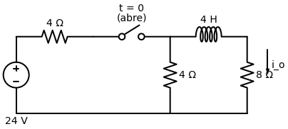
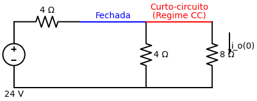

# Problema 7.11

> **Objetivo:** Resolver o problema passo a passo.
> **Instrução:** Leia o enunciado abaixo e tente resolver usando a metodologia.

**Enunciado:**
Para o circuito na figura abaixo, determine $i_o(t)$ para $t > 0$.

---

> [!TIP]
> **Receita de Bolo: Análise de Circuitos de Primeira Ordem (RL)**
> 1. **Análise em t < 0:** O Indutor se comporta como um **Curto-Circuito** em regime de Corrente Contínua (CC). Calcule a corrente inicial do indutor $i_L(0)$.
> 2. **Análise em t > 0:** Redesenhe o circuito com a nova posição da chave. Encontre a resistência equivalente $R_{eq}$ vista pelo indutor.
> 3. **Constante de Tempo ($\tau$):** Para circuitos RL, a fórmula muda! Use $\tau = \frac{L}{R_{eq}}$.
> 4. **Equação Final:** Use a fórmula natural $i(t) = i_L(0)e^{-t/\tau}$. Lembre-se que essa é a corrente **DO INDUTOR**. Se o problema pedir outra corrente ($i_o$), você precisa relacionar ela com a do indutor.

## ✍️ Sua Vez!

### Passo 1: O cálculo de $i(0)$ (Para $t < 0$)
Antes do tempo zero, a chave estava **fechada**, deixando a corrente da fonte fluir livremente. O Indutor, por estar muito tempo em corrente contínua, virou um fio liso (curto-circuito).

Veja a topologia em $t < 0$:

Como o Indutor é um fio liso contínuo unindo a parte de cima, os resistores de $4\text{k}\Omega$ (vertical) e $8\text{k}\Omega$ ficaram em **paralelo**. A corrente sai da fonte, passa pelo resistor horizontal de $4\text{k}\Omega$, e então se divide entre o de 4 vertical e o de 8 vertical.

Nesta etapa o seu objetivo é: descobrir a **corrente total** que sai da fonte e aplicar o **Divisor de Corrente** para achar a corrente $i_o(0)$ (que passa no resistor de 8 e, consequentemente, é a mesma que passou pelo indutor).

Faça essa continha e me mande qual é a corrente inicial do indutor!
