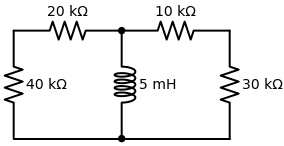
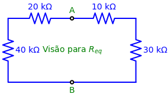

# Problema 7.14

> **Objetivo:** Resolver o problema passo a passo.
> **Instrução:** Leia o enunciado abaixo e tente resolver usando a metodologia.

**Enunciado:**
Calcule a constante de tempo do circuito na figura abaixo.

---

## ✍️ Sua Vez!

Este problema é rápido e rasteiro! Ele não quer saber corrente, não quer saber tensão... Ele quer **apenas** a Constante de Tempo ($\tau$).

Você já está careca de saber a fórmula:
$$\tau = \frac{L}{R_{eq}}$$

Para achar o $R_{eq}$, nós aplicamos o nosso querido Teorema de Thevenin: arrancamos o Indutor de $5\text{mH}$ e deixamos os terminais A e B escancarados para analisarmos a topologia.

Para acharmos a resistência equivalente vista pelos terminais A e B, imagine a corrente tentando ir de A para B: ela **obrigatoriamente** se divide em dois caminhos principais.

1. **Caminho da Esquerda:** A corrente passa pelo resistor de $20\text{k}\Omega$ e em seguida pelo de $40\text{k}\Omega$. Como estão na mesma rua sem saída intermediária, eles estão em **série**: $20\text{k} + 40\text{k} = 60\text{k}\Omega$.
2. **Caminho da Direita:** A mesma coisa! Passa pelo de $10\text{k}\Omega$ e desce pelo de $30\text{k}\Omega$. Total em **série**: $10\text{k} + 30\text{k} = 40\text{k}\Omega$.

Como a corrente dividiu no nó A e se encontrou no nó B, o grande blocão da esquerda ($60\text{k}$) está em **paralelo** com o blocão da direita ($40\text{k}$). 
Fazendo o "Produto pela Soma":
$$R_{eq} = \frac{60\text{k} \times 40\text{k}}{60\text{k} + 40\text{k}} = \frac{2400\text{k}}{100\text{k}} = \mathbf{24\text{k}\Omega}$$

### O Grande Final: Constante de Tempo
Agora é só aplicar a fórmula:
$$\tau = \frac{L}{R_{eq}}$$

Substituindo com as notações científicas corretas ($m = 10^{-3}$ e $k = 10^3$):
$$\tau = \frac{5 \times 10^{-3}}{24 \times 10^3}$$

Na divisão de potências de mesma base, você "sobe" a potência de baixo invertendo o sinal e depois soma:
$$\tau = \left(\frac{5}{24}\right) \times 10^{-3} \times 10^{-3}$$
$$\tau = 0,2083 \times 10^{-6} \, \text{s}$$

E como $10^{-6}$ atende pelo simpático nome de "micro" ($\mu$):
**Resposta Final:** $\tau \approx \mathbf{0,208 \, \mu\text{s}}$
