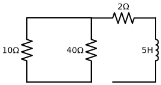
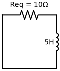
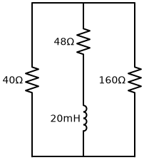
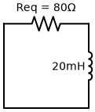

# Problema 7.15

**Enunciado:** Determine a constante de tempo para cada um dos circuitos da Figura 7.95.  
*(Página 267 do Livro / Página 287 do PDF)*

---

### A Regra Básica da Constante de Tempo
Para circuitos de primeira ordem do tipo RL (Resistor-Indutor), a constante de tempo $\tau$ dita quão rápido o circuito responde a mudanças e é calculada pela fórmula:
$$ \tau = \frac{L}{R_{eq}} $$
Onde $R_{eq}$ é a **resistência equivalente vista pelos terminais do indutor** (como se o indutor fosse a fonte de energia observando o resto do circuito).

---

### Circuito (a)

**1. Análise do Circuito e $R_{eq}$:**
O circuito (a) possui um indutor de $L = 5 \, H$. Se "arrancarmos" o indutor e olharmos para o circuito a partir dos seus terminais, veremos que a corrente precisa passar pelo resistor de $2 \, \Omega$ e, em seguida, se divide entre os resistores de $10 \, \Omega$ e $40 \, \Omega$.
Isso significa que os resistores de $10 \, \Omega$ e $40 \, \Omega$ estão em **paralelo**, e o resultado deles está em **série** com o de $2 \, \Omega$.

- Resistência em paralelo ($10 \parallel 40$):
  $$ R_p = \frac{10 \cdot 40}{10 + 40} = \frac{400}{50} = 8 \, \Omega $$
- Somando com o resistor em série:
  $$ R_{eq} = 8 + 2 = 10 \, \Omega $$

**2. Calculando a Constante de Tempo ($\tau$):**
$$ \tau = \frac{L}{R_{eq}} $$
$$ \tau = \frac{5}{10} = 0,5 \, s $$

**Circuito Equivalente (a):**

---

### Circuito (b)

**1. Análise do Circuito e $R_{eq}$:**
O circuito (b) possui um indutor de $L = 20 \, mH$. A regra de ouro é: **a resistência equivalente ($R_{eq}$) deve ser calculada a partir dos terminais do indutor, como se ele fosse a "fonte" do circuito.**

Se você imaginar a corrente saindo do indutor:
1. Ela é obrigada a subir e passar integralmente pelo resistor de $48 \, \Omega$. (Logo, o indutor está em **série** com os $48 \, \Omega$).
2. Ao chegar no nó superior, a corrente encontra dois caminhos para descer até o fio de baixo e voltar ao indutor:
   - Descer pelo ramo da esquerda ($40 \, \Omega$).
   - Descer pelo ramo da direita ($160 \, \Omega$).
3. Isso significa que os resistores de $40 \, \Omega$ e $160 \, \Omega$ estão em **paralelo** entre si.

Portanto, o indutor enxerga o resistor de $48 \, \Omega$ em série com o bloco paralelo de $40 \, \Omega \parallel 160 \, \Omega$.

- Resistência do bloco em paralelo ($40 \parallel 160$):
  $$ R_p = \frac{40 \cdot 160}{40 + 160} = \frac{6400}{200} = 32 \, \Omega $$
- Somando com o resistor em série ($48 \, \Omega$):
  $$ R_{eq} = 32 + 48 = 80 \, \Omega $$

**2. Calculando a Constante de Tempo ($\tau$):**
Lembrando que $20 \, mH = 20 \cdot 10^{-3} \, H$.
$$ \tau = \frac{L}{R_{eq}} $$
$$ \tau = \frac{20 \cdot 10^{-3}}{80} = \frac{20}{80} \cdot 10^{-3} = 0,25 \cdot 10^{-3} \, s $$
Ou seja:
$$ \tau = 0,25 \, ms \, (ou \, 250 \, \mu s) $$

**Circuito Equivalente (b):**

---
**✅ Resumo Final:**
- **(a)** $\tau = 0,5 \, s$
- **(b)** $\tau = 0,25 \, ms$
