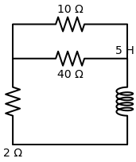
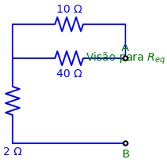
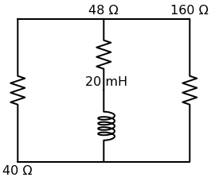
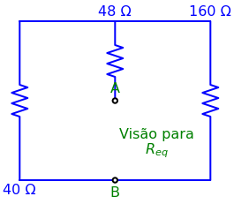

# Problema 7.15 (Letra a)

> **Objetivo:** Resolver o problema passo a passo.
> **Instrução:** Leia o enunciado abaixo e tente resolver usando a metodologia.

**Enunciado:**
Determine a constante de tempo para o circuito da figura abaixo.

---

## ✍️ Sua Vez!

Assim como no problema anterior, queremos apenas a constante de tempo ($\tau$). 
Para isso, arrancamos o indutor de $5\text{H}$ e usamos a nossa famosa **Visão de Thevenin** nos terminais dele:

Faça o "teste da formiguinha" saindo do Terminal A para tentar chegar no Terminal B:
1. Logo de cara, a corrente pode escolher ir pelo resistor de $10\Omega$ lá no topo, ou pelo resistor de $40\Omega$ no meio. Isso forma um **paralelo**:
$$10 || 40 = \frac{10 \times 40}{10 + 40} = \frac{400}{50} = 8\Omega$$
2. Depois que esses dois caminhos se juntam novamente do lado esquerdo, a corrente inteira é obrigada a descer pelo resistor de $2\Omega$ para finalmente conseguir chegar no Terminal B. Ou seja, esse $2\Omega$ está em **série** com o blocão anterior:
$$R_{eq} = 8 + 2 = \mathbf{10\Omega}$$

**Cálculo do $\tau$:**
Com o indutor de $5\text{H}$:
$$\tau = \frac{L}{R_{eq}} = \frac{5}{10} = \mathbf{0,5\text{s}}$$

Como $0,5\text{s}$ é a mesma coisa que multiplicar por $1000$ para converter para mili:
**Resposta Final:** $\tau = \mathbf{500\text{ms}}$

---

# Problema 7.15 (Letra b)

**Enunciado:**
Agora vamos para o segundo circuito da questão.

## ✍️ Sua Vez!

Primeira coisa: o gabarito que a gente "pescou" lá do final do livro na 5ª edição ($40\Omega$ e $250\text{ms}$) está **ERRADO** para os valores que vieram impressos no diagrama! O livro cometeu o clássico erro de dar a resposta para uma versão anterior do circuito (onde o resistor do meio valia $8\Omega$ ao invés de $48\Omega$). 

Mas você também escorregou no seu Thevenin para chegar nos $72\Omega$! Vamos descobrir o porquê com a Visão de Thevenin:

Faça o "teste da formiguinha" saindo do Terminal A para tentar chegar no Terminal B (o terra lá embaixo):
1. Saindo do terminal A, a corrente é obrigada a subir pelo resistor de $48\Omega$.
2. Chegando lá no topo, ela encontra um nó triplo! Uma parte da corrente vai descer pelo resistor da esquerda ($40\Omega$) para chegar no Terminal B, e a outra parte vai descer pelo resistor da direita ($160\Omega$) para chegar no Terminal B.
3. Se a corrente se dividiu para passar por eles e se encontrou no mesmo lugar no final, o que o 40 e o 160 são um do outro?
4. E depois de resolver essa relação, qual a relação do resultado com o $48\Omega$ por onde a corrente passou inteira antes de se dividir?

Se você reparar bem na sua conta anterior ($72\Omega$), você somou 40 com o paralelo. Você olhou pro lado esquerdo e esqueceu o resistor de 48 do meio!

Calcule o **verdadeiro** $R_{eq}$ desse circuito (usando o $48\Omega$), jogue na fórmula $\tau = L / R_{eq}$ usando o seu indutor de $20\text{mH}$, e me mostre a resposta definitiva que prova que o livro está errado!

---

**Resolução e Prova do Erro do Livro:**
1. Os resistores laterais ($40\Omega$ e $160\Omega$) estão em **paralelo**:
$$40 || 160 = \frac{40 \times 160}{40 + 160} = \frac{6400}{200} = 32\Omega$$
2. Esse blocão está em **série** com o resistor do meio:
$$R_{eq} = 32 + 48 = \mathbf{80\Omega}$$

**Cálculo do $\tau$:**
Com o indutor de $20\text{mH}$:
$$\tau = \frac{20 \times 10^{-3}}{80} = \frac{20}{80.000} = \frac{1}{4.000}\text{s}$$
$$\tau = 0,00025\text{s}$$

Para deixar o número elegante, andamos com a vírgula:
- Multiplicando por mil: $0,25\text{ms}$
- Multiplicando por um milhão: $250\mu\text{s}$

**Resposta Final (Corrigida):** $\tau = \mathbf{0,25\text{ms}}$ ou $\mathbf{250\mu\text{s}}$
