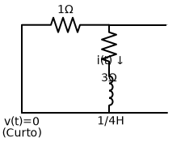
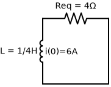

# Problema 7.17

**Enunciado:** Considere o circuito da Figura 7.97. Determine $v_o(t)$ se $i(0) = 6 \, A$ e $v(t) = 0$.

---

### 1. Análise Inicial do Circuito
O problema estabelece que para $t > 0$, a fonte de tensão $v(t) = 0$. Isso significa que a fonte de tensão atua como um **curto-circuito** (um fio liso fechando o lado esquerdo).

Os terminais da direita estão abertos (circuito aberto), o que significa que nenhuma corrente pode fluir pelo ramo mais à direita (apenas medimos a tensão $v_o(t)$ ali).
Sendo assim, o circuito se reduz a uma **única malha fechada** composta pelo resistor de $1 \, \Omega$, pelo resistor de $3 \, \Omega$ e pelo indutor de $1/4 \, H$. Como todos eles formam um caminho único para a corrente fluir circularmente, estão todos **em série**.

### 2. Cálculo da Resistência Equivalente ($R_{eq}$)
A resistência equivalente vista pelo indutor é simplesmente a soma dos dois resistores em série na malha.

- $R_{eq} = 1 \, \Omega + 3 \, \Omega = 4 \, \Omega$

### 3. Cálculo da Constante de Tempo ($\tau$)
$$ \tau = \frac{L}{R_{eq}} $$
$$ \tau = \frac{1/4}{4} = \frac{1}{16} \, s $$

### 4. Determinando a Corrente no Indutor $i(t)$
Sendo a corrente inicial dada por $i(0) = 6 \, A$:
$$ i(t) = i(0) e^{-t/\tau} $$
$$ i(t) = 6 e^{-16t} \, A \quad \text{para } t > 0 $$

### 5. Determinando a Tensão $v_o(t)$
A tensão $v_o(t)$ está sendo medida entre os dois nós abertos na direita, que estão conectados em paralelo ao ramo central. Isso significa que $v_o(t)$ é exatamente a tensão no topo do ramo central em relação ao terra (fio inferior).

Pela Lei das Malhas de Kirchhoff, a tensão no topo do circuito é definida pela queda de tensão no resistor de $1 \, \Omega$. A corrente $i(t)$ circula no sentido anti-horário na nossa malha fechada (desce no meio, vai para a esquerda, sobe no curto-circuito, e vai para a direita passando pelo resistor de $1 \, \Omega$).
Como a corrente entra no resistor de $1 \, \Omega$ pela esquerda (que está no terra, logo em $0 V$), a tensão logo após o resistor será negativa:
  $$ v_o(t) = - R \cdot i(t) $$
  $$ v_o(t) = - 1 \cdot (6 e^{-16t}) $$
  $$ v_o(t) = -6 e^{-16t} \, V $$

*(Curiosidade: Você chegaria exatamente no mesmo valor se somasse a tensão do indutor e do resistor de 3 ohms no centro: $v_o(t) = v_{3\Omega} + v_L = 3 \cdot i(t) + L \frac{di}{dt} = 18 e^{-16t} + \frac{1}{4}(-96 e^{-16t}) = 18 e^{-16t} - 24 e^{-16t} = -6 e^{-16t} \, V$.)*

---
**✅ Resposta Final:**
$$ v_o(t) = -6 e^{-16t} \, V $$
