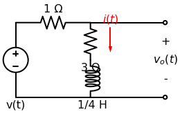
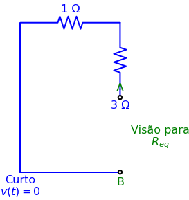

# Problema 7.17

> **Objetivo:** Resolver o problema passo a passo.
> **Instrução:** Leia o enunciado abaixo e tente resolver usando a metodologia.

**Enunciado:**
Considere o circuito abaixo. Determine $v_o(t)$ se $i(0) = 6\text{A}$ e $v(t) = 0$.

---

## ✍️ Sua Vez!

Bem-vindo ao Lote 4! Aqui as coisas começam a misturar tudo que aprendemos. 

Neste circuito, o enunciado nos dá uma informação de ouro: **$v(t) = 0$**. 
Uma fonte de tensão que vale zero volts é nada mais, nada menos que um **curto-circuito** (um fio liso). Além disso, temos uma corrente inicial no indutor de $6\text{A}$. Isso significa que estamos lidando com uma **Resposta Natural** pura!

Para resolver, vamos usar a nossa velha tática de achar o $R_{eq}$ pela Visão de Thevenin. Eu troquei a fonte $v(t)$ por um fio liso (curto) e abri o buraco do indutor nos terminais A e B:

Faça o "teste da formiguinha" saindo do Terminal A para tentar chegar no Terminal B:
1. Ela tem que passar pelo resistor de $3\Omega$.
2. Depois disso, ela chega no nó superior. O lado direito do circuito está totalmente aberto (não passa corrente). A única saída é ir para a esquerda!
3. Ela passa pelo resistor de $1\Omega$ e desce pelo fio liso para finalmente chegar no Terminal B (terra).

**1. Resistência Equivalente:**
Como o lado direito está aberto, o resistor de $3\Omega$ está em série direta com o de $1\Omega$ (já que o curto-circuito na esquerda fecha o caminho entre eles).
$$R_{eq} = 3 + 1 = \mathbf{4\Omega}$$

**2. Constante de Tempo:**
$$\tau = \frac{L}{R_{eq}} = \frac{1/4}{4} = \mathbf{\frac{1}{16}\text{s}}$$

**3. Equação da Corrente:**
$$i(t) = i(0)e^{-t/\tau} = \mathbf{6e^{-16t}\text{ A}}$$

---

## Parte 2: O xeque-mate ($v_o(t)$)

A corrente $i(t)$ a gente já sabe que é $6e^{-16t}$ e que ela aponta para **baixo** no ramo do meio.
Mas o problema quer saber o valor de **$v_o(t)$**, que é a tensão naqueles terminais abertos ali na direita.

Como os terminais estão em paralelo com o ramo do meio, a tensão $v_o(t)$ é literalmente a tensão em cima da "dupla" (resistor de $3\Omega$ + indutor). Você tem **dois caminhos** para resolver isso. Escolha o que preferir:

**Caminho 1 (A Força Bruta):**
A tensão $v_o(t)$ é a soma da tensão no resistor de 3 mais a tensão no indutor.
1. Calcule a tensão no resistor: $v_R = R \cdot i(t) = 3 \cdot i(t)$.
2. Calcule a tensão no indutor: $v_L = L \cdot \frac{di}{dt}$ (você vai ter que derivar o $6e^{-16t}$).
3. Some os dois: $v_o(t) = v_R + v_L$.

**Caminho 2 (O Truque Ninja):**
Olhe para o circuito fechado pela esquerda. A corrente $i(t)$ desce pelo meio, vira à esquerda no chão, sobe pelo curto-circuito, e vira à direita passando pelo resistor de $1\Omega$.
Se você fizer uma Lei de Kirchhoff das Tensões (LKT) na malha da esquerda inteira, você descobre que a tensão no ramo do meio (que é o $v_o(t)$) é exatamente igual à tensão em cima do resistor de $1\Omega$, mas com o sinal trocado (porque a corrente entra pelo lado negativo de quem está do outro lado)!
Ou seja: $v_o(t) = - v_{\text{resistor\_de\_1}}$
Sabendo que a corrente que passa no resistor de 1 é a mesma $i(t)$... a conta sai de cabeça!

Escolha a sua arma (Caminho 1 ou 2), faça a conta e me diga: Qual é a equação final de **$v_o(t)$**?

---

**Resolução Final (O Truque Ninja):**
Usando o Caminho 2, sabemos que a malha da esquerda inteira fecha um ciclo. A tensão $v_o(t)$ medida nos terminais abertos é exatamente a mesma tensão que está em paralelo com todo o ramo do meio.
Ao olhar para o circuito curto-circuitado, o ramo do meio está em **paralelo reverso** com o resistor de $1\Omega$ (já que o nó inferior liga ambos, e o nó superior liga ambos, mas a corrente "entra" no resistor e "desce" no ramo).
Portanto:
$$v_o(t) = - v_{\text{resistor 1}\Omega}$$
$$v_o(t) = - (R \cdot i(t))$$
$$v_o(t) = - (1 \cdot 6e^{-16t})$$
$$v_o(t) = \mathbf{-6e^{-16t}\text{ V}}$$
