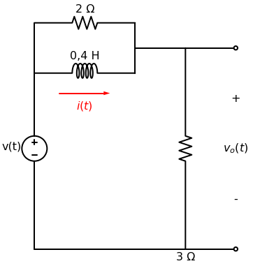
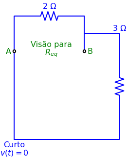

# Problema 7.18

> **Objetivo:** Resolver o problema passo a passo.
> **Instrução:** Leia o enunciado abaixo e tente resolver usando a metodologia.

**Enunciado:**
Para o circuito da Figura 7.98, determine $v_o(t)$ quando $i(0) = 5\text{A}$ e $v(t) = 0$.

---

## ✍️ Sua Vez!

Opa, eu vi a imagem que você mandou e corrigi tudo na mesma hora! Não tem nada de "irmão gêmeo", a topologia aqui é bem diferente: o indutor de $0,4\text{H}$ está **em paralelo** com o resistor de $2\Omega$ no ramo superior.

Mas a lógica matadora da Resposta Natural é a mesma! A fonte $v(t) = 0$ atua como um **curto-circuito**.

Se você olhar a **Visão de Thevenin** abaixo (onde eu tirei o indutor e substituí a fonte por um fio azul), perceba a mágica:
O fio azul conecta o lado esquerdo de tudo diretamente com o "chão". Isso significa que o lado esquerdo do circuito (Terminal A) está eletricamente no MESMO PONTO que a parte de baixo (Terminal B).
Ou seja, ao olhar a partir dos terminais A e B, **todos os componentes acabam ficando em paralelo entre si**!

Com essa dica de ouro, calcule nosso combo de 3 passos para o indutor:
1. Qual é a nova Resistência Equivalente ($R_{eq}$)? (Cuidado: o resistor de 2 e o resistor de 3 estão em...)
2. Qual é o novo $\tau$? (Lembrando que o indutor é $0,4\text{H}$)
3. Sabendo que o indutor começa com $i(0) = 5\text{A}$, qual a equação inicial de $i(t)$?

> [!TIP]
> **Receita de Bolo: Análise de Circuitos de Primeira Ordem**
> 1. **Análise em t < 0:** Identifique o estado da chave. Calcule $v(0)$ para capacitores ou $i(0)$ para indutores (eles se comportam como circuito aberto e curto-circuito, respectivamente, em CC).
> 2. **Análise em t > 0:** Redesenhe o circuito com a chave na nova posição. Encontre a resistência equivalente $R_{eq}$ vista pelo capacitor/indutor.
> 3. **Constante de Tempo ($\tau$):** Calcule $\tau = R_{eq}C$ (para RC) ou $\tau = L/R_{eq}$ (para RL).

## ✍️ Sua Vez!
*(Deixe sua resolução passo a passo aqui)*
