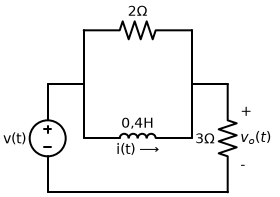
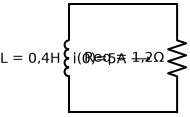

# Problema 7.18

**Enunciado:** Para o circuito da Figura 7.98, determine $v_o(t)$ quando $i(0) = 5 \, A$ e $v(t) = 0$.

---

### 1. Análise Inicial do Circuito
O problema nos pede a resposta natural do circuito para $t > 0$. Foi dado que $v(t) = 0$, o que significa que a fonte de tensão atua como um **curto-circuito** (um fio liso conectado ao terra). 

Com a fonte de tensão "em curto", o terminal esquerdo do resistor de $2 \, \Omega$ e do indutor de $0,4 \, H$ ficam conectados diretamente ao fio de baixo. 

Se você observar bem, as pontas direitas do resistor de $2 \, \Omega$ e do indutor de $0,4 \, H$ já estão conectadas no topo do resistor de $3 \, \Omega$. Com o curto-circuito da fonte do lado esquerdo, as pontas esquerdas deles passam a estar conectadas na parte de baixo do resistor de $3 \, \Omega$.
Isso resulta em uma topologia em que o resistor de $2 \, \Omega$, o indutor de $0,4 \, H$ e o resistor de $3 \, \Omega$ ficam todos **em paralelo**!

### 2. Cálculo da Resistência Equivalente ($R_{eq}$)
Do ponto de vista do indutor, ele vai descarregar sua energia armazenada sobre uma resistência equivalente formada pelos outros dois resistores em paralelo.

- $R_{eq} = 2 \, \Omega \parallel 3 \, \Omega$
- $R_{eq} = \frac{2 \cdot 3}{2 + 3} = \frac{6}{5} = 1,2 \, \Omega$

### 3. Cálculo da Constante de Tempo ($\tau$)
A constante de tempo de um circuito RL é dada por:
$$ \tau = \frac{L}{R_{eq}} $$
$$ \tau = \frac{0,4}{1,2} = \frac{1}{3} \, s $$

### 4. Determinando a Corrente no Indutor $i(t)$
Sabemos que a corrente no indutor para um circuito RL de fonte nula decai exponencialmente:
$$ i(t) = i(0) e^{-t/\tau} $$
$$ i(t) = 5 e^{-3t} \, A \quad \text{para } t > 0 $$

*(Lembre-se que se $\tau = 1/3$, então $-t/\tau = -3t$)*

### 5. Determinando a Tensão $v_o(t)$
A tensão $v_o(t)$ é a tensão sobre o resistor de $3 \, \Omega$. Mas como todos os elementos estão em paralelo, essa é a mesmíssima tensão em cima do resistor de $2 \, \Omega$ e do próprio indutor!

Vamos aplicar a Lei de Ohm analisando o nó superior. O indutor $i(t)$ aponta para a direita, o que significa que ele está mandando corrente diretamente para dentro do nó superior. 
Essa corrente total de $i(t)$ vai ter que descer para o terra passando pelos resistores. Em vez de calcular a divisão de corrente, basta usar a resistência equivalente de $1,2 \, \Omega$:
  $$ v_o(t) = i(t) \cdot R_{eq} $$
  $$ v_o(t) = (5 e^{-3t}) \cdot 1,2 $$
  $$ v_o(t) = 6 e^{-3t} \, V $$

---
**✅ Resposta Final:**
$$ v_o(t) = 6 e^{-3t} \, V $$
