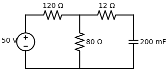

# Problema 7.2

> **Objetivo:** Resolver o problema passo a passo.
> **Instrução:** Leia o enunciado abaixo e tente resolver usando a metodologia.

**Enunciado:**
Determine a constante de tempo para o circuito RC abaixo.

---

> [!TIP]
> **Receita de Bolo: Análise de Circuitos de Primeira Ordem**
> 1. **Análise em t < 0:** Identifique o estado da chave. Calcule $v(0)$ para capacitores ou $i(0)$ para indutores (eles se comportam como circuito aberto e curto-circuito, respectivamente, em CC).
> 2. **Análise em t > 0:** Redesenhe o circuito com a chave na nova posição. Encontre a resistência equivalente $R_{eq}$ vista pelo capacitor/indutor.
> 3. **Constante de Tempo ($\tau$):** Calcule $\tau = R_{eq}C$ (para RC) ou $\tau = L/R_{eq}$ (para RL).
> 4. **Equação Final:** Use a fórmula da resposta $x(t) = x(\infty) + [x(0) - x(\infty)]e^{-t/\tau}$.

## ✍️ Sua Vez!

### Passo 1: O cálculo de $v(0)$ (Opcional para treino)
Mesmo que a questão não peça, calcular a tensão inicial é um excelente treino. Você percebeu perfeitamente que o capacitor em Corrente Contínua vira uma chave aberta, o que faz com que a corrente pelo resistor de $12 \, \Omega$ seja nula.

A tensão $v(0)$ no capacitor será exatamente a tensão no resistor de $80 \, \Omega$. Como os resistores de 120 e 80 estão em série com a fonte, usamos o **Divisor de Tensão** (lembre-se que é uma multiplicação):

$$V_{80} = V_{total} \times \frac{R_{alvo}}{R_{total}}$$
$$V_{80} = 50 \times \frac{80}{120 + 80}$$
$$v(0) = 50 \times \frac{80}{200} = 50 \times 0,4 = \mathbf{20 \, \text{V}}$$

---

### Passo 2: Achar o $R_{eq}$ (Para a Constante de Tempo $\tau$)
Você chutou $200 \, \text{V}$ (lembre-se que Resistência é medida em Ohms ($\Omega$) e não Volts). Você encontrou 200 porque somou $120 + 80$. Mas cuidado com a "pegadinha" topológica!

Para acharmos a resistência de Thévenin ($R_{eq}$) vista pelo capacitor:
1. Retiramos o capacitor (vamos olhar pelos "buracos" que ele deixou na direita).
2. "Desligamos" a fonte de $50\text{V}$ transformando-a em um **fio liso (curto-circuito)**.

Ao fechar um fio no lugar da fonte lá na esquerda, o resistor de $120 \, \Omega$ acaba ficando conectado aos mesmos dois pontos (nós) do resistor de $80 \, \Omega$. Ou seja, eles ficam em **PARALELO**! 

Sabendo disso, tente de novo: 
1. Faça o paralelo entre 120 e 80.
2. Como o resultado desse paralelo se junta com o resistor de 12 que está no caminho até o capacitor?
*(Escreva sua nova resposta aqui ou no chat)*
