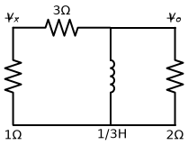
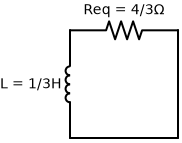

# Problema 7.23

**Enunciado:** Considere o circuito da Figura 7.103. Dado que $v_o(0) = 10 \, V$, determine $v_o$ e $v_x$ para $t > 0$.

---

### 1. Entendendo a Topologia e a Condição Inicial
O circuito não possui fontes ativas para $t > 0$, dependendo inteiramente da energia armazenada no indutor de $1/3 \, H$.
Note que o indutor está no ramo da direita, em paralelo direto com o resistor de $2 \, \Omega$ e com o ramo da esquerda (que contém a combinação em série de $3 \, \Omega$ e $1 \, \Omega$).

O problema não nos dá a corrente inicial do indutor $i_L(0)$ de bandeja, mas sim a tensão inicial sobre o resistor de $2 \, \Omega$: $v_o(0) = 10 \, V$.
Vamos usar a Lei de Kirchhoff dos Nós (LKC) no nó superior direito para descobrir $i_L(0)$. Considere que a corrente do indutor $i_L$ desce. A corrente que desce no resistor de $2 \, \Omega$ vale $\frac{v_o(0)}{2}$. A corrente que flui para a esquerda passa pelos resistores de $3 \, \Omega$ e $1 \, \Omega$ e vale $\frac{v_o(0)}{3+1} = \frac{v_o(0)}{4}$.
  $$ i_L(0) + \frac{10}{2} + \frac{10}{4} = 0 $$
  $$ i_L(0) + 5 + 2,5 = 0 \implies i_L(0) = -7,5 \, A $$
Isso nos garante que a condição inicial é consistente e que o circuito está devidamente caracterizado.

### 2. Cálculo da Resistência Equivalente ($R_{eq}$)
Do ponto de vista do indutor, ele injeta sua energia num circuito formado por:
- O resistor de $2 \, \Omega$ no mesmo ramo paralelo.
- Os resistores de $3 \, \Omega$ e $1 \, \Omega$ em série no outro ramo paralelo ($3 + 1 = 4 \, \Omega$).

A resistência equivalente é o paralelo entre esses dois caminhos:
  $$ R_{eq} = 2 \, \Omega \parallel 4 \, \Omega = \frac{2 \cdot 4}{2 + 4} = \frac{8}{6} = \frac{4}{3} \, \Omega $$

### 3. Cálculo da Constante de Tempo ($\tau$)
$$ \tau = \frac{L}{R_{eq}} $$
$$ \tau = \frac{1/3}{4/3} = \frac{1}{4} \, s $$

### 4. Determinando a Tensão $v_o(t)$
Como é um circuito RL natural (sem fontes) de primeira ordem, qualquer tensão ou corrente no circuito decai exponencialmente segundo a mesma constante de tempo. Como a constante é $1/4$, o expoente da exponencial será $-4t$.
Como já temos a condição inicial $v_o(0) = 10 \, V$:
$$ v_o(t) = v_o(0) e^{-t/\tau} $$
$$ v_o(t) = 10 e^{-4t} \, V \quad \text{para } t > 0 $$

### 5. Determinando a Tensão $v_x(t)$
A tensão $v_x(t)$ está em cima do resistor de $1 \, \Omega$.
O conjunto dos resistores da esquerda (de $3 \, \Omega$ e $1 \, \Omega$) está submetido à tensão $v_o(t)$ em seus terminais. Podemos simplesmente aplicar a regra do **divisor de tensão** para encontrar a tensão exclusivamente no resistor de $1 \, \Omega$:
  $$ v_x(t) = v_o(t) \cdot \frac{1}{1 + 3} $$
  $$ v_x(t) = \frac{v_o(t)}{4} $$
  $$ v_x(t) = \frac{10 e^{-4t}}{4} $$
  $$ v_x(t) = 2,5 e^{-4t} \, V $$

---
**✅ Respostas Finais:**
$$ v_o(t) = 10 e^{-4t} \, V $$
$$ v_x(t) = 2,5 e^{-4t} \, V $$
