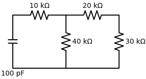
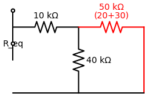
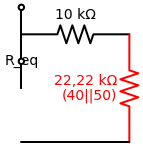

# Problema 7.3

> **Objetivo:** Resolver o problema passo a passo.
> **Instrução:** Leia o enunciado abaixo e tente resolver usando a metodologia.

**Enunciado:**
Determine a constante de tempo para o circuito da figura abaixo.

---

> [!TIP]
> **Receita de Bolo: Análise de Circuitos de Primeira Ordem**
> 1. **Análise em t < 0:** Identifique o estado da chave. Calcule $v(0)$ para capacitores ou $i(0)$ para indutores (eles se comportam como circuito aberto e curto-circuito, respectivamente, em CC).
> 2. **Análise em t > 0:** Redesenhe o circuito com a chave na nova posição. Encontre a resistência equivalente $R_{eq}$ vista pelo capacitor/indutor.
> 3. **Constante de Tempo ($\tau$):** Calcule $\tau = R_{eq}C$ (para RC) ou $\tau = L/R_{eq}$ (para RL).
> 4. **Equação Final:** Use a fórmula da resposta $x(t) = x(\infty) + [x(0) - x(\infty)]e^{-t/\tau}$.

## ✍️ Sua Vez!

Como não existe nenhuma fonte no circuito, assumimos que o capacitor já estava carregado. Portanto, pulamos direto para o cálculo da **Constante de Tempo ($\tau$)**.

### Passo 1: Achar o $R_{eq}$ 
Para acharmos a resistência equivalente vista pelo capacitor, primeiro retiramos o capacitor de 100 pF e olhamos pelos seus terminais (na extrema esquerda).

Começando a simplificar de trás para a frente (da direita para a esquerda):

1. **Série de 20k e 30k:** A corrente que passa no resistor de 20k não tem para onde fugir e entra direto no de 30k. Eles formam um ramo em série.
   $$R_s = 20k + 30k = \mathbf{50 \, \text{k}\Omega}$$

   **Circuito após primeira simplificação:**
   

2. **Paralelo de 40k e 50k:** O ramo equivalente de 50k que acabamos de achar está conectado nos exatos mesmos dois pontos do resistor de 40k.
   $$R_p = \frac{40k \times 50k}{40k + 50k} = \frac{2000}{90} \approx \mathbf{22,22 \, \text{k}\Omega}$$

   **Circuito após segunda simplificação:**
   

3. **Série Final:** Agora, o bloco de 22,22k está em série com o resistor de 10k!
   $$R_{eq} = 10k + 22,22k = \mathbf{32,22 \, \text{k}\Omega}$$
   *(Ou na forma de fração exata: $10 + \frac{200}{9} = \frac{290}{9} \, \text{k}\Omega$)*

---

### Passo 2: Calcular $\tau$
Sabendo que o $R_{eq} \approx 32,22\text{k}\Omega$ e $C = 100\text{pF}$.

Tente calcular o $\tau$ agora (cuidado com as letras `k` que é $10^3$ e `p` que é $10^{-12}$)!
*(Escreva sua nova resposta aqui ou no chat)*
