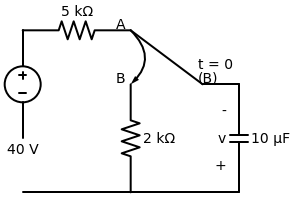
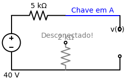

# Problema 7.4

> **Objetivo:** Resolver o problema passo a passo.
> **Instrução:** Leia o enunciado abaixo e tente resolver usando a metodologia.

**Enunciado:**
7.4 	 A chave da Figura 7.84 se encontra na posição A há um 
bom tempo. Suponha que a chave mude instantaneamente 
de A para B em t = 0. Determine v para t 7 0.
+
2 k:
5 k:
A chave do circuito abaixo se encontra na posição A há um bom tempo. Suponha que a chave mude instantaneamente de A para B em $t = 0$. Determine $v(t)$ para $t > 0$.

---

> [!TIP]
> **Receita de Bolo: Análise de Circuitos de Primeira Ordem**
> 1. **Análise em t < 0:** Identifique o estado da chave. Calcule $v(0)$ para capacitores ou $i(0)$ para indutores (eles se comportam como circuito aberto e curto-circuito, respectivamente, em CC).
> 2. **Análise em t > 0:** Redesenhe o circuito com a chave na nova posição. Encontre a resistência equivalente $R_{eq}$ vista pelo capacitor/indutor.
> 3. **Constante de Tempo ($\tau$):** Calcule $\tau = R_{eq}C$ (para RC) ou $\tau = L/R_{eq}$ (para RL).
> 4. **Equação Final:** Use a fórmula da resposta $x(t) = x(\infty) + [x(0) - x(\infty)]e^{-t/\tau}$.

## ✍️ Sua Vez!

### Passo 1: O cálculo de $v(0)$ (Para $t < 0$)
Antes do tempo zero, a chave estava descansando na posição **A**. Isso significa que a perninha da chave tocava no fio de cima. 
O terminal B (que é a cabeça do resistor de $2\text{k}\Omega$) ficou **desconectado do resto do circuito**, flutuando no ar.

Veja como fica a topologia verdadeira do circuito em $t < 0$, com o capacitor assumindo o seu papel de circuito aberto em Corrente Contínua:

Analisando a imagem:
1. O resistor de 2k está cinza porque por ele não passa absolutamente nada (uma das pontas dele não vai a lugar nenhum). Logo, **ele não está em série com ninguém**.
2. O capacitor é que está perfeitamente em série com o resistor de 5k! A corrente sai da fonte de 40V, passa pelo 5k, chega no capacitor aberto e para.
3. Como o capacitor bloqueia a passagem (corrente = 0), a queda de tensão no resistor de 5k é nula ($V = R \cdot i = 5000 \cdot 0 = 0$).

Olhando para esse diagrama claríssimo, quanto é que vale a tensão $v(0)$ nas pernas do capacitor?
*(Escreva sua resposta aqui ou no chat)*
