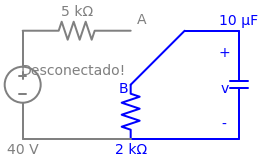

# Problema 7.4

> **Objetivo:** Resolver o problema passo a passo.
> **Instrução:** Leia o enunciado abaixo e tente resolver usando a metodologia.

**Enunciado:**
7.4 	 A chave da Figura 7.84 se encontra na posição A há um 
bom tempo. Suponha que a chave mude instantaneamente 
de A para B em t = 0. Determine v para t 7 0.
+
2 k:
5 k:
A chave do circuito abaixo se encontra na posição A há um bom tempo. Suponha que a chave mude instantaneamente de A para B em $t = 0$. Determine $v(t)$ para $t > 0$.

---

> [!TIP]
> **Receita de Bolo: Análise de Circuitos de Primeira Ordem**
> 1. **Análise em t < 0:** Identifique o estado da chave. Calcule $v(0)$ para capacitores ou $i(0)$ para indutores (eles se comportam como circuito aberto e curto-circuito, respectivamente, em CC).
> 2. **Análise em t > 0:** Redesenhe o circuito com a chave na nova posição. Encontre a resistência equivalente $R_{eq}$ vista pelo capacitor/indutor.
> 3. **Constante de Tempo ($\tau$):** Calcule $\tau = R_{eq}C$ (para RC) ou $\tau = L/R_{eq}$ (para RL).
> 4. **Equação Final:** Use a fórmula da resposta $x(t) = x(\infty) + [x(0) - x(\infty)]e^{-t/\tau}$.

## ✍️ Sua Vez!

### Passo 1: O cálculo de $v(0)$ (Para $t < 0$)
Antes do tempo zero, a chave estava descansando na posição **A**. Isso significa que a perninha da chave tocava no fio de cima. 
O terminal B (que é a cabeça do resistor de $2\text{k}\Omega$) ficou **desconectado do resto do circuito**, flutuando no ar.

Veja como fica a topologia verdadeira do circuito em $t < 0$, com o capacitor assumindo o seu papel de circuito aberto em Corrente Contínua:

Analisando a imagem:
1. O resistor de 2k está cinza porque por ele não passa absolutamente nada (uma das pontas dele não vai a lugar nenhum). Logo, **ele não está em série com ninguém**.
2. O capacitor é que está perfeitamente em série com o resistor de 5k! A corrente sai da fonte de 40V, passa pelo 5k, chega no capacitor aberto e para.
3. Como o capacitor bloqueia a passagem (corrente = 0), a queda de tensão no resistor de 5k é nula ($V = R \cdot i = 5000 \cdot 0 = 0$).

Olhando para esse diagrama, você pode ter o instinto de pensar: *"Ah, se a corrente é zero, a tensão é zero!"*. Mas cuidado! 

Pense no capacitor como uma **caixa d'água** e a fonte de 40V como uma **bomba**. Durante o tempo em que a chave ficou no A, a bomba encheu a caixa d'água. A corrente ficou zero justamente porque a caixa encheu até o topo e não cabe mais nada! 

Em termos de circuito, usamos a Lei de Kirchhoff das Tensões (LKT):
$$V_{fonte} = V_{Resistor} + V_{Capacitor}$$

Como a corrente é zero, a queda de tensão no resistor de 5k é $0\text{V}$ (Lei de Ohm: $V = 5000 \cdot 0$). Portanto:
$$40 = 0 + v(0)$$
$$v(0) = \mathbf{40 \, \text{V}}$$

O capacitor está "carregadíssimo" com 40V.

---

### Passo 2: O Circuito em $t > 0$ (A Descarga)
Agora a chave vira para a posição B. Você acertou em cheio numa coisa: **a fonte de 40V passa a ser ignorada**. 

A fonte e o resistor de 5k ficam literalmente com as "pernas" cortadas para a direita, saindo do jogo. Mas o capacitor (nossa "caixa d'água cheia") com $40\text{V}$ agora está fechado em um circuito exclusivo com o resistor de $2\text{k}\Omega$:

Daqui para a frente, é pura receita de bolo!

**1. O $R_{eq}$:**
Olhando pelos terminais do capacitor, a única coisa que sobrou viva no circuito azul é o resistor de $2\text{k}\Omega$.
$$R_{eq} = \mathbf{2 \, \text{k}\Omega}$$

**2. O $\tau$:**
$$\tau = R_{eq} \times C$$
$$\tau = (2 \times 10^3) \times (10 \times 10^{-6})$$
$$\tau = 20 \times 10^{-3} = \mathbf{0,02 \, \text{s}}$$

**3. A Equação Final:**
Jogando na nossa fórmula mágica de descarga $v(t) = v(0)e^{-t/\tau}$:
$$v(t) = 40 e^{-t / 0,02}$$

Sabendo que $\frac{1}{0,02} = 50$, nossa resposta oficial (e perfeita) é:
$$v(t) = \mathbf{40 e^{-50t} \, \text{V}, \quad t > 0}$$
