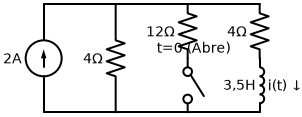
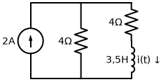
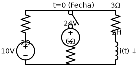
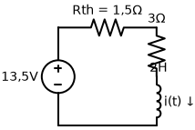

# Problema 7.54

**Enunciado:** Obtenha a corrente no indutor para $t < 0$ e $t > 0$ em cada um dos circuitos da Figura 7.120.  
*(Página 291 do PDF)*

---

## Circuito (a)

### 1. Análise para $t < 0$
Antes do instante $t=0$, a chave está **fechada** há muito tempo. Isso significa que o circuito atingiu o regime permanente de corrente contínua (CC) e o indutor de $3,5 \, H$ atua como um **curto-circuito**.
O circuito é formado por uma fonte de corrente de $2 \, A$ conectada a três ramos em paralelo:
- Resistor de $4 \, \Omega$
- Resistor de $12 \, \Omega$ (conectado pela chave fechada)
- Ramo com o resistor de $4 \, \Omega$ e o indutor (em curto).

A resistência equivalente em paralelo ($R_p$) vista pela fonte de $2 \, A$ é:
$$ R_p = 4 \parallel 12 \parallel 4 $$
Sabemos que $4 \parallel 4 = 2 \, \Omega$.
Logo, $R_p = 2 \parallel 12 = \frac{2 \cdot 12}{2 + 12} = \frac{24}{14} = \frac{12}{7} \, \Omega$.

A tensão no nó superior (que é a mesma para todos os ramos paralelos) é:
$$ V = I \cdot R_p = 2 \cdot \frac{12}{7} = \frac{24}{7} \, V $$

A corrente inicial no indutor $i(0)$, que é a corrente descendo pelo ramo do indutor (com seu resistor de $4 \, \Omega$ em série), é:
$$ i(0^-) = \frac{V}{4} = \frac{24/7}{4} = \frac{6}{7} \, A \quad (\text{aproximadamente } 0,857 \, A) $$

Portanto: **Para $t < 0$, $\quad i(t) = \frac{6}{7} \, A$**

### 2. Análise para $t > 0$
No instante $t=0$, a chave se **abre**, desconectando o resistor de $12 \, \Omega$ do circuito.

A topologia do circuito agora se resume a:
- Fonte de $2 \, A$ em paralelo com o resistor de $4 \, \Omega$ e em paralelo com o ramo do indutor (outro resistor de $4 \, \Omega$ + Indutor).

**Cálculo da corrente final $i(\infty)$:**
Quando $t \to \infty$, o indutor volta a ser um curto-circuito. Agora a fonte de $2 \, A$ alimenta apenas dois resistores de $4 \, \Omega$ em paralelo. Como as resistências são idênticas, a corrente se divide igualmente:
$$ i(\infty) = \frac{2 \, A}{2} = 1 \, A $$

**Cálculo da Constante de Tempo ($\tau$):**
Do ponto de vista do indutor, as outras resistências formam sua Resistência de Thevenin equivalente ($R_{eq}$). Desligando a fonte de corrente (abrindo-a), a resistência vista a partir dos terminais do indutor é a soma em série do seu próprio resistor com o resistor em paralelo da fonte:
$$ R_{eq} = 4 + 4 = 8 \, \Omega $$
$$ \tau = \frac{L}{R_{eq}} = \frac{3,5}{8} = \frac{7}{16} \, s \implies \frac{1}{\tau} = \frac{16}{7} \, s^{-1} $$

**Montando a Resposta de Degrau:**
$$ i(t) = i(\infty) + [i(0^+) - i(\infty)] e^{-t/\tau} $$
$$ i(t) = 1 + \left(\frac{6}{7} - 1\right) e^{-16t/7} $$
$$ i(t) = 1 - \frac{1}{7} e^{-16t/7} \, A $$

---

## Circuito (b)

### 1. Análise para $t < 0$
Para tempos antes de zero, a chave está **aberta**. O ramo do meio (com a fonte de $24 \, V$ e o resistor de $6 \, \Omega$) está desconectado.
O circuito funciona como uma única malha em série:
- Fonte de $10 \, V$ na esquerda.
- Resistor de $2 \, \Omega$ na esquerda.
- Resistor de $3 \, \Omega$ e Indutor de $2 \, H$ na direita.

Em regime permanente CC, o indutor vira um curto-circuito. A corrente gira na malha no sentido horário.
A corrente no indutor $i(0)$ é:
$$ i(0^-) = \frac{10}{2 + 3} = \frac{10}{5} = 2 \, A $$

Portanto: **Para $t < 0$, $\quad i(t) = 2 \, A$**

### 2. Análise para $t > 0$
No instante $t=0$, a chave **fecha**. O ramo do meio é inserido em paralelo no circuito, criando dois laços e injetando a energia da fonte de $24 \, V$.

**Transformação para Facilitar a Vida (Thevenin):**
Vamos determinar o Equivalente de Thevenin de todas as fontes que alimentam o ramo do indutor (olhando para a esquerda a partir do topo do resistor de $3 \, \Omega$).
O circuito ativo possui duas filiais em paralelo:
- Filial Esquerda: Fonte de $10 \, V$ em série com $2 \, \Omega$.
- Filial do Meio: Fonte de $24 \, V$ em série com $6 \, \Omega$.

A tensão de Thevenin ($V_{th}$) será a tensão paralela dos dois ramos (usando a conversão de fontes ou o teorema de Millman):
$$ V_{th} = \frac{\frac{V_1}{R_1} + \frac{V_2}{R_2}}{\frac{1}{R_1} + \frac{1}{R_2}} = \frac{\frac{10}{2} + \frac{24}{6}}{\frac{1}{2} + \frac{1}{6}} = \frac{5 + 4}{\frac{3}{6} + \frac{1}{6}} = \frac{9}{4/6} = 13,5 \, V $$

A resistência de Thevenin equivalente ($R_{th}$) é o paralelo das duas resistências:
$$ R_{th} = 2 \parallel 6 = \frac{2 \cdot 6}{2 + 6} = \frac{12}{8} = 1,5 \, \Omega $$

O circuito passa a ser uma única malha Thevenin equivalente super simples!

**Cálculo da corrente final $i(\infty)$:**
A resistência total dessa nova malha é $R_{eq\_total} = R_{th} + 3 = 1,5 + 3 = 4,5 \, \Omega$.
A corrente no regime permanente com o indutor em curto é:
$$ i(\infty) = \frac{V_{th}}{R_{eq\_total}} = \frac{13,5}{4,5} = 3 \, A $$

**Cálculo da Constante de Tempo ($\tau$):**
$$ \tau = \frac{L}{R_{eq\_total}} = \frac{2}{4,5} = \frac{2}{9/2} = \frac{4}{9} \, s \implies \frac{1}{\tau} = \frac{9}{4} = 2,25 \, s^{-1} $$

**Montando a Resposta de Degrau:**
$$ i(t) = i(\infty) + [i(0^+) - i(\infty)] e^{-t/\tau} $$
$$ i(t) = 3 + (2 - 3) e^{-2,25t} $$
$$ i(t) = 3 - e^{-2,25t} \, A $$
