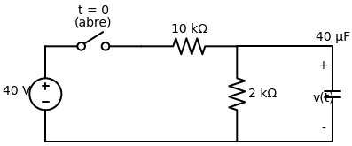
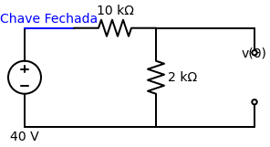
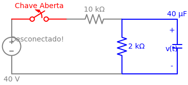

# Problema 7.6

> **Objetivo:** Resolver o problema passo a passo.
> **Instrução:** Leia o enunciado abaixo e tente resolver usando a metodologia.

**Enunciado:**
A chave na figura abaixo foi fechada há um bom tempo e é aberta em $t = 0$. Determine $v(t)$ para $t \ge 0$.

---

> [!TIP]
> **Receita de Bolo: Análise de Circuitos de Primeira Ordem**
> 1. **Análise em t < 0:** Identifique o estado da chave. Calcule $v(0)$ para capacitores ou $i(0)$ para indutores (eles se comportam como circuito aberto e curto-circuito, respectivamente, em CC).
> 2. **Análise em t > 0:** Redesenhe o circuito com a chave na nova posição. Encontre a resistência equivalente $R_{eq}$ vista pelo capacitor/indutor.
> 3. **Constante de Tempo ($\tau$):** Calcule $\tau = R_{eq}C$ (para RC) ou $\tau = L/R_{eq}$ (para RL).
> 4. **Equação Final:** Use a fórmula da resposta $x(t) = x(\infty) + [x(0) - x(\infty)]e^{-t/\tau}$.

## ✍️ Sua Vez!

### Passo 1: O cálculo de $v(0)$ (Para $t < 0$)
Antes do tempo zero, a chave estava **fechada**, agindo como um fio liso. 
E o nosso capacitor, em regime de corrente contínua, age como um **circuito aberto** (uma parede que não deixa a corrente passar). 

Veja como a topologia fica:

Como o ramo da direita (o capacitor) está rompido, a corrente da fonte só consegue girar na malha da esquerda, descendo pelo resistor de 2k.
Para descobrirmos a tensão no capacitor $v(0)$, notamos que ele está conectado diretamente em paralelo com o resistor de 2k (toca nos mesmos nós de cima e de baixo). 

Logo, basta usarmos o **Divisor de Tensão** para descobrir a queda de tensão no resistor de 2k:
$$v(0) = V_{2k} = 40 \cdot \left(\frac{2k}{10k + 2k}\right)$$
$$v(0) = 40 \cdot \left(\frac{2}{12}\right) = 40 \cdot \left(\frac{1}{6}\right) = \mathbf{\frac{20}{3} \, \text{V}}$$

---

### Passo 2: O Circuito em $t > 0$
Agora a nossa chave finalmente **abre**. O que vai acontecer com o circuito?

A regra de ouro diz que para acharmos o $R_{eq}$ visto pelo capacitor, devemos desligar as fontes independentes (fontes de tensão virariam curto-circuito). **PORÉM**, repare no que a abertura da chave causou fisicamente:
A chave cortou o fio! Isso significa que a fonte de 40V e o resistor de 10k foram completamente amputados do resto do circuito ativo. Não precisamos nem nos preocupar em transformá-la em curto, porque ela não faz mais parte da malha onde o capacitor está.

Veja como fica a topologia em $t > 0$:

O capacitor, que estava lotado de energia ($20/3\text{V}$), agora está isolado em um circuito fechado (azul) **apenas** com o resistor de $2\text{k}\Omega$. Ele começará a descarregar sua energia ali.

**1. O $R_{eq}$:**
Olhando pelos terminais do capacitor, o único caminho fechado disponível é o resistor de $2\text{k}\Omega$.
$$R_{eq} = \mathbf{2 \, \text{k}\Omega}$$

**2. O $\tau$:**
$$\tau = R_{eq} \times C$$
$$\tau = (2 \times 10^3) \times (40 \times 10^{-6})$$
$$\tau = 80 \times 10^{-3} = \mathbf{0,08 \, \text{s}}$$

**3. A Equação Final:**
Usando a equação de descarga do capacitor $v(t) = v(0)e^{-t/\tau}$:
$$v(t) = \frac{20}{3} e^{-t / 0,08}$$

Sabendo que $\frac{1}{0,08} = 12,5$, nossa resposta oficial é:
$$v(t) = \mathbf{\frac{20}{3} e^{-12,5t} \, \text{V}, \quad t \ge 0}$$
