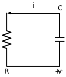

# Problema 7.8

> **Objetivo:** Resolver o problema passo a passo.
> **Instrução:** Leia o enunciado abaixo e tente resolver usando a metodologia.

**Enunciado:**
Para o circuito da figura abaixo, considere as equações para o tempo $t > 0$:
$$v(t) = 10 e^{-4t} \, \text{V}$$
$$i(t) = 0,2 e^{-4t} \, \text{A}$$

(a) Determine $R$ e $C$.
(b) Determine a constante de tempo $\tau$.
(c) Calcule a energia inicial no capacitor.
(d) Obtenha o tempo necessário para dissipar 50% da energia inicial.

---

## ✍️ Sua Vez!

Esse problema tem uma "pegada" um pouquinho diferente dos anteriores porque ele já te deu a equação final pronta! Vamos destrinchar ela para descobrirmos os componentes.

### Parte (a) e (b): Determinar $R$, $C$ e a constante de tempo $\tau$
Você matou a charada perfeitamente só de "bater o olho" nas equações!

**Para o $\tau$:**
Comparando a equação do problema com a nossa fórmula geral de descarga $v(t) = v(0)e^{-t/\tau}$:
$$e^{-4t} = e^{-t/\tau} \implies \frac{1}{\tau} = 4 \implies \tau = \frac{1}{4} = \mathbf{0,25 \, \text{s}}$$
*(Isso já resolve a Letra B!)*

**Para o $R$:**
Como você bem notou, as constantes que multiplicam o exponencial são os valores iniciais em $t=0$:
- $v(0) = 10 \, \text{V}$
- $i(0) = 0,2 \, \text{A}$

No circuito, toda a tensão do capacitor cai diretamente no resistor. Como a corrente $i$ flui do capacitor para o resistor, podemos usar a Lei de Ohm ($V = R \cdot i$):
$$10 = R \cdot 0,2$$
$$R = \frac{10}{0,2} = \mathbf{50 \, \Omega}$$

**Para o $C$:**
Sabendo que $\tau = R \cdot C$, é só substituir o que acabamos de descobrir:
$$0,25 = 50 \cdot C$$
$$C = \frac{0,25}{50} = 0,005 \, \text{F} = \mathbf{5 \, \text{mF}}$$

---

### Parte (c): Calcular a energia inicial no capacitor
Sem problemas! A fórmula para a energia de um capacitor é super parecida com a da energia cinética da física clássica ($mv^2/2$). No mundo da elétrica, a "massa" é a capacitância e a "velocidade" é a tensão:
$$w(t) = \frac{1}{2} C \cdot v(t)^2$$

Queremos a energia no instante $t=0$, então usamos o $v(0)$:
$$w(0) = \frac{1}{2} \cdot (5 \times 10^{-3}) \cdot (10)^2$$
$$w(0) = \frac{1}{2} \cdot (0,005) \cdot 100 = \frac{0,5}{2} = \mathbf{0,25 \, \text{J}}$$

O capacitor começou com um quarto de Joule de energia armazenada.

---

### Parte (d): Obter o tempo para dissipar 50% da energia
Essa é a grande missão final deste problema! O livro quer saber exatamente em qual **instante de tempo $t$** a energia do capacitor vai cair para a **metade** do que ele tinha no começo.

Se no começo ele tinha $0,25\text{J}$, metade disso é $0,125\text{J}$.

Sabemos que a energia em qualquer instante é dada pela fórmula:
$$w(t) = \frac{1}{2} C \cdot v(t)^2$$

E você já conhece a equação monstruosa do $v(t)$:
$$v(t) = 10 e^{-4t}$$

Tente juntar essas peças! Substitua $w(t)$ por $0,125$ e troque o $v(t)$ pela equação dele para descobrir em que momento $t$ isso vai acontecer! (Se precisar aplicar um Logaritmo Natural `ln` no final, vai fundo!). 
Me mande o seu raciocínio!
