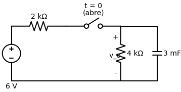
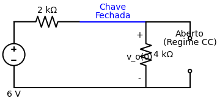
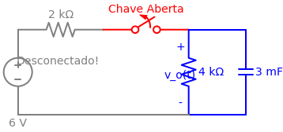

# Problema 7.9

> **Objetivo:** Resolver o problema passo a passo.
> **Instrução:** Leia o enunciado abaixo e tente resolver usando a metodologia.

**Enunciado:**
A chave da figura abaixo abre em $t = 0$. Determine $v_o$ para $t > 0$.

---

> [!TIP]
> **Receita de Bolo: Análise de Circuitos de Primeira Ordem**
> 1. **Análise em t < 0:** Identifique o estado da chave. Calcule $v(0)$ para capacitores ou $i(0)$ para indutores (eles se comportam como circuito aberto e curto-circuito, respectivamente, em CC).
> 2. **Análise em t > 0:** Redesenhe o circuito com a chave na nova posição. Encontre a resistência equivalente $R_{eq}$ vista pelo capacitor/indutor.
> 3. **Constante de Tempo ($\tau$):** Calcule $\tau = R_{eq}C$ (para RC) ou $\tau = L/R_{eq}$ (para RL).
> 4. **Equação Final:** Use a fórmula da resposta $x(t) = x(\infty) + [x(0) - x(\infty)]e^{-t/\tau}$.

## ✍️ Sua Vez!

### Passo 1: O cálculo de $v(0)$ (Para $t < 0$)
Antes do tempo zero, a chave estava **fechada**, agindo como um fio liso contínuo.
Neste momento em que tudo é Corrente Contínua estável, o capacitor age como um **circuito aberto** (barrando a corrente no ramo da direita).

Veja como o circuito se comporta neste instante:

A corrente sai da fonte de 6V, passa pelo resistor de 2k, desce pelo resistor de 4k e volta para a fonte. O ramo do capacitor está bloqueado, logo, o capacitor está **exatamente em paralelo com o resistor de 4k**. A tensão $v_o(0)$ que cai no resistor de 4k é a mesma tensão armazenada no capacitor!

Usando a regra do Divisor de Tensão e lembrando que queremos a tensão no resistor de 4k:
$$v_o(0) = 6 \cdot \left(\frac{4}{2 + 4}\right)$$
$$v_o(0) = 6 \cdot \left(\frac{4}{6}\right) = \mathbf{4 \, \text{V}}$$

---

### Passo 2: O Circuito em $t > 0$
No momento do tempo zero a chave finalmente **abre**. O que vai acontecer com o circuito?

Olha só o efeito de abrir a chave ali no meio do fio de cima:

A chave, ao abrir, **cortou fisicamente o fio**, isolando toda a parte esquerda do circuito (fonte de 6V e resistor de 2k). O capacitor virou a nossa "bateria" temporária cheia de energia (4V) e sobrou apenas ele e o resistor de 4k no circuito vivo (em azul).

Olhando para essa nova topologia, responda:
1. Qual o valor do $R_{eq}$ visto pelo capacitor?
2. Quanto vale a constante de tempo $\tau$?
3. Como fica a equação final de $v_o(t)$?
