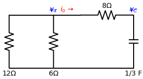
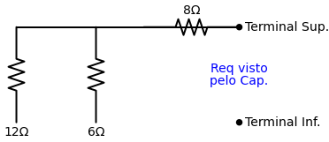

# Problema Prático 7.1
*(Página 247 do PDF)*

**Enunciado:**
Consulte o circuito da Figura 7.7. Seja $v_C(0) = 60V$. Determine $v_C, v_x$ e $i_o$, para $t \ge 0$.

---

## 🎂 Aplicando a Receita de Bolo para o Capacitor

### Passo 1: Encontrar o Início $v_C(0)$
O próprio enunciado já nos deu esse presente de bandeja! A energia inicial armazenada no capacitor é:
$$ v_C(0) = 60V $$

### Passo 2: Encontrar o Fim $v_C(\infty)$
Observe o circuito: **não existe nenhuma fonte de tensão ou de corrente** (não há baterias). 
Temos apenas o capacitor carregado com 60V e um monte de resistores pendurados nele.
Com o passar do tempo ($t \to \infty$), toda essa energia vai ser gasta esquentando os resistores (Efeito Joule). O capacitor vai descarregar completamente.
Logo, a tensão final será nula:
$$ v_C(\infty) = 0V $$
*(É um problema clássico de Resposta Natural).*

### Passo 3: Encontrar a Constante de Tempo ($\tau$)
Temos que encontrar a Resistência Equivalente ($R_{eq}$) olhando a partir dos terminais do capacitor.

Se a corrente sair dos buracos do capacitor, ela atravessa o resistor de $8 \, \Omega$ e chega em um nó onde ela se divide em duas: desce pelo resistor de $12 \, \Omega$ e desce pelo resistor de $6 \, \Omega$.
Isso significa que o $12 \, \Omega$ e o $6 \, \Omega$ estão em **paralelo** entre si! E o resultado deles está em **série** com o resistor de $8 \, \Omega$.

1. **Paralelo (12 e 6):**
$$ R_p = \frac{12 \cdot 6}{12 + 6} = \frac{72}{18} = 4 \, \Omega $$

2. **Série (com o 8):**
$$ R_{eq} = 8 + 4 = 12 \, \Omega $$

Agora calculamos o $\tau$:
$$ \tau = R_{eq} \cdot C = 12 \cdot \frac{1}{3} = 4 \text{ segundos} $$

### Passo 4: Jogar na Equação Mágica
A equação geral para a tensão no capacitor é:
$$ v_C(t) = v_C(\infty) + [v_C(0) - v_C(\infty)] \cdot e^{-t/\tau} $$
$$ v_C(t) = 0 + [60 - 0] \cdot e^{-t/4} $$
Como $1/4 = 0.25$:
$$ v_C(t) = 60 e^{-0.25t} \text{ V} $$

---

## 🕵️‍♂️ Encontrando as Variáveis Extras ($v_x$ e $i_o$)
O problema também pede a corrente $i_o$ e a tensão $v_x$. Agora que sabemos a equação que "dita as regras" do circuito ($v_C$), o resto é pura Lei de Ohm (Análise Nodal).

### Encontrando $v_x$
Repare que $v_x$ é a tensão em cima do resistor de $6 \, \Omega$. Mas o resistor de $12 \, \Omega$ está em paralelo com ele, logo, os dois formaram aquele bloco $R_p = 4 \, \Omega$.
O nosso circuito inteiro se resumiu a:
- O Capacitor (nossa fonte de $60 e^{-0.25t}$ Volts).
- O Resistor de $8 \, \Omega$.
- O bloco paralelo de $4 \, \Omega$.

O $v_x$ é exatamente a tensão que cai em cima do bloco de $4 \, \Omega$!
Podemos usar um **Divisor de Tensão**:
$$ v_x = V_{fonte} \cdot \left( \frac{R_{alvo}}{R_{total}} \right) $$
Onde $V_{fonte}$ é o capacitor $v_C(t)$, $R_{alvo} = 4$ e $R_{total} = 8 + 4 = 12$.
$$ v_x = v_C(t) \cdot \left( \frac{4}{12} \right) $$
$$ v_x = (60 e^{-0.25t}) \cdot \left( \frac{1}{3} \right) $$
$$ v_x = 20 e^{-0.25t} \text{ V} $$

### Encontrando $i_o$
A corrente $i_o$ está passando pelo resistor de $8 \, \Omega$. Mas olhe a **seta** dela no desenho! A seta aponta para a direita (entrando no capacitor).
Porém, é o capacitor que está descarregando energia! A corrente real sai do terminal positivo do capacitor (em cima) e flui para a esquerda, dividindo-se nos resistores.
Como a corrente real está indo contra a flecha de $i_o$, a nossa resposta será **negativa**.

A corrente total que o capacitor cospe é $I = V / R_{eq}$.
$$ I_{real} = \frac{v_C(t)}{12} $$
$$ I_{real} = \frac{60 e^{-0.25t}}{12} = 5 e^{-0.25t} \text{ A} $$

Como $i_o$ está contra a corrente real:
$$ i_o = -5 e^{-0.25t} \text{ A} $$

### 🌟 Bônus: Correntes nos ramos paralelos ($12 \, \Omega$ e $6 \, \Omega$)
Como vimos, a corrente total real sai do capacitor e passa pelo resistor de $8 \, \Omega$ com valor de $5 e^{-0.25t} A$. Ao chegar na bifurcação, ela se divide. Como podemos achar quanto de corrente desceu em cada um dos ramos?

Temos dois caminhos fáceis: **Divisor de Corrente** ou **Lei de Ohm**. Vamos pela Lei de Ohm, já que nós acabamos de calcular a tensão em cima dessa bifurcação inteira (que é o $v_x$).

**Corrente no resistor de $6 \, \Omega$:**
$$ i_6 = \frac{v_x}{6} = \frac{20 e^{-0.25t}}{6} = \frac{10}{3} e^{-0.25t} \approx 3.33 e^{-0.25t} \text{ A} $$

**Corrente no resistor de $12 \, \Omega$:**
$$ i_{12} = \frac{v_x}{12} = \frac{20 e^{-0.25t}}{12} = \frac{5}{3} e^{-0.25t} \approx 1.67 e^{-0.25t} \text{ A} $$

**A prova real:** Se você somar $\frac{10}{3} + \frac{5}{3}$, o resultado é $\frac{15}{3} = 5A$. Ou seja, a soma das correntes divididas é perfeitamente igual à corrente total que vinha do capacitor ($I_{real}$), provando que nossa Lei de Kirchhoff das Correntes está corretíssima!

### 🎯 Respostas Finais
- $v_C(t) = 60 e^{-0.25t} \text{ V}$
- $v_x(t) = 20 e^{-0.25t} \text{ V}$
- $i_o(t) = -5 e^{-0.25t} \text{ A}$
