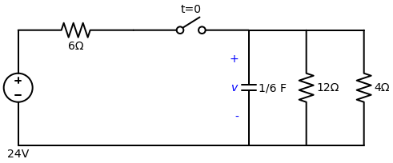
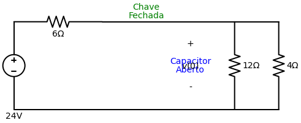
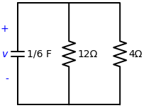
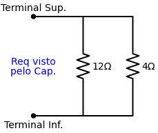

# Problema Prático 7.2
*(Página 247 do PDF)*

**Enunciado:**
Se a chave da Figura 7.10 abrir em $t = 0$, determine $v(t)$ para $t \ge 0$ e $w_C(0)$.

---

## 🎂 Aplicando a Receita de Bolo para o Capacitor

### Passo 1: Encontrar o Início $v(0)$ e a Energia Inicial $w_C(0)$
Para $t < 0$, a chave estava **fechada** há muito tempo. Isso significa que o circuito estava em Regime Permanente DC e o capacitor atuava como um **circuito aberto**.

Com o capacitor funcionando como um "buraco", a corrente da fonte de 24V passa pelo resistor de $6 \, \Omega$ e chega no nó. A partir dali, ela se divide para descer pelo resistor de $12 \, \Omega$ e pelo resistor de $4 \, \Omega$.
Isso significa que esses dois resistores da direita estão em paralelo!
$$ R_p = \frac{12 \cdot 4}{12 + 4} = \frac{48}{16} = 3 \, \Omega $$

O nosso circuito virou uma série simples: Fonte de 24V $\rightarrow$ Resistor de $6 \, \Omega$ $\rightarrow$ Bloco de $3 \, \Omega$.
A tensão $v(0)$ do capacitor é exatamente a mesma tensão que cai sobre o bloco paralelo de $3 \, \Omega$. Podemos calcular isso de duas formas:

**Método 1: Usando a Lei de Ohm (Passo a Passo)**
1. Achamos a corrente total da malha:
$$ I = \frac{V_{fonte}}{R_{total}} = \frac{24}{6 + 3} = \frac{24}{9} \text{ A} $$
2. Multiplicamos essa corrente pela resistência do bloco alvo ($3 \, \Omega$):
$$ v(0) = R_{bloco} \cdot I = 3 \cdot \left( \frac{24}{9} \right) = \frac{72}{9} = 8 \text{ V} $$

**Método 2: Usando o Divisor de Tensão (Direto)**
A fórmula condensa os dois passos acima em uma única tacada:
$$ v(0) = V_{fonte} \cdot \left( \frac{R_{alvo}}{R_{total}} \right) $$
$$ v(0) = 24 \cdot \left( \frac{3}{6 + 3} \right) = 24 \cdot \left( \frac{3}{9} \right) = 24 \cdot \frac{1}{3} = 8 \text{ V} $$

**Energia Inicial:**
A fórmula da energia num capacitor é:
$$ w_C = \frac{1}{2} C v^2 $$
$$ w_C(0) = \frac{1}{2} \left( \frac{1}{6} \right) \cdot (8)^2 $$
$$ w_C(0) = \frac{1}{12} \cdot 64 = \frac{64}{12} \approx 5.333 \text{ Joules} $$

### Passo 2: Encontrar o Fim $v(\infty)$
Para $t \ge 0$, a chave se abre. A parte esquerda inteira do circuito (a fonte de 24V e o resistor de $6 \, \Omega$) é fisicamente desconectada do resto e morre.

Sobra apenas o capacitor descarregando energia nos dois resistores da direita. Como não há mais nenhuma fonte (bateria) alimentando o circuito, o capacitor inevitavelmente vai gastar toda a sua energia e zerar.
$$ v(\infty) = 0 \text{ V} $$

### Passo 3: Encontrar a Constante de Tempo ($\tau$)
Temos que encontrar a Resistência Equivalente ($R_{eq}$) olhando a partir dos terminais do capacitor, com a chave já aberta.

A corrente saindo do capacitor tem dois caminhos: o resistor de $12 \, \Omega$ e o de $4 \, \Omega$. Como o ramo da esquerda foi "amputado" pela chave aberta, ele não entra na conta!
Então, o circuito visto pelo capacitor é apenas os dois resistores em paralelo. E nós já fizemos essa conta!
$$ R_{eq} = \frac{12 \cdot 4}{12 + 4} = 3 \, \Omega $$

Agora calculamos o $\tau$:
$$ \tau = R_{eq} \cdot C = 3 \cdot \frac{1}{6} = 0.5 \text{ segundos} $$

### Passo 4: Jogar na Equação Mágica
A equação geral para a tensão no capacitor é:
$$ v(t) = v(\infty) + [v(0) - v(\infty)] \cdot e^{-t/\tau} $$
$$ v(t) = 0 + [8 - 0] \cdot e^{-\frac{t}{0.5}} $$
Como $1/0.5 = 2$:
$$ v(t) = 8 e^{-2t} \text{ V} $$

---

### 🎯 Respostas Finais
- $v(t) = 8 e^{-2t} \text{ V}$ para todo $t \ge 0$
- $w_C(0) = 5.333 \text{ Joules}$
