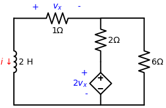
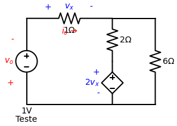

# Problema Prático 7.3
*(Página 251 do PDF)*

> **Tipo de Circuito:** Resposta Natural de Circuito RL (não há fontes independentes para $t > 0$).

**Enunciado:**
Determine $i$ e $v_x$ no circuito da Figura 7.15. Façamos $i(0) = 12$ A.

---

## 🎂 Aplicando a Receita de Bolo para o Indutor

### Passo 1: Encontrar o Início $i(0)$ e a Energia Inicial $w_L(0)$
O próprio enunciado já foi bonzinho e nos deu a corrente inicial de graça:
$$ i(0) = 12 \text{ A} $$

**Energia Inicial no Indutor:**
A fórmula da energia armazenada em um indutor é $w_L = \frac{1}{2} L i^2$:
$$ w_L(0) = \frac{1}{2} \cdot (2) \cdot (12)^2 $$
$$ w_L(0) = 1 \cdot 144 = 144 \text{ Joules} $$

### Passo 2: Encontrar o Fim $i(\infty)$
Como é um circuito de **Resposta Natural** e não possui nenhuma fonte "bateria" independente (aquelas redondas clássicas) para alimentar o sistema no infinito, o indutor vai gastar toda a energia dele nos resistores e vai descarregar até zerar. A fonte em formato de losango é **dependente**, então se a corrente do circuito morre, ela morre junto.
$$ i(\infty) = 0 \text{ A} $$

### Passo 3: Encontrar a Constante de Tempo ($\tau$)
Aqui vem a grande "pegadinha" dessa questão. Não podemos simplesmente agrupar os resistores em paralelo ou série porque temos uma **Fonte Dependente** ($2v_x$) no meio do caminho!

Quando isso acontece, precisamos usar a técnica da **Fonte de Teste**:
1. Nós arrancamos o Indutor do circuito.
2. No buraco dele, colocamos uma fonte de teste imaginária $v_o$ (que vamos assumir como 1V para facilitar).
3. Injetamos uma corrente de teste $i_o$ entrando no circuito.
4. O nosso objetivo é descobrir a Resistência Equivalente de Thevenin usando a Lei de Ohm: $R_{eq} = \frac{v_o}{i_o}$.

**Análise do Circuito de Teste:**
Nós sabemos que a tensão injetada $v_o = 1V$. 
A corrente $i_o$ sai da nossa fonte de teste e passa inteira pelo resistor de $1 \, \Omega$ (repare que $i_o$ está no mesmo sentido que a polaridade de $v_x$, entrando pelo + e saindo pelo -). 
Pela Lei de Ohm nesse resistor de 1 ohm:
$$ v_x = 1 \cdot i_o \implies v_x = i_o $$

Aplicando a Lei de Kirchhoff das Correntes (KCL) no Nó do meio (onde a corrente $i_o$ se divide):
A corrente que entra é $i_o$. Ela se divide na corrente que desce pelo meio ($i_{meio}$) e na corrente que vai para a direita ($i_{direita}$).
$$ i_o = i_{meio} + i_{direita} $$

Qual a tensão nesse Nó do meio? 
Ora, a fonte de teste do lado esquerdo injetou 1V, e o resistor de 1 ohm "gastou" uma tensão $v_x$. Então o que chega no nó é $1 - v_x$. Como já descobrimos que $v_x = i_o$, a tensão do nó é:
$$ V_{no} = 1 - i_o $$

Agora, calculamos as duas correntes que saem usando a Lei de Ohm e a Lei de Kirchhoff das Malhas (LKT):
- **Corrente no ramo do meio ($i_{meio}$):** 
  Para descobrir a corrente descendo pelo ramo do meio, usamos o princípio da Diferença de Potencial. A tensão total do nó superior até o terra (0V) é $V_{no}$. Essa tensão se divide entre o resistor e a fonte dependente.
  Pela LKT, descendo o ramo: $V_{no} = V_{resistor} + V_{fonte}$
  Substituindo a Lei de Ohm no resistor ($V = 2 \cdot i_{meio}$) e a tensão da fonte ($2v_x$):
  $V_{no} = (2 \cdot i_{meio}) + 2v_x$
  Isolando o $i_{meio}$:
  $$ 2 \cdot i_{meio} = V_{no} - 2v_x \implies i_{meio} = \frac{V_{no} - 2v_x}{2} = \frac{(1 - i_o) - 2(i_o)}{2} = \frac{1 - 3i_o}{2} $$
- **Corrente no ramo da direita ($i_{direita}$):**
  Como só há o resistor no caminho direto para o terra (0V):
  $$ i_{direita} = \frac{V_{no} - 0}{6} = \frac{1 - i_o}{6} $$

Juntando tudo na KCL:
$$ i_o = \frac{1 - 3i_o}{2} + \frac{1 - i_o}{6} $$

Para sumir com as frações, multiplicamos tudo por 6:
$$ 6 i_o = 3(1 - 3i_o) + 1(1 - i_o) $$
$$ 6 i_o = 3 - 9i_o + 1 - i_o $$
$$ 6 i_o = 4 - 10i_o $$
Passando os $i_o$ para a esquerda:
$$ 16 i_o = 4 \implies i_o = \frac{4}{16} = 0.25 \text{ A} $$

Agora podemos finalmente achar o nosso Thevenin!
$$ R_{eq} = \frac{v_o}{i_o} = \frac{1 \text{ V}}{0.25 \text{ A}} = 4 \, \Omega $$

E calculamos a constante de tempo do Indutor:
$$ \tau = \frac{L}{R_{eq}} = \frac{2}{4} = 0.5 \text{ segundos} $$

### Passo 4: Jogar na Equação Mágica
$$ i(t) = i(\infty) + [i(0) - i(\infty)] \cdot e^{-t/\tau} $$
$$ i(t) = 0 + [12 - 0] \cdot e^{-\frac{t}{0.5}} $$
$$ i(t) = 12 e^{-2t} \text{ A} $$

### 🌟 Bônus: Calculando o $v_x$ real do circuito
O problema também pede a tensão $v_x$.
No circuito original com o indutor de volta ao lugar, o indutor (ramo esquerdo) empurra uma corrente $i(t)$ para baixo.
Isso significa que a corrente sobe pelo lado direito, e vai fluir para a ESQUERDA passando pelo resistor de $1 \, \Omega$ para poder voltar para o indutor.

Mas olhe as marcações de $v_x$: o sinal de $+$ está na esquerda e o de $-$ na direita. 
Como a corrente está vindo "na contramão" (entrando pelo $-$ e saindo pelo $+$), a tensão ganha um sinal de negativo!
$$ v_x = - (R \cdot i) = - (1 \cdot i(t)) = -12 e^{-2t} \text{ V} $$

---

### 🎯 Respostas Finais
- $i(t) = 12 e^{-2t} \text{ A}$ para todo $t > 0$
- $v_x(t) = -12 e^{-2t} \text{ V}$ para todo $t > 0$
- $w_L(0) = 144 \text{ Joules}$ (Energia Inicial)
