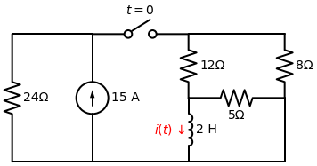
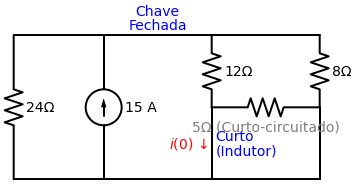
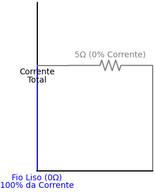
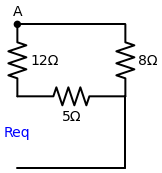

# Problema Prático 7.4
*(Página 251 do PDF)*

> **Tipo de Circuito:** Resposta Natural de Circuito RL (não há fontes independentes atuando sobre o indutor para $t > 0$).

**Enunciado:**
Para o circuito da Figura 7.18, determine $i(t)$ para $t > 0$.

---

## 🎂 Aplicando a Receita de Bolo para o Indutor

### Passo 1: Encontrar o Início $i(0)$ e a Energia Inicial $w_L(0)$
Para o tempo $t < 0$, a chave estava fechada por um longo tempo. Isso significa que o circuito alcançou o regime estacionário de corrente contínua (CC). 
Em CC, um indutor se comporta como um **Curto-Circuito** (um fio liso sem resistência).

Veja o que acontece com o circuito desenhado com o curto-circuito no lugar do indutor:

O indutor virou um fio liso que conecta o nó do meio diretamente ao terra (fio de baixo). O resistor de $5 \, \Omega$ está espremido exatamente entre esses mesmos dois pontos (o nó do meio e o terra). Ou seja, o Indutor e o Resistor de $5 \, \Omega$ estão em **paralelo**.

> [!TIP]
> **Por que o 5 ohms morre?**
> A corrente elétrica é preguiçosa e sempre busca o caminho mais fácil. Quando a água (corrente) chega no nó central, ela vê duas opções: descer pelo indutor (que agora tem **0 ohms**, resistência zero, caminho livre) ou virar à direita pelo resistor (que tem 5 ohms de dificuldade). 
> Quando existe um caminho com resistência **absolutamente zero** (um fio liso), **100% da corrente** desce por ele. O resistor de 5 ohms recebe $0\%$ de corrente, ficando "curto-circuitado" e efetivamente fora do circuito matemático nesse instante.
> *E se no lugar do indutor houvesse um resistor de $2 \, \Omega$?* Neste caso, nenhum caminho teria zero resistência. A corrente **se dividiria**, enviando mais água para o caminho de $2 \, \Omega$ e menos água para o de $5 \, \Omega$. A anulação completa só ocorre por causa do $0 \, \Omega$!

Com o resistor de $5 \, \Omega$ anulado, sobram apenas os resistores de $12 \, \Omega$ e $8 \, \Omega$ no lado direito. Ambos estão conectados do fio superior ao fio de baixo, então estão em paralelo:
$$ R_{paralelo} = \frac{12 \cdot 8}{12 + 8} = \frac{96}{20} = 4.8 \, \Omega $$

No lado esquerdo, temos a fonte de 15 A em paralelo com o resistor de $24 \, \Omega$. Toda a corrente do circuito se divide entre o resistor de $24 \, \Omega$ e o bloco direito de $4.8 \, \Omega$.
Podemos achar a Resistência Total que a fonte de corrente enxerga:
$$ R_{total} = \frac{24 \cdot 4.8}{24 + 4.8} = \frac{115.2}{28.8} = 4 \, \Omega $$

A tensão total do fio de cima (Nó A) é calculada pela Lei de Ohm:
$$ V_A = I_{fonte} \cdot R_{total} = 15 \cdot 4 = 60 \text{ V} $$

Como a corrente inicial $i(0)$ do indutor é a exata mesma corrente que passa pelo resistor de $12 \, \Omega$ (já que o de 5 ohm morreu):
$$ i(0) = \frac{V_A}{12} = \frac{60}{12} = 5 \text{ A} $$

**Energia Inicial no Indutor:**
$$ w_L(0) = \frac{1}{2} L i^2 = \frac{1}{2} \cdot (2) \cdot (5)^2 = 1 \cdot 25 = 25 \text{ Joules} $$

### Passo 2: Encontrar o Fim $i(\infty)$
No instante $t=0$, a chave abre! Isso corta totalmente a fonte de corrente de 15 A e o resistor de $24 \, \Omega$ da história. O circuito da direita fica sozinho, sem nenhuma bateria. O indutor vai gastar toda a energia dele até zerar.
$$ i(\infty) = 0 \text{ A} $$

### Passo 3: Encontrar a Constante de Tempo ($\tau$)
Com a chave aberta ($t > 0$), a fonte foi "amputada". O indutor agora precisa "enxergar" a Resistência Equivalente de Thevenin ($R_{eq}$) dos resistores que sobraram.

Arrancamos o indutor e olhamos pelos seus terminais (buracos azuis na imagem abaixo):

A corrente sairia do buraco superior, não pode ir para a esquerda porque a chave está aberta, então é obrigada a subir pelo resistor de $12 \, \Omega$, seguir para a direita e descer pelo resistor de $8 \, \Omega$ para chegar no terra. Portanto, esses dois estão em **série**:
$$ R_{serie} = 12 + 8 = 20 \, \Omega $$

Mas espere! O resistor de $5 \, \Omega$ liga exatamente o buraco superior do indutor ao terra. Isso significa que ele está em **paralelo** com o caminho imenso que acabamos de somar ($20 \, \Omega$).
$$ R_{eq} = \frac{20 \cdot 5}{20 + 5} = \frac{100}{25} = 4 \, \Omega $$

Calculando a constante de tempo do Indutor:
$$ \tau = \frac{L}{R_{eq}} = \frac{2}{4} = 0.5 \text{ segundos} $$
*(Ou, invertendo: $\frac{1}{\tau} = 2$)*

### Passo 4: Jogar na Equação Mágica
$$ i(t) = i(\infty) + [i(0) - i(\infty)] \cdot e^{-t/\tau} $$
$$ i(t) = 0 + [5 - 0] \cdot e^{-t/0.5} $$
$$ i(t) = 5 e^{-2t} \text{ A} $$

---

### 🎯 Respostas Finais
- $i(t) = 5 e^{-2t} \text{ A}$ para todo $t > 0$
- $w_L(0) = 25 \text{ Joules}$ (Energia Inicial)
