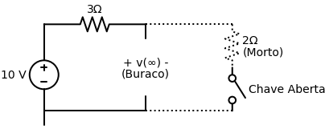

# Questão de Revisão 7.6
*(Página 265 do PDF)*

> **Objetivo:** Encontrar a tensão final $v(\infty)$ no capacitor.
> **Instrução:** Analise o circuito *muito tempo depois* da chave abrir/fechar. 

**Enunciado:**
No circuito da Figura 7.79 abaixo, a tensão final $v(\infty)$ é:
(a) $10 \, \text{V}$
(b) $7 \, \text{V}$
(c) $6 \, \text{V}$
(d) $4 \, \text{V}$
(e) $0 \, \text{V}$

---

## ✅ Solução Correta: Letra (a)

> [!TIP]
> **Receita de Bolo: Como encontrar a Tensão Final $v(\infty)$ em Capacitores**
> 1. **Identifique o estado da chave no infinito:** A chave abriu ou fechou em $t=0$? Defina como o circuito ficará para $t > 0$.
> 2. **Substitua o Capacitor:** Após muito tempo ($\infty$) sob corrente contínua, o capacitor carrega totalmente e vira um **Circuito Aberto** (fio cortado). Faça um "buraco" no lugar dele.
> 3. **Elimine "Braços Mortos":** Se algum fio foi cortado (pela chave ou pelo capacitor) e a corrente não tem por onde fluir, os resistores ali não terão queda de tensão.
> 4. **Calcule a Tensão Restante:** Use a Lei de Ohm e a tensão da Fonte no caminho que sobrou para descobrir a voltagem nas pontas do "buraco" do capacitor.

**Aplicando a Receita, passo a passo:**

**Passo 1 e 2: O estado da Chave e do Capacitor**
O enunciado indica que a chave "abre" em $t=0$. Então, no infinito, a chave está aberta. Isso corta o fio do lado direito! Nenhuma corrente pode passar pelo resistor de $2 \, \Omega$. Aquele pedaço inteiro do circuito vira um "braço morto".
Transformamos o capacitor de $7\text{F}$ em um circuito aberto. 

Olhe como o circuito fica muito mais amigável após limparmos o que "morreu" e substituirmos o capacitor:

**Passo 3 e 4: Cálculo da Tensão**
Como a corrente total no circuito é zero (o buraco do capacitor não deixa a corrente circular, e a chave da direita está aberta), não há corrente atravessando o resistor de $3 \, \Omega$.
Aplicando a Lei de Ohm nele: $V_{resistor} = R \cdot I \rightarrow V_{resistor} = 3 \cdot 0 = \mathbf{0 \, \text{V}}$.
Se o resistor não "gasta" nenhuma voltagem, toda a força da Fonte de $10\text{V}$ chega intacta nos terminais do capacitor.

Portanto:
$$ v(\infty) = \mathbf{10 \, \text{V}} $$

A alternativa correta é a **(a)**!
