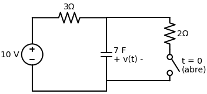

# Questão de Revisão 7.6
*(Página 265 do PDF)*

> **Objetivo:** Encontrar a tensão final $v(\infty)$ no capacitor.
> **Instrução:** Analise o circuito *muito tempo depois* da chave abrir/fechar. 

**Enunciado:**
No circuito da Figura 7.79 abaixo, a tensão final $v(\infty)$ é:
(a) $10 \, \text{V}$
(b) $7 \, \text{V}$
(c) $6 \, \text{V}$
(d) $4 \, \text{V}$
(e) $0 \, \text{V}$

---

## ✅ Solução Correta: Letra (a)

A questão pede a tensão no capacitor "no infinito" ($t \to \infty$). 

Nesse momento, a chave (switch) que estava fechada já se **abriu** (pois o enunciado diz que ela abre em $t=0$). 

Se a chave do lado direito abriu, o fio foi cortado! Nenhuma corrente pode passar pelo resistor de $2 \, \Omega$ da direita. Aquele pedaço inteiro do circuito virou um "braço morto".

O que sobrou do circuito foi apenas a Fonte de $10\text{V}$, o Resistor de $3 \, \Omega$ e o Capacitor de $7\text{F}$. Tudo isso ligado em série.
Como passou-se muito tempo ($t \to \infty$), o capacitor está completamente carregado e se comporta como um **Circuito Aberto** novamente.

Se a corrente total no circuito é zero (o capacitor não deixa passar nada e a chave da direita está aberta), então não há queda de tensão no resistor de $3 \, \Omega$ (Lei de Ohm: $V = R \cdot I \rightarrow V = 3 \cdot 0 = 0\text{V}$).

Sem perder voltagem nenhuma no caminho, toda a tensão da fonte de $10\text{V}$ é aplicada diretamente nos terminais do capacitor.
Portanto:
$$ v(\infty) = \mathbf{10 \, \text{V}} $$

A alternativa correta é a **(a)**!
