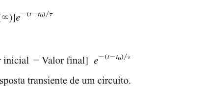

# Questão de Revisão 7.6
*(Página 265 do PDF)*

> **Objetivo:** Encontrar a tensão final $v(\infty)$ no capacitor.
> **Instrução:** Analise o circuito *muito tempo depois* da chave abrir/fechar. 

---

## ✍️ Sua Vez!
*(Escreva como você deduziu o valor de tensão final!)*
