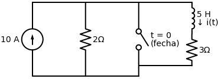

# Questão de Revisão 7.7
*(Página 265 do PDF)*

> **Objetivo:** Encontrar a corrente inicial $i(0)$ no indutor.
> **Instrução:** Analise o circuito em regime estacionário (CC) *antes* da chave agir. O que o indutor vira em CC?

**Enunciado:**
Para o circuito da Figura 7.80 abaixo, a corrente no indutor imediatamente antes de $t = 0$ é:
(a) $8 \, \text{A}$
(b) $6 \, \text{A}$
(c) $4 \, \text{A}$
(d) $2 \, \text{A}$
(e) $0 \, \text{A}$

---

## ✅ Solução Correta: Letra (c)

> [!TIP]
> **Receita de Bolo: Como encontrar a Corrente Inicial $i(0)$ em Indutores**
> 1. **Identifique o estado da chave antes de zero ($t < 0$):** Se a chave diz que "fecha em t=0", significa que ela esteve **aberta** a vida inteira.
> 2. **Substitua o Indutor:** Após muito tempo ($\infty$) sob corrente contínua, o indutor vira um **Curto-Circuito** (fio liso sem resistência). Troque o desenho da bobina por um fio normal.
> 3. **Analise o fluxo da Corrente:** Veja por quais caminhos a corrente da fonte consegue passar. (Cuidado: fios lisos "roubam" toda a corrente de resistores em paralelo a eles!).
> 4. **Calcule a Corrente Alvo:** Use a fórmula do **Divisor de Corrente** ou a Lei de Ohm para descobrir quanta corrente desce pelo ramo onde o indutor estava.

**Aplicando a Receita, passo a passo:**

**Passo 1: O estado da Chave**
A chave diz "fecha em t=0". Como queremos saber o que acontece "imediatamente antes de t=0", a chave ainda está **aberta**. Isso significa que o ramo do meio não existe, a corrente não passa por ali.

**Passo 2 e 3: Substituir o Indutor e analisar o fluxo**
Trocando o Indutor de $5 \, \text{H}$ por um fio liso (curto-circuito), o nosso circuito passa a ter apenas a Fonte de $10\text{A}$, e dois resistores em paralelo: o de $2 \, \Omega$ e o de $3 \, \Omega$. 

A corrente de $10\text{A}$ sai da fonte e chega no nó de cima. Ela precisa se dividir entre o caminho da esquerda ($2 \, \Omega$) e o caminho da direita ($3 \, \Omega$). A corrente que queremos é a que desce pelo caminho da direita, pois é lá que está o indutor.

**Passo 4: Cálculo da Corrente (Divisor de Corrente)**
A fórmula do divisor de corrente para achar a corrente em um ramo é: "Resistência do OUTRO lado, dividida pela soma das resistências, vezes a corrente total".

$$ I_{indutor} = I_{total} \times \frac{R_{outro}}{R_{outro} + R_{meu}} $$
$$ I_{indutor} = 10 \times \frac{2}{2 + 3} $$
$$ I_{indutor} = 10 \times \frac{2}{5} $$
$$ I_{indutor} = \mathbf{4 \, \text{A}} $$

A alternativa correta é a **(c)**!
