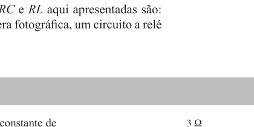

# Questão de Revisão 7.7
*(Página 265 do PDF)*

> **Objetivo:** Encontrar a corrente inicial $i(0)$ no indutor.
> **Instrução:** Analise o circuito em regime estacionário (CC) *antes* da chave agir. O que o indutor vira em CC?

---

## ✍️ Sua Vez!
*(Qual o caminho que a corrente vai preferir fazer em regime estacionário?)*
