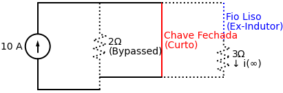

# Questão de Revisão 7.8
*(Página 285 do PDF)*

> **Objetivo:** Encontrar a corrente final $i(\infty)$ no indutor.
> **Instrução:** Analise o mesmo circuito da 7.7, mas agora *muito tempo depois* da chave fechar. Cuidado com o caminho da corrente!

**Enunciado:**
No circuito da Figura 7.80 abaixo, $i(\infty)$ é:
(a) $10 \, \text{A}$
(b) $6 \, \text{A}$
(c) $4 \, \text{A}$
(d) $2 \, \text{A}$
(e) $0 \, \text{A}$

---

## ✅ Solução Correta: Letra (e)

> [!TIP]
> **Receita de Bolo: Como encontrar a Corrente Final $i(\infty)$ em Indutores**
> 1. **Identifique o estado da chave no infinito ($t \to \infty$):** Se a chave diz que "fecha em t=0", significa que no infinito ela já está **fechada**.
> 2. **Substitua o Indutor:** Após muito tempo sob corrente contínua, o indutor vira um **Curto-Circuito** (fio liso sem resistência). Troque a bobina por um fio.
> 3. **Cuidado com Curtos-Circuitos Parasitas:** Se uma chave fechada criar um caminho 100% liso (sem resistores) em paralelo com o resto do circuito, **toda** a corrente vai fugir por ali. Os outros caminhos "morrem".
> 4. **Calcule a Corrente:** Analise quanto de corrente sobra para passar no fio onde estava o indutor.

**Aplicando a Receita, passo a passo:**

**Passo 1 e 2: O estado da Chave e do Indutor**
No infinito, a chave que fechou em t=0 se torna um **fio liso** no meio do circuito.
Ao mesmo tempo, o nosso indutor já carregou totalmente e também vira um fio liso. 

Olhe como fica o circuito equivalente no infinito:

**Passo 3: A Fuga de Corrente (Curto-Circuito)**
Aqui entra a grande pegadinha conceitual de circuitos elétricos! 
A corrente de $10\text{A}$ chega no nó de cima. Ela olha para três opções de caminho:
1. Descer pela esquerda, enfrentando um resistor de $2 \, \Omega$.
2. Descer pela direita, enfrentando um resistor de $3 \, \Omega$.
3. Descer pelo meio (a chave fechada em vermelho), enfrentando **Zero Resistência**.

A corrente elétrica é "preguiçosa". Se existe um caminho sem resistência nenhuma (um curto-circuito real) em paralelo com resistores, **100% da corrente passa pelo caminho sem resistência**. O fio vermelho no meio "roubou" todos os 10A da fonte. 

**Passo 4: O que sobra pro Indutor?**
Se todos os $10\text{A}$ passaram pela chave fechada no meio, não sobrou absolutamente nada de corrente para passar pelos resistores da esquerda ou da direita. A corrente no ramo do ex-indutor será zero.

$$ i(\infty) = \mathbf{0 \, \text{A}} $$

A alternativa correta é a **(e)**!
