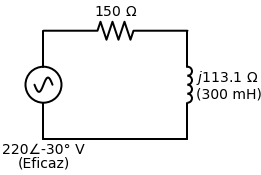

# Atividade Avaliativa: Capítulo 9
*(Exercício Proposto pela Professora)*

> **Enunciado:**
> Considere um circuito de RL série, alimentado por uma fonte alternada senoidal igual a $v(t) = 311,127 \cos(377t - 30^\circ)$ V. O valor do resistor é de $150 \, \Omega$ e o do indutor é de $300$ mH.
> 
> a) Obter o fasor tensão eficaz. (0,5 ponto)
> b) Calcular a impedância total do circuito na forma retangular e polar. (1 ponto)
> c) Calcular o fasor corrente eficaz. (0,5 ponto)
> d) Calcular o fasor tensão eficaz no indutor, $V_L$. (0,5 ponto)
> e) Calcular o fasor tensão eficaz no resistor, $V_R$. (0,5 ponto)

---

## 🎂 Aplicando a "Receita de Bolo" com Fasores Eficazes

Esta questão introduz um conceito fundamental que será a base do Capítulo 11 (Potência): **O Valor Eficaz (RMS)**. Em aplicações reais de potência, não usamos a amplitude máxima da onda ($V_m$) nos cálculos, usamos o Valor Eficaz. 

### a) Obter o fasor tensão eficaz
Para converter a fonte de tensão do domínio do tempo para um fasor eficaz, dividimos a amplitude máxima ($V_m$) por $\sqrt{2}$.

A fonte dada é:
$$ v(t) = 311,127 \cos(377t - 30^\circ) \text{ V} $$
- **Amplitude Máxima ($V_m$):** $311,127 \text{ V}$
- **Frequência Angular ($\omega$):** $377 \text{ rad/s}$
- **Fase ($\phi$):** $-30^\circ$

**Cálculo da Tensão Eficaz ($V_{rms}$):**
$$ V_{rms} = \frac{V_m}{\sqrt{2}} = \frac{311,127}{1,4142} \approx 220 \text{ V} $$
> *Curiosidade: Essa é a tensão de tomada comum no Brasil (220V RMS).*

**Fasor Tensão Eficaz:**
$$ \tilde{V}_{ef} = 220 \angle -30^\circ \text{ V} $$

---

### b) Calcular a impedância total na forma retangular e polar
As fórmulas de impedância precisam da frequência $\omega = 377$ rad/s.

- **Impedância do Resistor ($Z_R$):**
  $$ Z_R = R = 150 \, \Omega $$

- **Impedância do Indutor ($Z_L$):**
  $$ Z_L = j\omega L = j \cdot (377) \cdot (0,3) = j113,1 \, \Omega $$

Como o circuito é série, basta somar as impedâncias:
**Forma Retangular:**
$$ Z_{eq} = 150 + j113,1 \, \Omega $$

**Convertendo para Forma Polar:**
- Módulo ($|Z|$): $\sqrt{150^2 + 113,1^2} = \sqrt{22500 + 12791,61} = \sqrt{35291,61} \approx 187,86 \, \Omega$
- Fase ($\theta$): $\arctan\left(\frac{113,1}{150}\right) = \arctan(0,754) \approx 37,01^\circ$

**Forma Polar:**
$$ Z_{eq} = 187,86 \angle 37,01^\circ \, \Omega $$

---

### c) Calcular o fasor corrente eficaz
Aplicamos a Lei de Ohm usando os fasores e a impedância total:
$$ \tilde{I}_{ef} = \frac{\tilde{V}_{ef}}{Z_{eq}} $$

Usamos a forma polar para divisão (divide os módulos, subtrai os ângulos de cima pelos de baixo):
$$ \tilde{I}_{ef} = \frac{220 \angle -30^\circ}{187,86 \angle 37,01^\circ} $$
$$ \tilde{I}_{ef} = \left(\frac{220}{187,86}\right) \angle (-30^\circ - 37,01^\circ) $$
$$ \tilde{I}_{ef} = 1,171 \angle -67,01^\circ \text{ A} $$

---

### d) Calcular o fasor tensão eficaz no indutor ($V_L$)
Aplicamos a Lei de Ohm separadamente no indutor. Para facilitar a multiplicação, convertemos o $Z_L$ ($j113,1 \, \Omega$) para polar. O "j" positivo significa um ângulo de $90^\circ$:
$$ Z_L = 113,1 \angle 90^\circ \, \Omega $$

Multiplicando (multiplica os módulos, soma os ângulos):
$$ \tilde{V}_{L} = Z_L \cdot \tilde{I}_{ef} $$
$$ \tilde{V}_{L} = (113,1 \angle 90^\circ) \cdot (1,171 \angle -67,01^\circ) $$
$$ \tilde{V}_{L} = (113,1 \cdot 1,171) \angle (90^\circ - 67,01^\circ) $$
$$ \tilde{V}_{L} = 132,44 \angle 22,99^\circ \text{ V} $$

---

### e) Calcular o fasor tensão eficaz no resistor ($V_R$)
Aplicamos a Lei de Ohm no resistor. Na forma polar, um resistor puramente real tem ângulo de $0^\circ$:
$$ Z_R = 150 \angle 0^\circ \, \Omega $$

Multiplicando:
$$ \tilde{V}_{R} = Z_R \cdot \tilde{I}_{ef} $$
$$ \tilde{V}_{R} = (150 \angle 0^\circ) \cdot (1,171 \angle -67,01^\circ) $$
$$ \tilde{V}_{R} = 175,65 \angle -67,01^\circ \text{ V} $$

---

> [!TIP]
> **Prova Real (LKT):**
> Se você quiser garantir que acertou na hora da prova, a soma fasorial $V_R + V_L$ **tem** que dar a tensão da fonte ($220 \angle -30^\circ$).
> Convertendo $V_R$ e $V_L$ para retangular e somando:
> $V_R = 68,60 - j161,70$
> $V_L = 121,91 + j51,71$
> **Soma:** $(68,60 + 121,91) + j(-161,70 + 51,71) = 190,51 - j109,99 \text{ V}$
> 
> Convertendo a fonte para retangular:
> $220 \cos(-30^\circ) + j220 \sin(-30^\circ) = 190,52 - j110 \text{ V}$.
> **Bateu cravado!** A diferença de décimos é só arredondamento.
