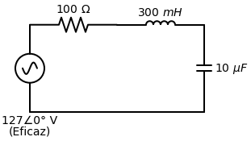

# Exemplo Resolvido: Circuito RLC (Capítulo 9)
*(Exercício de Treinamento e Fixação)*

> **Enunciado:**
> Um circuito RLC série está conectado a uma tomada residencial de $127 \angle 0^\circ \text{ V (rms)}$ com frequência de $60\text{ Hz}$. Os componentes do circuito são:
> - Um Resistor de $100 \, \Omega$
> - Um Indutor de $300\text{ mH}$
> - Um Capacitor de $10 \, \mu\text{F}$
> 
> **Calcule:**
> a) A impedância total do circuito e afirme se ele é indutivo ou capacitivo.
> b) A corrente eficaz do circuito.
> c) A queda de tensão sobre o Resistor ($V_R$), sobre o Indutor ($V_L$) e sobre o Capacitor ($V_C$).

---

## 🎂 Resolução Passo a Passo

### Passo 1: Preparar o terreno (Como achar o $\omega$)
Toda a nossa análise com indutores e capacitores precisa da Frequência Angular ($\omega$) em radianos por segundo. Mas **atenção**, a forma como você acha esse valor muda dependendo de como a professora montou a questão! Existem dois cenários clássicos:

> [!TIP]
> **CASO 1: A fonte foi dada no domínio do tempo (Equação com "t")**
> *Exemplo: $v(t) = 311 \cos(377t - 30^\circ)$*
> Aqui você **não precisa usar fórmula nenhuma**! É só bater o olho na equação. A estrutura matemática padrão da onda é sempre $V_m \cos(\omega t + \theta)$. Ou seja, o $\omega$ é sempre o número que está multiplicando a letra "$t$".
> - *Resultado direto:* Em $311 \cos(\mathbf{377}t - 30^\circ)$, o $\omega$ já é **$377 \text{ rad/s}$**. Fim de papo.

> [!TIP]
> **CASO 2: A fonte foi dada já como Fasor/Coordenada Polar (Graus)**
> *Exemplo: A fonte do nosso exercício ($127 \angle 0^\circ \text{ V}$) e $f = 60\text{ Hz}$.*
> Observe que o número polar **não tem a letra "t"**! O fasor é um número "congelado". Quando a professora te dá o fasor puro, ela **tem** que te dar a frequência real da rede em Hertz ($f$). Sempre que você vir um $f$ em Hertz, aí sim você **deve usar a fórmula**:
> $$ \omega = 2\pi f $$
> - *Cálculo do nosso exercício:* Como $f = 60\text{ Hz}$, aplicamos a fórmula:
> $$ \omega = 2 \cdot 3,1415 \cdot 60 \approx 377 \text{ rad/s} $$

> 📌 **A Regra de Ouro:** Tem a letra "t" na função? Roube o número colado nele. Não tem a letra "t" e ele te deu Hertz (Hz)? Multiplique os Hertz por $2\pi$!
### Passo 2: O Expurgo do Tempo (Tudo vira $Z$)
Vamos converter os 3 elementos para Impedância (em Ohms), aplicando o "j" mágico.

- **Resistor:**
  $$ Z_R = 100 \, \Omega \quad \text{(ou } 100 \angle 0^\circ \text{)} $$
- **Indutor ($L = 0,3\text{ H}$):**
  $$ Z_L = j\omega L = j \cdot 377 \cdot 0,3 = j113,1 \, \Omega \quad \text{(ou } 113,1 \angle 90^\circ \text{)} $$
- **Capacitor ($C = 10 \times 10^{-6}\text{ F}$):**
  $$ Z_C = \frac{-j}{\omega C} = \frac{-j}{377 \cdot 10^{-5}} = -j265,25 \, \Omega \quad \text{(ou } 265,25 \angle -90^\circ \text{)} $$

**Letra (a): Impedância Total**
Como estão em série, somamos na forma retangular:
$$ Z_{eq} = Z_R + Z_L + Z_C $$
$$ Z_{eq} = 100 + j113,1 - j265,25 $$
$$ Z_{eq} = 100 - j152,15 \, \Omega $$

Convertendo para Polar (usaremos para achar a corrente):
- Módulo: $\sqrt{100^2 + (-152,15)^2} \approx 182,07 \, \Omega$
- Ângulo: $\arctan\left(\frac{-152,15}{100}\right) \approx -56,68^\circ$
$$ Z_{eq} = 182,07 \angle -56,68^\circ \, \Omega $$

> **Justificativa:** O circuito é **Capacitivo**, pois a reatância total imaginária ($-j152,15$) é negativa. A força do capacitor venceu a do indutor.

---

### Passo 3: A Guerra dos Complexos (Lei de Ohm)

> [!TIP]
> **Como fazer isso na Casio fx-991LA CW:**
> 1. Pressione `HOME` e vá no aplicativo **Complexo**.
> 2. Pressione `SETTINGS` (tecla com a engrenagem) $\to$ `Config Calc` $\to$ `Unidade Ângulo` $\to$ Escolha **Grau** (Degree). Sempre faça operações polares em Graus!
> 3. Para colocar o símbolo de ângulo ($\angle$), pressione a tecla **`CATALOG`** $\to$ **Complexo** $\to$ escolha **$\angle$**.
> 4. Você pode digitar a conta inteira de uma vez (ex: `127∠0 / (182.07∠-56.68)`) e apertar `EXE`. A calculadora pode mostrar a resposta em $x + yi$. Para ver em polar, pressione `FORMAT` e escolha $r\angle\theta$.

**Letra (b): Corrente Eficaz**
A tensão fornecida é $\tilde{V} = 127 \angle 0^\circ$ V. Aplicamos a Lei de Ohm usando divisão polar:
$$ \tilde{I} = \frac{\tilde{V}}{Z_{eq}} = \frac{127 \angle 0^\circ}{182,07 \angle -56,68^\circ} $$
Divide os tamanhos, subtrai o de cima pelo de baixo no ângulo:
$$ \tilde{I} = \left(\frac{127}{182,07}\right) \angle (0^\circ - (-56,68^\circ)) $$
$$ \tilde{I} = 0,697 \angle 56,68^\circ \text{ A} $$

**Letra (c): Quedas de Tensão**
A corrente $\tilde{I}$ passa por todos os componentes (pois estão em série). Vamos aplicar a Lei de Ohm ($V = Z \cdot I$) individualmente para cada um, usando multiplicação polar (multiplica tamanhos, soma os ângulos).

- **Tensão no Resistor ($V_R$):**
  $$ V_R = Z_R \cdot \tilde{I} = (100 \angle 0^\circ) \cdot (0,697 \angle 56,68^\circ) $$
  $$ V_R = 69,70 \angle 56,68^\circ \text{ V} $$

- **Tensão no Indutor ($V_L$):**
  $$ V_L = Z_L \cdot \tilde{I} = (113,1 \angle 90^\circ) \cdot (0,697 \angle 56,68^\circ) $$
  $$ V_L = (113,1 \cdot 0,697) \angle (90^\circ + 56,68^\circ) $$
  $$ V_L = 78,83 \angle 146,68^\circ \text{ V} $$

- **Tensão no Capacitor ($V_C$):**
  $$ V_C = Z_C \cdot \tilde{I} = (265,25 \angle -90^\circ) \cdot (0,697 \angle 56,68^\circ) $$
  $$ V_C = (265,25 \cdot 0,697) \angle (-90^\circ + 56,68^\circ) $$
  $$ V_C = 184,88 \angle -33,32^\circ \text{ V} $$

> [!NOTE]
> Você notou que a Tensão sobre o capacitor ($184,88\text{ V}$) é **MAIOR** que a tensão da própria fonte que alimenta o circuito ($127\text{ V}$)? 
> Em circuitos CC isso seria impossível! Mas em CA isso acontece porque o Capacitor e o Indutor estão fora de fase. Quando a tensão do indutor está positiva, a do capacitor está negativa, e elas meio que se "cancelam" permitindo picos gigantes de tensão sem queimar o sistema. Fascinante, não?
