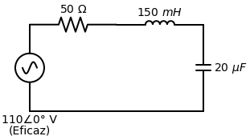
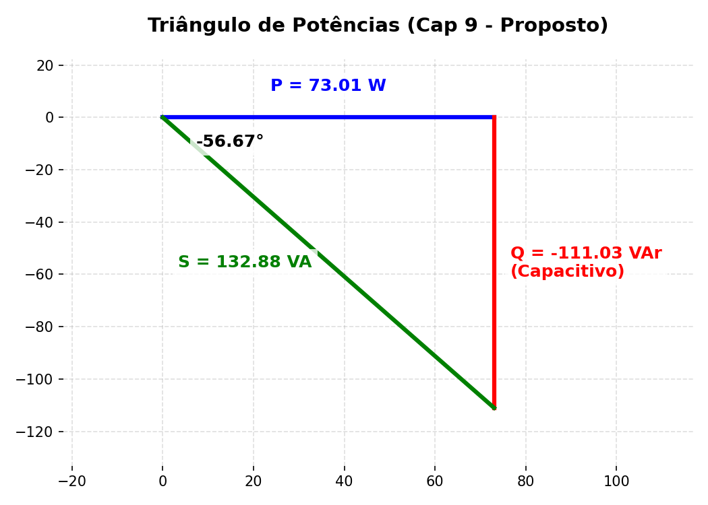

# Exercício Proposto: Circuito RLC (Capítulos 9 e 11)
*(Sua vez de treinar para a prova!)*

> **A Missão:**
> Imagine que você está projetando o circuito interno de um pequeno ventilador. Ele é modelado como um circuito RLC série alimentado pela tomada padrão americana: uma fonte senoidal de $110 \angle 0^\circ \text{ V (rms)}$ com frequência de $60\text{ Hz}$. 
> 
> Os elementos têm os seguintes valores:
> - $R = 50 \, \Omega$
> - $L = 150\text{ mH}$
> - $C = 20 \, \mu\text{F}$
> 
> **Calcule:**
> a) A impedância total do circuito na forma polar e retangular. O circuito é predominantemente indutivo ou capacitivo?
> b) O fasor de Corrente Eficaz ($\tilde{I}_{rms}$).
> c) As Potências Ativa ($P$), Reativa ($Q$) e Aparente ($S$) fornecidas pela fonte.

---
*(Tente resolver sozinho copiando os passos da Folha de Cola e depois expanda a caixa abaixo para ver se acertou os resultados!)*
 
 

<b>👀 CLIQUE AQUI PARA VER O GABARITO (SPOILER)</b>

**Aviso:** Usei $\omega = 377 \text{ rad/s}$ nas contas. Dependendo do arredondamento de casas decimais na sua calculadora, seus números podem variar alguns décimos, isso é normal!

**Resposta da (a):**
- $Z_R = 50 \, \Omega$
- $Z_L = j56,55 \, \Omega$
- $Z_C = -j132,63 \, \Omega$
- **$Z_{eq}$ (Retangular):** $50 - j76,08 \, \Omega$
- **$Z_{eq}$ (Polar):** $91,04 \angle -56,67^\circ \, \Omega$
- **Caráter:** Capacitivo (a parte imaginária é negativa).

**Resposta da (b):**
- $\tilde{I}_{rms} = \frac{110 \angle 0^\circ}{91,04 \angle -56,67^\circ}$
- **$\tilde{I}_{rms}$:** $1,208 \angle 56,67^\circ \text{ A}$

**Resposta da (c):**
A Letra C pede as três potências (Ativa, Reativa e Aparente). Em vez de calcular uma por uma usando fórmulas separadas, nós usamos a fórmula suprema da Potência Complexa ($S$), que já entrega todas as respostas juntas de uma vez!

1. **A Fórmula:** $S = \tilde{V} \cdot \tilde{I}^*$
2. **O Segredo do Asterisco ($I^*$):** O asterisco significa "Conjugado Complexo". Na prática, significa que você deve pegar a corrente que achou na letra B ($1,208 \angle 56,67^\circ$) e **inverter o sinal do ângulo**. Ela vira $1,208 \angle -56,67^\circ$.
3. **A Multiplicação:**
   $$ S = (110 \angle 0^\circ) \cdot (1,208 \angle -56,67^\circ) $$
4. **Entendendo o Resultado:**
   Se você multiplicar "na mão", você multiplica os módulos ($110 \cdot 1,208 = 132,88$) e soma os ângulos ($0 - 56,67 = -56,67^\circ$). O resultado final é o Fasor da Potência: **$132,88 \angle -56,67^\circ$**.
   A partir dele, tiramos as 3 respostas da questão:
   - **Potência Aparente ($S$):** É o tamanho total do fasor (o módulo). $\to \mathbf{132,88 \text{ VA}}$.
   - **Potência Ativa ($P$):** É a parte Real (calculada por $Módulo \cdot \cos(\theta)$). $132,88 \cdot \cos(-56,67^\circ) \to \mathbf{73,01 \text{ W}}$.
   - **Potência Reativa ($Q$):** É a parte Imaginária (calculada por $Módulo \cdot \sin(\theta)$). $132,88 \cdot \sin(-56,67^\circ) \to \mathbf{-111,03 \text{ VAr}}$.

> [!TIP]
> **O Caminho Ninja na Casio:** 
> Você não precisa fazer $\cos$ e $\sin$ na mão! 
> 1. Digite a multiplicação direto no aplicativo Complexo: `110∠0 × 1.208∠-56.67`.
> 2. Ao dar `EXE`, ela vai te cuspir a resposta na forma Retangular: **$73,01 - 111,03i$**.
> 3. O número sozinho ($73,01$) já é a sua **Potência Ativa (P)**!
> 4. O número grudado no "$i$" ($-111,03$) já é a sua **Potência Reativa (Q)**!
> 5. Para achar a Potência Aparente, basta apertar `FORMAT` $\to$ Polar Coord. O módulo ($132,88$) que vai aparecer na tela é a sua **Aparente (S)**. Simples assim!

**Triângulo de Potências (Letra C):**
Para desenhar o triângulo na sua folha de prova, siga esta lógica simples baseada nos resultados que a Casio te deu:
1. **O Chão (Eixo X):** Desenhe uma reta horizontal para a direita. Essa é a sua Potência Ativa ($P = 73,01\text{ W}$).
2. **A Parede (Eixo Y):** Na ponta direita dessa reta, desenhe uma linha vertical. Como o nosso $Q$ deu negativo ($-111,03\text{ VAr}$), o circuito é predominantemente **Capacitivo**, então essa linha obrigatoriamente tem que apontar **para baixo**!
3. **O Telhado (Hipotenusa):** Feche o triângulo ligando a origem (onde você começou o desenho) até a ponta final da linha do $Q$. Essa linha verde diagonal é o seu $S$ ($132,88\text{ VA}$).
4. **O Ângulo:** Coloque o ângulo que a calculadora gerou ($-56,67^\circ$) lá na origem, imprensado entre a linha azul ($P$) e a verde ($S$).

