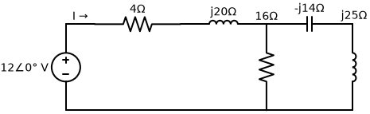
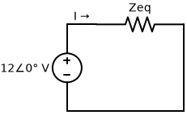

# Problema 9.39

**Enunciado:** Para o circuito exibido na Figura 9.46, determine $\mathbf{Z}_{eq}$ e use esta para determinar a corrente $\mathbf{I}$. Considere $\omega = 10 \text{ rad/s}$.  
*(Página 383 do PDF)*

---

### Observação Importante sobre o Enunciado
O enunciado nos dá a informação extra de que $\omega = 10 \text{ rad/s}$. Contudo, se olharmos atentamente para o diagrama do circuito, todas as impedâncias já foram calculadas e fornecidas diretamente em Ohms ($\Omega$). 
Componentes listados no circuito:
- Indutor 1: $j20 \, \Omega$
- Indutor 2: $j25 \, \Omega$
- Capacitor: $-j14 \, \Omega$

Como já temos as reatâncias em $\Omega$, a informação do $\omega = 10 \text{ rad/s}$ é redundante e **não precisará ser usada** nos cálculos! Este é um "pega-ratão" muito comum no livro do Sadiku para testar a atenção do aluno.

---

### 1. Análise da Topologia do Circuito

A corrente $\mathbf{I}$ pedida é a corrente total que sai da fonte de $12 \angle 0^\circ \text{ V}$.
Para achar a corrente total, precisamos reduzir todo o circuito à sua **Impedância Equivalente ($\mathbf{Z}_{eq}$)** vista pela fonte.

O circuito é composto por duas grandes partes:
1. Uma parte **em série** com a fonte: o resistor de $4 \, \Omega$ e o indutor de $j20 \, \Omega$.
2. Uma ramificação paralela formada por dois ramos:
   - Ramo Central: Resistor de $16 \, \Omega$.
   - Ramo da Direita: Capacitor de $-j14 \, \Omega$ em série com o indutor de $j25 \, \Omega$.

### 2. Calculando a Impedância Equivalente ($\mathbf{Z}_{eq}$)

**Passo A: Impedância do Ramo da Direita ($Z_{dir}$)**
Como o capacitor e o indutor do ramo da direita estão no mesmo caminho, eles estão em série:
$$ Z_{dir} = -j14 + j25 = j11 \, \Omega $$

**Passo B: Paralelo Central e Direita ($Z_p$)**
O resistor de $16 \, \Omega$ está em paralelo com o ramo da direita ($j11 \, \Omega$):
$$ Z_p = 16 \parallel j11 = \frac{16 \cdot j11}{16 + j11} $$
Para resolver a divisão, multiplicamos o numerador e o denominador pelo complexo conjugado do denominador ($16 - j11$):
$$ Z_p = \frac{j176 \cdot (16 - j11)}{16^2 + 11^2} = \frac{j2816 - j^2 1936}{256 + 121} = \frac{1936 + j2816}{377} $$
$$ Z_p \approx 5,135 + j7,469 \, \Omega $$

**Passo C: Somando tudo ($\mathbf{Z}_{eq}$)**
Agora somamos a impedância paralela ($Z_p$) com os componentes que estavam no início em série:
$$ \mathbf{Z}_{eq} = (4 + j20) + Z_p $$
$$ \mathbf{Z}_{eq} = (4 + j20) + (5,135 + j7,469) $$
$$ \mathbf{Z}_{eq} = 9,135 + j27,469 \, \Omega $$

Passando $\mathbf{Z}_{eq}$ para a forma polar (fasorial) para facilitar a divisão a seguir:
- Módulo: $|\mathbf{Z}_{eq}| = \sqrt{9,135^2 + 27,469^2} = \sqrt{83,45 + 754,55} \approx \sqrt{838} \approx 28,95 \, \Omega$
- Ângulo: $\theta = \arctan\left(\frac{27,469}{9,135}\right) \approx 71,6^\circ$

$$ \mathbf{Z}_{eq} = 28,95 \angle 71,6^\circ \, \Omega $$

### 3. Calculando a Corrente ($\mathbf{I}$)
Usando a Lei de Ohm fasorial ($\mathbf{V} = \mathbf{Z} \cdot \mathbf{I}$), dividimos a tensão total pela impedância total equivalente:
$$ \mathbf{I} = \frac{\mathbf{V}_s}{\mathbf{Z}_{eq}} $$
$$ \mathbf{I} = \frac{12 \angle 0^\circ}{28,95 \angle 71,6^\circ} $$
$$ \mathbf{I} = \left(\frac{12}{28,95}\right) \angle (0^\circ - 71,6^\circ) $$
$$ \mathbf{I} = 0,4145 \angle -71,6^\circ \, \text{A} $$

---

**✅ Respostas Finais:**
$$ \mathbf{Z}_{eq} = 9,135 + j27,469 \, \Omega \quad \text{ou} \quad 28,95 \angle 71,6^\circ \, \Omega $$
$$ \mathbf{I} = 0,4145 \angle -71,6^\circ \, \text{A} $$