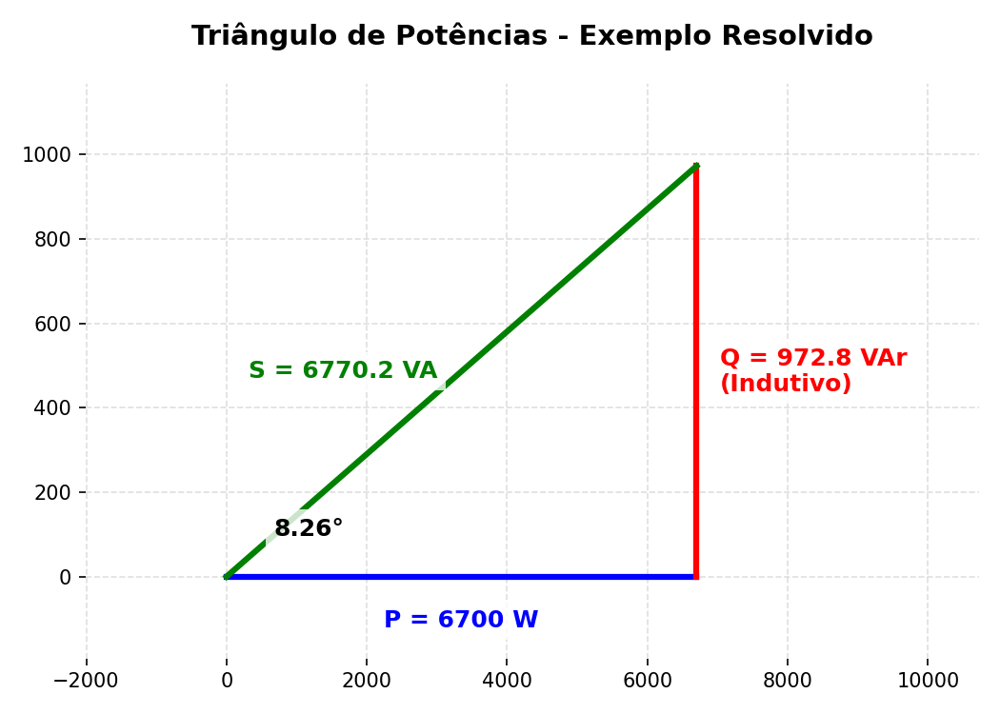

# Exemplo Resolvido: Potência em Cargas Paralelas (Capítulo 11)
*(Modelado a partir da Questão 4 da Prova 2)*

> **Enunciado:**
> Uma fonte de 240 V (rms) alimenta duas cargas industriais ligadas em paralelo:
> - **Carga 1:** Consome $5500\text{ W}$ de potência ativa e opera com potência reativa de $850\text{ VAr}$ com característica **capacitiva**.
> - **Carga 2:** Consome $1200\text{ W}$ de potência ativa e possui um fator de potência (FP) de **0,55 indutivo**.
> 
> **Calcule:**
> a) A Potência Aparente Total ($S_{total}$) fornecida pela fonte.
> b) O Fator de Potência Total da instalação.
> c) Desenhe o Triângulo de Potências.

---

## 🎂 A "Receita de Bolo" da Potência Paralela

### Passo 1: Organizar a "Mesa de Ingredientes" (P e Q separados)
Em problemas de cargas em paralelo, o nosso objetivo é sempre descobrir o $P$ (Ativa) e o $Q$ (Reativa) de cada máquina separadamente.

**Carga 1:** (Já deu tudo mastigado)
- $P_1 = 5500\text{ W}$
- $Q_1 = -850\text{ VAr}$ 
  *(Atenção! Ele disse "capacitivo", então obrigatoriamente colocamos o sinal negativo).*

**Carga 2:** (Deu o $P$ e o $FP$, falta achar o $Q$)
- $P_2 = 1200\text{ W}$
- Se $FP = 0,55$, então o ângulo exato dessa carga é: $\theta_2 = \arccos(0,55) \approx 56,633^\circ$.
- A potência aparente dessa máquina é $S_2 = \frac{P_2}{FP} = \frac{1200}{0,55} \approx 2181,82\text{ VA}$.
- Usamos a trigonometria para achar o $Q_2$:
  $$Q_2 = S_2 \cdot \sin(\theta_2) = 2181,82 \cdot \sin(56,633^\circ) \approx \mathbf{+1822,18\text{ VAr}}$$
  *(Atenção! Ele disse "indutivo", então o sinal é positivo).*

> [!TIP]
> **Na Casio fx-991LA CW (O Atalho Ninja Carga 2):**
> Se você arredondar o ângulo e digitar `1200 × tan(56.63)`, você vai achar **1821,97**. E tá tudo bem! Na prova a professora aceita pequenas variações de arredondamento.
> Mas se quiser o valor *exato* de primeira sem arredondar nada no meio do caminho, digite a fórmula aninhada:
>    `1200 × tan(acos(0.55))` $\to$ Resultado exato: **1822,18**. Muito mais seguro e elegante!

### Passo 2: O Liquidificador (Somar Ativa com Ativa, Reativa com Reativa)
Agora que temos tudo separado, é só somar:
- **Total de Ativa (P):** $P_{total} = P_1 + P_2 = 5500 + 1200 = \mathbf{6700\text{ W}}$
- **Total de Reativa (Q):** $Q_{total} = Q_1 + Q_2 = -850 + 1822,18 = \mathbf{+972,18\text{ VAr}}$

### Passo 3: O Forno (Achar a Potência Aparente e o Fator de Potência Total)
Temos $P = 6700$ e $Q = +972,18$. 
Isso forma o fasor de Potência Complexa Total: $\mathbf{S_{total}} = 6700 + j972,8$.

> [!TIP]
> **Na Casio fx-991LA CW (O Fim do Problema):**
> Vá no aplicativo **Complexo** e digite: `6700 + 972.8i`.
> Pressione `FORMAT` $\to$ `Polar Coord` e aperte `EXE`.
> Ela vai cuspir a resposta na tela: **$6770,2 \angle 8,26^\circ$**.

O que a calculadora acabou de te dar? Tudo!
- **Letra A (Potência Aparente Total):** É o módulo (o $6770,2$).
  $\to \mathbf{S_{total} \approx 6770\text{ VA}}$
- **Letra B (Fator de Potência Total):** É o cosseno do ângulo que a Casio deu ($8,26^\circ$).
  $\to \mathbf{FP_{total} = \cos(8,26^\circ) \approx 0,989}$ (É **Indutivo** porque o Q final deu positivo!).

### Passo 4: Desenhar o Triângulo de Potências (Letra C)
O triângulo é o retrato visual do nosso passo 3. 
- O eixo deitado é a Potência Ativa (P).
- O eixo em pé subindo é a Potência Reativa (Q).
- A diagonal é a Potência Aparente (S), fechando a figura.

> **Interpretando o Triângulo:**
> Veja como a linha azul (P) é enorme comparada à linha vermelha (Q). Isso resultou em um ângulo muito pequeno ($8,27^\circ$) e um Fator de Potência (FP) muito alto ($0,989$), o que significa que essa fábrica é super eficiente no uso de energia!
