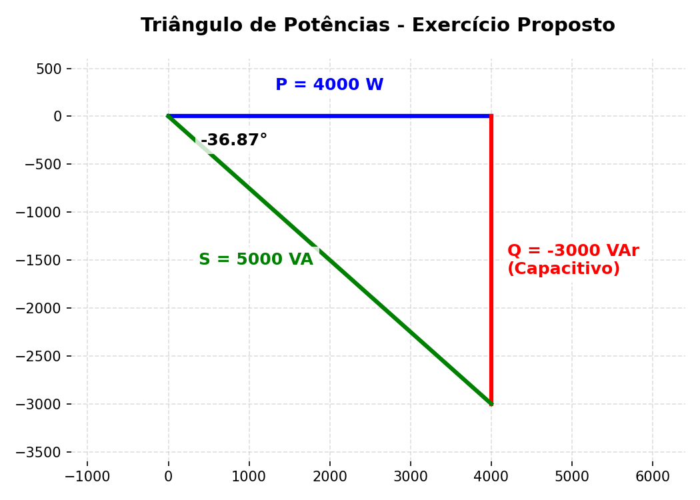

# Exercício Proposto: O Desafio do Triângulo (Capítulo 11)
*(Teste as suas habilidades e o domínio da Casio!)*

> **A Missão:**
> Uma fonte alimenta um galpão contendo duas máquinas grandes ligadas em paralelo:
> - **Máquina 1 (Motor):** Consome $2000\text{ W}$ de potência ativa e opera com potência reativa de $1000\text{ VAr}$ **indutivo**.
> - **Máquina 2 (Banco de Capacitores):** Consome $2000\text{ W}$ de potência ativa e possui uma Potência Aparente total de $4472\text{ VA}$ com característica **capacitiva**.
> 
> **Calcule:**
> a) A Potência Aparente Total ($S_{total}$) fornecida pela fonte.
> b) O Fator de Potência Total da instalação (classifique em indutivo ou capacitivo).
> c) Esboce o Triângulo de Potências (quem venceu o cabo de guerra: a parte de cima indutiva ou a parte de baixo capacitiva?).

---
*(Pegue sua Casio, rabisque e só abra a caixa abaixo depois que tentar chegar no resultado final!)*
 
 

<b>👀 CLIQUE AQUI PARA VER O GABARITO (SPOILER)</b>

**Resposta da (a):**
Primeiro, isolamos as grandezas.
- **Máquina 1:** $P_1 = 2000\text{ W}$ / $Q_1 = +1000\text{ VAr}$.
- **Máquina 2:** $P_2 = 2000\text{ W}$ / $S_2 = 4472\text{ VA}$. 
  Como descobrir o $Q_2$? Vamos inverter a fórmula básica de Pitágoras ($S^2 = P^2 + Q^2$). Jogando o P para o outro lado diminuindo, a fórmula vira $Q = \sqrt{S^2 - P^2}$. (É daí que surge esse sinal de "menos" dentro da raiz!).
  
  O cálculo numérico fica: $Q_2 = \sqrt{4472^2 - 2000^2} \approx 4000\text{ VAr}$.
  A matemática sempre nos dá um número positivo na raiz, mas a regra de ouro diz que **Máquinas Capacitivas** puxam o triângulo para baixo. Então nós, engenheiros, forçamos um sinal negativo no final da conta: $\mathbf{Q_2 = -4000\text{ VAr}}$.

**Somando:**
- $P_{total} = 2000 + 2000 = \mathbf{4000\text{ W}}$
- $Q_{total} = +1000 - 4000 = \mathbf{-3000\text{ VAr}}$

Na Casio, digitamos `4000 - 3000i` e pedimos para converter p/ Polar (`FORMAT`).
Resultado: **$5000 \angle -36,87^\circ$**
O módulo é o seu $S_{total}$:
$\mathbf{S_{total} = 5000\text{ VA}}$

**Resposta da (b):**
O Fator de Potência é o cosseno do ângulo que a Casio gerou:
$\mathbf{FP_{total}} = \cos(-36,87^\circ) = \mathbf{0,8}$ 
Como o $Q_{total}$ deu negativo (o ângulo também), ele é **Capacitivo**.

**Resposta da (c): O Triângulo**
Como a máquina capacitiva "puxou" com força de $4000$ para baixo, e o motor puxou só com $1000$ para cima, a resultante foi de $-3000$ (para baixo). O triângulo aponta para o chão!

