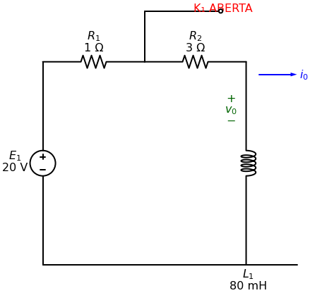
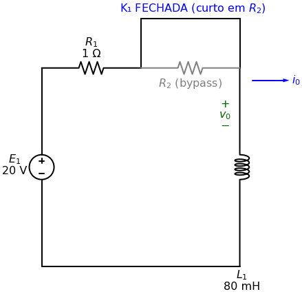

# Prova 2 — Questão 1
**Capítulo 7 | Tema: Circuito RL de Primeira Ordem — Resposta a Degrau com Chave**

> **Enunciado (08 pontos):**
> A chave K₁ no circuito abaixo esteve **aberta por um longo tempo** antes de ser fechada em $t=0$.
> Sabendo que $R_1 = 1\Omega$, $R_2 = 3\Omega$ e $L_1 = 80\text{ mH}$, determine:
> - a) O valor inicial da corrente $i_0(t)$. (1 ponto)
> - b) A constante de tempo do circuito para $t > 0$. (1,5 pontos)
> - c) A expressão numérica para $i_0(t)$ após a chave ter sido fechada. (2 pontos)
> - d) A expressão numérica para a tensão $v_0(t)$ após a chave ter sido fechada. (2 pontos)
> - e) A energia armazenada no indutor. (1,5 pontos)

---

## 🔑 Passo 0: Entendendo o circuito

O ponto-chave desse problema é entender **o que a chave K₁ faz**:
- **Antes de fechar (t < 0):** K₁ está **aberta**, logo nenhuma corrente passa por ela. O circuito ativo é: $E_1 → R_1 → R_2 → L_1$ **(série completa)**.
- **Depois de fechar (t > 0):** K₁ **curto-circuita** o $R_2$. O resistor $R_2$ é "eliminado" do circuito. O circuito ativo passa a ser: $E_1 → R_1 → L_1$ **(série sem R₂)**.

---

## ✅ Parte (a): Valor inicial $i_0(0)$

**Estado $t < 0$ — Chave Aberta:**

Em regime permanente de CC, o **indutor se comporta como um fio (curto-circuito)**. Toda a tensão da fonte cai nos resistores:

$$i_0(0^-) = \frac{E_1}{R_1 + R_2} = \frac{20}{1 + 3} = \frac{20}{4} = \mathbf{5\text{ A}}$$

Pela **continuidade da corrente no indutor**: $i_0(0^+) = i_0(0^-) = \mathbf{5\text{ A}}$

---

## ✅ Parte (b): Constante de tempo $\tau$ para $t > 0$

**Estado $t > 0$ — Chave Fechada (K₁ curto-circuita $R_2$):**

Com $R_2$ bypassado, a resistência equivalente vista pelo indutor é apenas $R_1$:

$$R_{eq} = R_1 = 1\Omega$$

$$\boxed{\tau = \frac{L_1}{R_{eq}} = \frac{80 \times 10^{-3}}{1} = 80\text{ ms} = 0,08\text{ s}}$$

---

## ✅ Parte (c): Expressão de $i_0(t)$

Como a fonte continua ligada ($E_1 = 20\text{V}$), é uma **Resposta a Degrau** (não natural!). Usamos a fórmula completa:

$$i_0(t) = i(\infty) + [i(0) - i(\infty)]e^{-t/\tau}$$

Calculamos o valor final (regime permanente para $t \to \infty$, com K₁ fechada):
$$i(\infty) = \frac{E_1}{R_1} = \frac{20}{1} = 20\text{ A}$$

Substituindo:
$$i_0(t) = 20 + [5 - 20]e^{-t/0,08}$$

$$\boxed{i_0(t) = 20 - 15e^{-12,5t}\text{ A}, \quad t \geq 0}$$

---

## ✅ Parte (d): Expressão de $v_0(t)$

A tensão $v_0(t)$ é a tensão sobre o indutor $L_1$:

$$v_0(t) = L_1 \frac{di_0}{dt}$$

Derivando $i_0(t) = 20 - 15e^{-12,5t}$:

$$\frac{di_0}{dt} = 0 - 15 \cdot (-12,5) \cdot e^{-12,5t} = 187,5\, e^{-12,5t}$$

Multiplicando por $L_1 = 0,08\text{ H}$:

$$v_0(t) = 0,08 \times 187,5\, e^{-12,5t}$$

$$\boxed{v_0(t) = 15e^{-12,5t}\text{ V}, \quad t \geq 0}$$

> 💡 **Verificação rápida:** Em $t=0$, $v_0(0) = 15\text{ V}$. Pela Lei de Kirchhoff das Tensões: $E_1 = R_1 \cdot i_0(0) + v_0(0) = 1 \times 5 + 15 = 20\text{ V}$ ✅

**Método Alternativo — Lei de Kirchhoff das Tensões (LKT):**

Podemos chegar ao mesmo resultado sem derivar! Aplicando a LKT na malha principal em $t \geq 0$ (com K₁ fechada, R₂ bypassado):

$$E_1 = v_{R_1}(t) + v_0(t)$$

A queda de tensão no resistor $R_1$ é:
$$v_{R_1}(t) = R_1 \cdot i_0(t) = 1 \times (20 - 15e^{-12,5t}) = 20 - 15e^{-12,5t}\text{ V}$$

Isolando $v_0(t)$:
$$v_0(t) = E_1 - v_{R_1}(t) = 20 - (20 - 15e^{-12,5t})$$

$$\boxed{v_0(t) = 15e^{-12,5t}\text{ V}} \quad \checkmark$$

> Ambos os métodos chegam ao mesmo resultado — e o Kirchhoff é ainda mais rápido aqui!

---

## ✅ Parte (e): Energia armazenada no indutor

A energia armazenada num indutor é:

$$w_L = \frac{1}{2} L_1 \cdot [i_0(0)]^2$$

Usando a corrente **inicial** (que é o momento de maior interesse, pois o indutor estava carregado antes da chave fechar):

$$w_L = \frac{1}{2} \times 0,08 \times (5)^2 = \frac{1}{2} \times 0,08 \times 25$$

$$\boxed{w_L(0) = 1\text{ J}}$$

> **Nota:** No regime permanente final ($t \to \infty$), a energia será: $w_L(\infty) = \frac{1}{2} \times 0,08 \times (20)^2 = 16\text{ J}$
