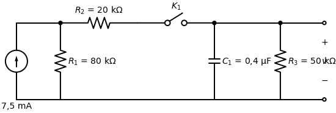
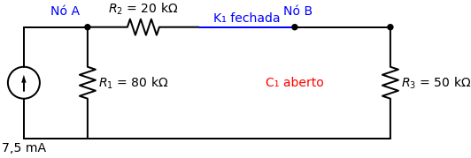
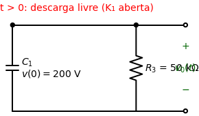

# Resolução da Prova 2 - Questão 2

**Tipo de Circuito:** Resposta Natural (RC)
*Neste problema, a fonte de energia é desconectada do circuito para $t>0$, logo a resposta do circuito será natural, indo a zero com o tempo.*

## O Problema
A chave $K_1$ no circuito abaixo esteve fechada por um longo tempo e é aberta em $t=0$.
Sabendo que $R_1 = 80\ k\Omega$, $R_2 = 20\ k\Omega$, $R_3 = 50\ k\Omega$ e $C_1 = 0,4\ \mu F$, determine:
a) O valor inicial de $v(t)$.
b) A constante de tempo para $t > 0$.
c) A expressão numérica para $v_o(t)$ para $t \ge 0$.
d) A energia inicial armazenada no capacitor.

---

> [!TIP] Receita de Bolo: Resposta Natural RC/RL
> **Para resolver qualquer circuito de resposta natural (sem fonte em $t>0$):**
> 1. Analise o circuito em $t < 0$ (regime permanente). Substitua o capacitor por um **circuito aberto** (ou o indutor por um curto) e encontre a tensão $v(0)$ (ou corrente $i(0)$).
> 2. Desenhe o circuito em $t > 0$ (com as mudanças da chave). Encontre a resistência equivalente $R_{eq}$ "vista" pelo capacitor (ou indutor).
> 3. Calcule a constante de tempo: $\tau = R_{eq}C$ para capacitor, ou $\tau = L/R_{eq}$ para indutor.
> 4. Monte a equação exponencial natural: $x(t) = x(0) e^{-t/\tau}$.
> 5. A energia inicial pode sempre ser calculada via $w_C(0) = \frac{1}{2} C v(0)^2$ ou $w_L(0) = \frac{1}{2} L i(0)^2$.

---

## Passo 1: Encontrar o Início $v(0)$ (Antes da Chave Abrir)

Temos que olhar o circuito no instante **antes** da chave abrir ($t < 0$).
Como a chave $K_1$ estava fechada há muito tempo, o circuito atingiu o *Regime Permanente*.
- **Regra:** O Capacitor se comporta como um **Circuito Aberto** (vira um "buraco" onde não entra corrente).
- A fonte de corrente de $7,5\ mA$ está injetando corrente no circuito. Essa corrente vai se dividir entre a rua do $R_1$ e a rua formada por $R_2$ e $R_3$ (já que o capacitor não puxa corrente).

A tensão $v(0)$ que queremos encontrar é a tensão nos terminais do capacitor, que, olhando para o circuito, é exatamente a mesma tensão em cima do resistor $R_3$ (pois eles estão em paralelo).

**Vamos resolver usando a velha e boa Lógica (Transformação de Fonte e Divisor de Tensão):**
1. Onde você vê uma **Fonte de Corrente** em paralelo com um **Resistor**, você pode transformá-los em uma **Fonte de Tensão** em série! Isso simplifica muito a vida.
   A fonte de $7,5\ mA$ e o resistor $R_1 = 80\ k\Omega$ viram uma fonte $V_s$:
   $$ V_s = I \cdot R_1 = 7,5 \times 10^{-3} \cdot 80 \times 10^3 = 600\ V $$
2. Agora imagine o novo circuito: Uma fonte de $600\ V$ empurrando corrente por uma única rua (circuito série) contendo o próprio $R_1$ ($80\ k\Omega$), o $R_2$ ($20\ k\Omega$) e o $R_3$ ($50\ k\Omega$).
3. Qual a resistência total dessa rua? $R_{total} = 80k + 20k + 50k = 150\ k\Omega$.
4. Como queremos saber a tensão apenas no trecho final (o resistor $R_3$), usamos a fórmula do **Divisor de Tensão** (que é pegar o total de $600V$ e multiplicar pela "fração" de resistência do nosso alvo):
   $$ v(0) = V_{fonte} \cdot \left( \frac{R_{alvo}}{R_{total}} \right) = 600 \cdot \left( \frac{50k}{150k} \right) = 600 \cdot \frac{1}{3} = 200\ V $$

Como a tensão no capacitor não dá "saltos" instantâneos, cravamos que **$v(0) = 200\ V$**.

*(Resposta da letra A)*

---

## Passo 2: Encontrar o Fim $v(\infty)$

Agora olhamos para o circuito **muito tempo depois** da chave abrir ($t \to \infty$).
- Quando a chave $K_1$ abre em $t=0$, toda aquela bagunça do lado esquerdo (fonte de corrente, $R_1$, $R_2$) é "amputada" e desconectada do nosso capacitor.
- O capacitor fica trancado sozinho em um circuito fechado apenas com o resistor $R_3$.
- Como não há mais nenhuma fonte injetando energia na parte direita, o capacitor vai descarregar toda a energia de $200\ V$ que ele tinha juntado no resistor $R_3$, até zerar.
- Portanto, o valor final é **$v(\infty) = 0\ V$**.

---

## Passo 3: Encontrar a Constante de Tempo ($\tau$)

Olhe para o circuito **depois que a chave mudou ($t > 0$)**.
- Arrancamos o capacitor do circuito para ver a Resistência Equivalente ($R_{eq}$) pelos buracos que ficaram.
- O circuito restante à direita da chave aberta possui **apenas** o resistor de $50\ k\Omega$.
- Logo, a resistência vista pelo capacitor é simplesmente $R_{eq} = 50\ k\Omega$.

A fórmula da Constante de Tempo para RC é:
$$ \tau = R_{eq} \cdot C_1 = (50 \times 10^3) \cdot (0,4 \times 10^{-6}) = 20 \times 10^{-3} = 0,02 \text{ segundos} $$

*(Resposta da letra B)*

---

## Passo 4: Jogar na Equação Mágica (Letra C)

A equação geral para a tensão no capacitor é:
$$ v(t) = v(\infty) + [v(0) - v(\infty)] \cdot e^{-\frac{t}{\tau}} $$

Substituindo os três ingredientes que achamos ($v(0) = 200$, $v(\infty) = 0$, $\tau = 0,02$):
$$ v_o(t) = 0 + [200 - 0] \cdot e^{-\frac{t}{0,02}} $$
$$ v_o(t) = 200 e^{-50t} \text{ V} $$

*(Resposta da letra C)*

---

## Passo 5: Energia Inicial (Letra D)

A energia inicial armazenada em um capacitor é simplesmente calculada pela fórmula:
$$ w_C(0) = \frac{1}{2} C v(0)^2 $$

Substituindo o $v(0)$ de $200\ V$ que achamos no Passo 1:
$$ w_C(0) = \frac{1}{2} \cdot (0,4 \times 10^{-6}) \cdot (200)^2 $$
$$ w_C(0) = 0,2 \times 10^{-6} \cdot 40000 = 0,008 \text{ Joules} = 8\ mJ $$

*(Resposta da letra D)*
