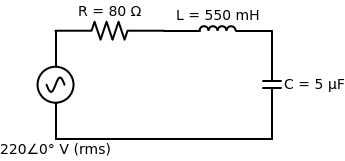
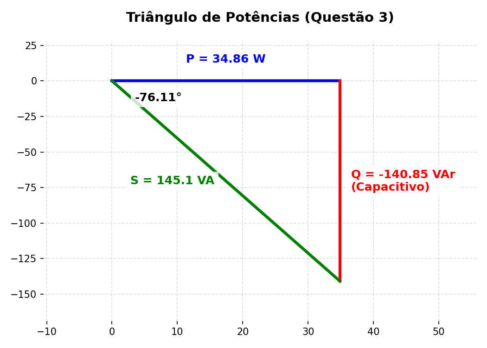

# Prova 2 — Questão 3
**Capítulo 9 (Fasores e Impedância) com introdução ao Capítulo 11 (Potência C.A.)**

> **Enunciado (10 pontos):**
> Um circuito RLC série é alimentado por uma fonte alternada senoidal de $220 \angle 0^\circ \text{ V (rms)}$ e frequência $f=60\text{ Hz}$. O valor dos elementos são: $R = 80 \, \Omega$, $L = 550\text{ mH}$ e $C = 5 \, \mu\text{F}$. Calcule:
> a) A impedância total do circuito. O circuito é predominantemente indutivo ou capacitivo, justifique. (2 pontos)
> b) A corrente elétrica (módulo e ângulo). (2 pontos)
> c) As potências ativa, reativa e aparente fornecidas pela fonte. Desenhe o triângulo de potências, indicando inclusive o valor do ângulo. (6 pontos)

---

## ✅ Parte (a): Impedância Total do Circuito

Para calcular a impedância total, primeiro precisamos da **Frequência Angular ($\omega$)**, pois a professora deu apenas a frequência em Hertz ($f = 60\text{ Hz}$).
A fórmula que conecta as duas é:
$$ \omega = 2\pi f $$
$$ \omega = 2 \cdot \pi \cdot 60 \approx 376,99 \text{ rad/s} $$
*(Para facilitar as contas e usar o padrão dos livros, vamos arredondar para $377 \text{ rad/s}$).*

Agora, aplicamos a nossa *Receita de Bolo*, convertendo Henrys (H) e Farads (F) para Ohms ($\Omega$):

1. **Impedância do Resistor ($Z_R$):**
   $$ Z_R = R = 80 \, \Omega $$

2. **Impedância do Indutor ($Z_L$):**
   *(Atenção: 550 mH = 0,55 H)*
   $$ Z_L = j\omega L = j \cdot (377) \cdot (0,55) = j207,35 \, \Omega $$

3. **Impedância do Capacitor ($Z_C$):**
   *(Atenção: 5 $\mu$F = $5 \times 10^{-6}$ F)*
   $$ Z_C = \frac{1}{j\omega C} = \frac{-j}{\omega C} = \frac{-j}{377 \cdot 5 \times 10^{-6}} = \frac{-j}{0,001885} \approx -j530,50 \, \Omega $$

Como estão todos em **Série**, a impedância equivalente é a soma pura e simples:
$$ Z_{eq} = Z_R + Z_L + Z_C $$
$$ Z_{eq} = 80 + j207,35 - j530,50 $$
$$ Z_{eq} = 80 - j323,15 \, \Omega \quad \text{(Forma Retangular)} $$

Para as próximas contas, vamos precisar da **Forma Polar**. Convertendo:
- Módulo ($|Z|$): $\sqrt{80^2 + (-323,15)^2} = \sqrt{6400 + 104425,92} = \sqrt{110825,92} \approx 332,90 \, \Omega$
- Ângulo ($\theta$): $\arctan\left(\frac{-323,15}{80}\right) = \arctan(-4,039) \approx -76,11^\circ$

$$ Z_{eq} = 332,90 \angle -76,11^\circ \, \Omega \quad \text{(Forma Polar)} $$

**Justificativa (Indutivo ou Capacitivo?):**
O circuito é predominantemente **Capacitivo**. 
*Justificativa:* Ao somarmos as reatâncias (parte imaginária), a reatância capacitiva ($-j530,50$) era muito maior em módulo do que a reatância indutiva ($j207,35$). O resultado líquido foi uma parte imaginária **negativa** ($-j323,15 \, \Omega$), o que é a característica marcante dos capacitores. O ângulo da impedância também é negativo ($-76,11^\circ$).

---

## ✅ Parte (b): Corrente Elétrica

Aplicamos a Lei de Ohm fasorial ($V = Z \cdot I$). 
A professora já foi boazinha e deu a fonte mastigada na forma de **fasor eficaz (rms)**: $220 \angle 0^\circ \text{ V}$.

$$ \tilde{I} = \frac{\tilde{V}}{Z_{eq}} $$
$$ \tilde{I} = \frac{220 \angle 0^\circ}{332,90 \angle -76,11^\circ} $$

Dividimos os módulos e subtraímos o ângulo de baixo do de cima:
$$ \tilde{I} = \left(\frac{220}{332,90}\right) \angle (0^\circ - (-76,11^\circ)) $$
$$ \tilde{I} = 0,66 \angle 76,11^\circ \text{ A} \text{ (rms)} $$

*Faz sentido:* Como o circuito é predominantemente capacitivo, a corrente está **adiantada** em relação à tensão (o ângulo dela é positivo, enquanto o da tensão é 0). Lembre do ICE (Corrente $I$ antes da Tensão $E$).

---

## ✅ Parte (c): Potência Ativa, Reativa, Aparente e Triângulo

Aqui entramos no **Capítulo 11**. Para resolver TUDO sobre potência de uma vez só em CA, a gente usa a fórmula suprema da **Potência Complexa ($S$)**. 

A fórmula é:
$$ S = V_{rms} \cdot I_{rms}^* $$
*(O asterisco significa **Conjugado**, ou seja, nós apenas invertemos o sinal do ângulo da corrente na hora de multiplicar).*

- Fasor de Tensão: $220 \angle 0^\circ$
- Fasor de Corrente Conjugado ($I^*$): $0,66 \angle -76,11^\circ$ *(Viu? Troquei o $+76,11$ por $-76,11$)*

> [!TIP]
> **Calculadora Casio fx-991LA CW:**
> Para calcular essa Potência Complexa em 5 segundos sem errar nada:
> 1. Vá em `HOME` $\to$ **Complexo**.
> 2. Verifique se tem um **D** na tela (Settings $\to$ Config Calc $\to$ Unidade Ângulo $\to$ Grau).
> 3. Digite: `220∠0 × 0.66∠-76.11` (lembrando que o $\angle$ fica em `CATALOG` $\to$ Complexo $\to$ $\angle$).
> 4. Ao apertar `EXE`, ela já vai te dar a resposta de bandeja no formato Retangular: $34,86 - 140,85i$. 
> Pronto! Você acabou de achar a Potência Ativa (W) e a Reativa (VAr) numa tacada só! Se quiser ver a Aparente (VA), é só apertar `FORMAT` e escolher $r\angle\theta$.

Calculando a Potência Complexa ($S$):
$$ S = (220 \angle 0^\circ) \cdot (0,66 \angle -76,11^\circ) $$
$$ S = (220 \cdot 0,66) \angle (0^\circ - 76,11^\circ) $$
$$ S = 145,20 \angle -76,11^\circ \text{ VA} \text{ (Volt-Ampères)} $$

Nós achamos o número polar, que nos dá duas informações diretas:
- **Potência Aparente ($|S|$):** É apenas o módulo do número. É o "total" da potência que viaja pelo fio.
  > **Potência Aparente ($|S|$) = 145,20 VA**

Para achar a Potência Ativa (W) e a Reativa (VAr), basta converter o $S$ para a **forma retangular**! Onde $S = P + jQ$.

- **Potência Ativa ($P$):** É a parte Real. ($P = |S| \cos(\theta)$)
  $$ P = 145,20 \cdot \cos(-76,11^\circ) = 145,20 \cdot 0,240 \approx \mathbf{34,86 \text{ W (Watts)}} $$
  *(Essa é a potência que realmente vira calor/trabalho no Resistor).*

- **Potência Reativa ($Q$):** É a parte Imaginária. ($Q = |S| \sin(\theta)$)
  $$ Q = 145,20 \cdot \sin(-76,11^\circ) = 145,20 \cdot (-0,970) \approx \mathbf{-140,85 \text{ VAr (Volt-Ampère Reativo)}} $$
  *(Essa é a potência que fica "ping-pongando" entre a fonte, o Indutor e o Capacitor. O sinal **negativo** crava novamente que o circuito é **capacitivo**, pois indutores consomem VAr positivo e capacitores fornecem VAr negativo).*

### O Triângulo de Potências
O Triângulo de Potências é literalmente o gráfico desse número complexo que acabamos de achar:
- **Cateto Adjacente (Eixo X):** É a Potência Ativa ($P$), sempre deitada e para a direita (positiva).
- **Cateto Oposto (Eixo Y):** É a Potência Reativa ($Q$). Se for Positivo (Indutivo), aponta para CIMA. Se for Negativo (Capacitivo), aponta para BAIXO.
- **Hipotenusa:** É a Potência Aparente ($S$).
- **Ângulo:** É a defasagem entre a tensão e a corrente ($-76,11^\circ$).

